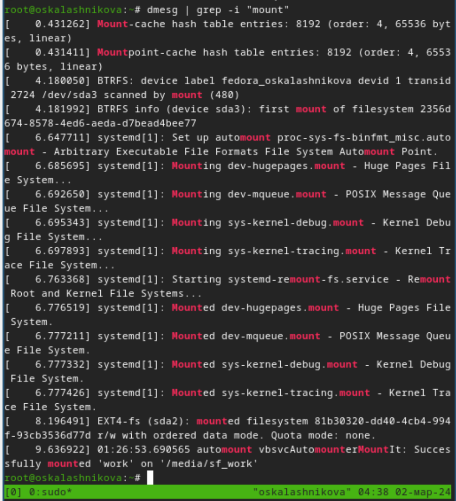

---
## Front matter
lang: ru-RU
title: Лабораторная работа №1
subtitle: Операционные системы
author:
  - Калашникова Ольга Сергеевна НПИбд-01-23
institute:
  - Российский университет дружбы народов, Москва, Россия
date: 02 марта 2024

## i18n babel
babel-lang: russian
babel-otherlangs: english

## Formatting pdf
toc: false
toc-title: Содержание
slide_level: 2
aspectratio: 169
section-titles: true
theme: metropolis
header-includes:
 - \metroset{progressbar=frametitle,sectionpage=progressbar,numbering=fraction}
 - '\makeatletter'
 - '\beamer@ignorenonframefalse'
 - '\makeatother'

## Fonts 
mainfont: PT Serif 
romanfont: PT Serif 
sansfont: PT Sans 
monofont: PT Mono 
mainfontoptions: Ligatures=TeX 
romanfontoptions: Ligatures=TeX 
sansfontoptions: Ligatures=TeX,Scale=MatchLowercase 
monofontoptions: Scale=MatchLowercase,Scale=0.9

---

## Цель работы

Целью данной работы является приобретение практических навыков установки операционной системы на виртуальную машину, настройки минимально необходимых для дальнейшей работы сервисов.

## Задание

1. Создание виртуальной машины.
2. Установка операционной системы.
3. Работа с операционной системой после установки.
4. Установка программного обеспечения для создания документации.
5. Дополнительные задания.

## Создание виртуальной машины

Создаём новую виртуальную машину в графическом интерфейсе, указываем имя виртуальной машины(в моём случае  oskalashnikova), тип операционной системы — Linux, Fedora, выбираем скачанный образ операционной системы Fedora (рис.1).

{#fig:001 width=50%}

## Создание виртуальной машины

Указываем размер основной памяти виртуальной машины(в моём случае 4096  МБ) и количество ядер (5), а так же на этом этапе включаем поддержку UEFI (рис.2).

{#fig:002 width=50%}

## Создание виртуальной машины

Задаём размер диска (В моём случае 135 ГБ) (рис.3).

{#fig:003 width=50%}

## Создание виртуальной машины

После создания машины в настройках в качестве графического контроллера ставим VMSVGA и включаем ускорение 3D, так же увеличиваю коэф масштабирования для зрительного удобства (рис.4).

{#fig:004 width=50%}

## Создание виртуальной машины

Включаем общий буфер обмена и перетаскивание объектов между хостом и гостевой ОС (рис.5).

{#fig:005 width=50%}

## Настройка хост-клавиши

В меню выбераем Файл, Настройки -> Ввод, вкладка Виртуальная машина -> Сочетание клавиш в строке Хост-комбинация. Нажимаем новое сочетание клавиш и нажимаем ОК, чтобы сохранить изменения. (рис.6).

{#fig:006 width=40%}

## Запуск приложения для установки системы и установка системы на диск

Запускаем виртуальную машину, после при помощи Win+w запускаем liveinst (рис.7).

{#fig:007 width=50%}

## Запуск приложения для установки системы и установка системы на диск

Выбираем язык интерфейса и переходим к настройкам установки операционной системы (рис.8).

{#fig:008 width=50%}

## Запуск приложения для установки системы и установка системы на диск

Выбираем часовой пояс и раскладку клавиатуры (рис.9).

{#fig:009 width=20%}

## Запуск приложения для установки системы и установка системы на диск

Место установки ОС оставляем без изменения (рис.10).

{#fig:010 width=50%}

## Запуск приложения для установки системы и установка системы на диск

Задаём сетевое имя компьютера (рис.11).

{#fig:011 width=50%}

## Запуск приложения для установки системы и установка системы на диск

Установливаем имя и пароль для пользователя root (рис.12).

{#fig:012 width=50%}

## Запуск приложения для установки системы и установка системы на диск

Установливаем имя и пароль для пользователя (рис.13).

{#fig:013 width=50%}

## Запуск приложения для установки системы и установка системы на диск

У меня оптический диск не отключается автоматически, так что отключаем носитель информации с образом (рис.15).

{#fig:015 width=50%}

## Обновления

Для начала переключимся на роль супер-пользователя при помощи команды sudo -i (рис.16).

{#fig:016 width=50%}

## Обновления

Обновляем все пакеты при помощи команды dnf -y update (рис.17).

{#fig:017 width=50%}

## Повышение комфорта работы

Устанавливаем программы для удобства работы в консоли при помощи dnf -y install tmux mc (рис.18).

{#fig:018 width=50%}

## Автоматическое обновление

Будем использовать автоматическое обновление. Установим программное обеспечение при помощи dnf install dnf-automatic (рис.19).

{#fig:019 width=50%}

## Автоматическое обновление

Теперь запускаем таймер при помощи команды systemctl enable --now dnf-automatic.timer  (рис.20).

{#fig:020 width=50%}

## Отключение SELinux

Сначала зайдём в mc, затем в  файле /etc/selinux/config заменяем значение SELINUX=enforcing на значение SELINUX=permissive и перезагружаем виртуальную машину(рис.22).

{#fig:022 width=30%}

## Установка драйверов для VirtualBox

Запускаем терминальный мультиплексор tmux,переключаемся на рольсупер-пользователя при помощи sudo -i и устанавливаем средства разработки при помощи dnf -y group install "Development Tools" (рис.24).

{#fig:024 width=50%}

## Установка драйверов для VirtualBox

Теперь установим пакет DKMS при помощи dnf -y install dkms (рис.25).

{#fig:025 width=50%}

## Установка драйверов для VirtualBox

В меню виртуальной машины подключаем образ диска дополнений гостевой ОС (через меню у меня не работает, поэтому подключала вручную) (рис.26).

{#fig:026 width=20%}

## Установка драйверов для VirtualBox

Подмонтируем диск при помощи mount /dev/sr0 /media (рис.27).

{#fig:027 width=50%}

## Установка драйверов для VirtualBox

Устанавливаем драйвера при помощи /media/VBoxLinuxAdditions.run (рис.28).

{#fig:028 width=50%}

## Установка драйверов для VirtualBox

Перезагружаем виртуальную машину(reboot) (рис.29).

{#fig:029 width=50%}

## Настройка раскладки клавиатуры

Запускаем терминальный мультиплексор tmux (рис.30).

{#fig:030 width=50%}

## Настройка раскладки клавиатуры

Создаём конфигурационный файл ~/.config/sway/config.d/95-system-keyboard-config.conf(для начала все нужные папки) (рис.31).

{#fig:031 width=50%}

## Настройка раскладки клавиатуры

Переходим в папку с конфигурационным файлом ~/.config/sway/config.d/95-system-keyboard-config.conf (рис.32).

{#fig:032 width=50%}

## Настройка раскладки клавиатуры

Отредактируем конфигурационный файл ~/.config/sway/config.d/95-system-keyboard-config.conf ( добавим в него exec_always /usr/libexec/sway-systemd/locale1-xkb-config --oneshot) (рис.33).

{#fig:033 width=50%}

## Настройка раскладки клавиатуры

Переключимся на роль супер-пользователя при помощи sudo -i (рис.34).

{#fig:034 width=50%}

## Настройка раскладки клавиатуры

Преходим в папку с конфигурационным файлом /etc/X11/xorg.conf.d/00-keyboard.conf (рис.35).

{#fig:035 width=50%}

## Настройка раскладки клавиатуры

Отредактируем конфигурационный файл /etc/X11/xorg.conf.d/00-keyboard.conf (рис.36).

{#fig:036 width=50%}

## Настройка раскладки клавиатуры

Перегружаем виртуальную машину при помощи reboot и проверяем смену языка (рис.37).

{#fig:037 width=50%}

## Подключение общей папки

Внутри виртуальной машины добавляем своего пользователя в группу vboxsf при помощи gpasswd -a oskalashnikova vboxsf (рис.38).

{#fig:038 width=50%}

## Подключение общей папки

В хостовой системе подключаем разделяемую папку (у меня это windows и команда строится как на фото) (рис.39).

{#fig:039 width=50%}

## Подключение общей папки

Проверяем подключилась ли папка (рис.40).

{#fig:040 width=50%}

## Установка программного обеспечения для создания документации

Установливаем pandoc и pandoc-crossref вручную при помощи сайта(проверяем версии) (рис.41).

{#fig:041 width=50%}

## Установка программного обеспечения для создания документации

Распаковываем архивы (рис.42).

{#fig:042 width=30%}

## Установка программного обеспечения для создания документации

Помещаем файлы в каталог /usr/local/bin (рис.43).

{#fig:043 width=50%}

## Установка программного обеспечения для создания документации

Установим дистрибутив TeXlive при помощи команды dnf -y install texlive-scheme-full (рис.44).

{#fig:044 width=50%}

## Домашнее задание

Дождёмся загрузки графического окружения и откроем терминал. В окне терминала проанализируем последовательность загрузки системы, выполнив команду dmesg (рис.45)

{#fig:045 width=50%}

## Домашнее задание

Можем просто просмотреть вывод этой команды при помощи dmesg | less (рис.48).

{#fig:048 width=30%}

## Домашнее задание

Используя поиск с помощью grep (dmesg | grep -i "то, что ищем") получите следующую информацию:

1. Версия ядра Linux (Linux version) (рис.49).

{#fig:049 width=50%}

## Домашнее задание

2. Частота процессора (Detected Mhz processor) (рис.50).

{#fig:050 width=50%}

## Домашнее задание

3. Модель процессора (CPU0) (рис.51).

{#fig:051 width=50%}

## Домашнее задание

4. Объём доступной оперативной памяти (Memory available) (рис.52).

{#fig:052 width=50%}

## Домашнее задание

5. Тип обнаруженного гипервизора (Hypervisor detected) (рис.53).

{#fig:053 width=50%}

## Домашнее задание

6. Тип файловой системы корневого раздела (рис.54).

{#fig:054 width=50%}

## Домашнее задание

7.Последовательность монтирования файловых систем (рис.55).

{#fig:055 width=30%}

## Выводы

Я приобрела практические навыки установки операционной системы на виртуальную машину, настройки минимально необходимых для дальнейшей работы сервисов.

## Список литературы{.unnumbered}

https://selectel.ru/blog/directory-structure-linux/

https://intuit.ru/studies/courses/23/23/lecture/27143

туис

::: {#refs}
:::