---
## Front matter
title: "Отчёт по лабораторной работе №1"
subtitle: "Операционные системы"
author: "Калашникова Ольга Сергеевна"

## Generic otions
lang: ru-RU
toc-title: "Содержание"

## Bibliography
bibliography: bib/cite.bib
csl: pandoc/csl/gost-r-7-0-5-2008-numeric.csl

## Pdf output format
toc: true # Table of contents
toc-depth: 2
lof: true # List of figures
lot: true # List of tables
fontsize: 12pt
linestretch: 1.5
papersize: a4
documentclass: scrreprt
## I18n polyglossia
polyglossia-lang:
  name: russian
  options:
	- spelling=modern
	- babelshorthands=true
polyglossia-otherlangs:
  name: english
## I18n babel
babel-lang: russian
babel-otherlangs: english
## Fonts
mainfont: PT Serif
romanfont: PT Serif
sansfont: PT Sans
monofont: PT Mono
mainfontoptions: Ligatures=TeX
romanfontoptions: Ligatures=TeX
sansfontoptions: Ligatures=TeX,Scale=MatchLowercase
monofontoptions: Scale=MatchLowercase,Scale=0.9
## Biblatex
biblatex: true
biblio-style: "gost-numeric"
biblatexoptions:
  - parentracker=true
  - backend=biber
  - hyperref=auto
  - language=auto
  - autolang=other*
  - citestyle=gost-numeric
## Pandoc-crossref LaTeX customization
figureTitle: "Рис."
tableTitle: "Таблица"
listingTitle: "Листинг"
lofTitle: "Список иллюстраций"
lotTitle: "Список таблиц"
lolTitle: "Листинги"
## Misc options
indent: true
header-includes:
  - \usepackage{indentfirst}
  - \usepackage{float} # keep figures where there are in the text
  - \floatplacement{figure}{H} # keep figures where there are in the text
---

# Цель работы

Целью данной работы является приобретение практических навыков установки операционной системы на виртуальную машину, настройки минимально необходимых для дальнейшей работы сервисов.

# Задание

1. Создание виртуальной машины
2. Настройка хост-клавиши
3. Запуск приложения для установки системы и установка системы на диск
4. Обновления
5. Повышение комфорта работы
6. Автоматическое обновление
7. Отключение SELinux
8. Установка драйверов для VirtualBox
9. Настройка раскладки клавиатуры
10. Подключение общей папки
11. Установка программного обеспечения для создания документации

# Выполнение лабораторной работы

## Создание виртуальной машины

Создаём новую виртуальную машину в графическом интерфейсе, указываем имя виртуальной машины(в моём случае  oskalashnikova), тип операционной системы — Linux, Fedora, выбираем скачанный образ операционной системы Fedora (рис. [-@fig:001]).

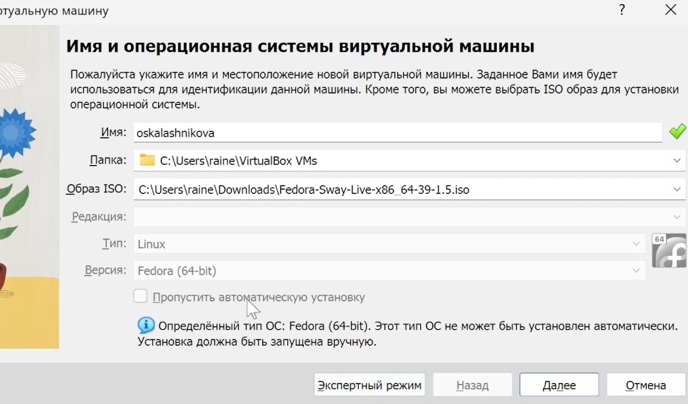{#fig:001 width=70%}

Указываем размер основной памяти виртуальной машины(в моём случае 4096  МБ) и количество ядер (5), а так же на этом этапе включаем поддержку UEFI (рис. [-@fig:002]).

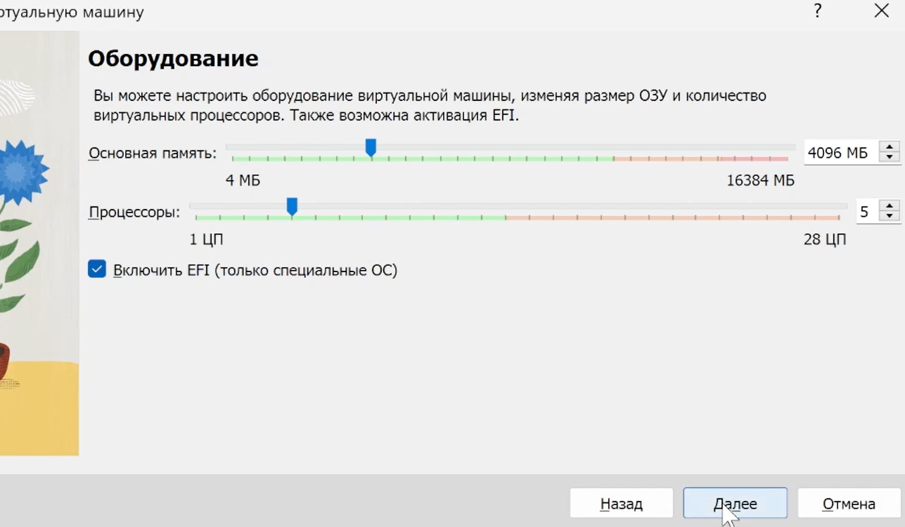{#fig:002 width=70%}

Задаём размер диска (В моём случае 135 ГБ) (рис. [-@fig:003]).

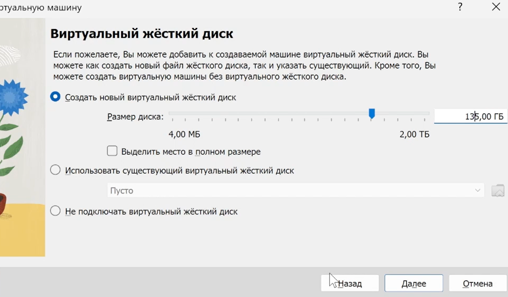{#fig:003 width=70%}

После создания машины в настройках в качестве графического контроллера ставим VMSVGA и включаем ускорение 3D, так же увеличиваю коэф масштабирования для зрительного удобства (рис. [-@fig:004]).

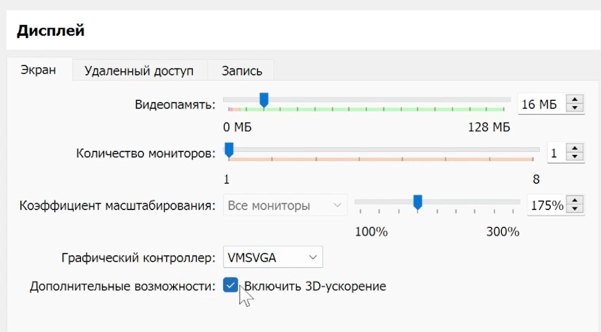{#fig:004 width=70%}

Включаем общий буфер обмена и перетаскивание объектов между хостом и гостевой ОС (рис. [-@fig:005]).

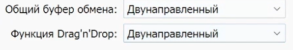{#fig:005 width=70%}

## Настройка хост-клавиши

В меню выбераем Файл, Настройки -> Ввод, вкладка Виртуальная машина -> Сочетание клавиш в строке Хост-комбинация. Нажимаем новое сочетание клавиш и нажимаем ОК, чтобы сохранить изменения. (рис. [-@fig:006]).

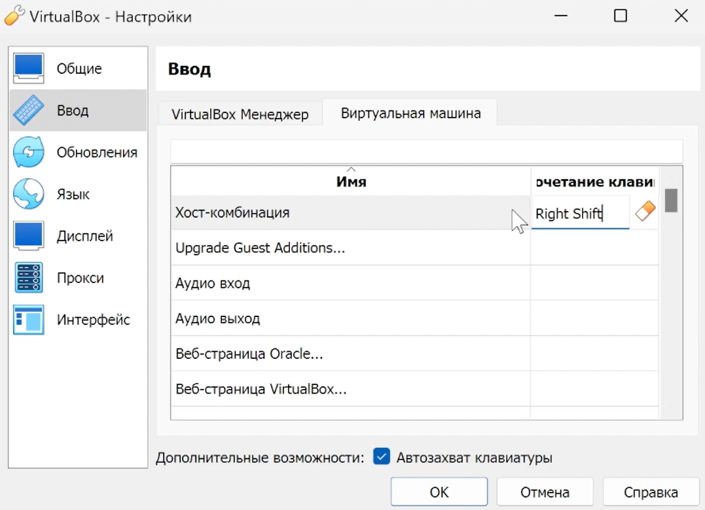{#fig:006 width=70%}

## Запуск приложения для установки системы и установка системы на диск

Запускаем виртуальную машину, после при помощи Win+w запускаем liveinst (рис. [-@fig:007]).

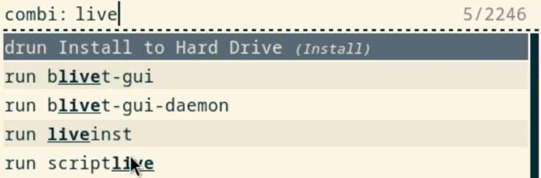{#fig:007 width=70%}

Выбираем язык интерфейса и переходим к настройкам установки операционной системы (рис. [-@fig:008]).

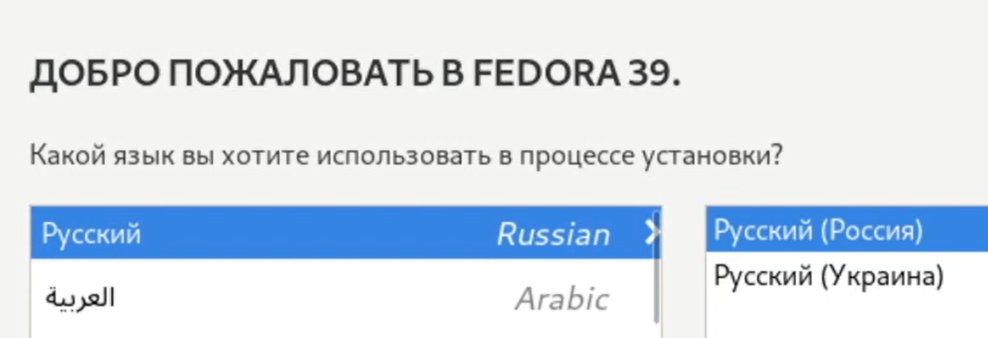{#fig:008 width=70%}

Выбираем часовой пояс и раскладку клавиатуры (рис. [-@fig:009]).

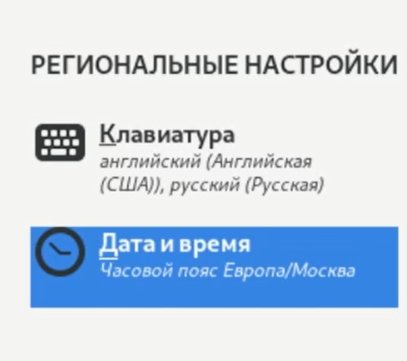{#fig:009 width=70%}

Место установки ОС оставляем без изменения (рис. [-@fig:010]).

{#fig:010 width=70%}

Задаём сетевое имя компьютера (рис. [-@fig:011]).

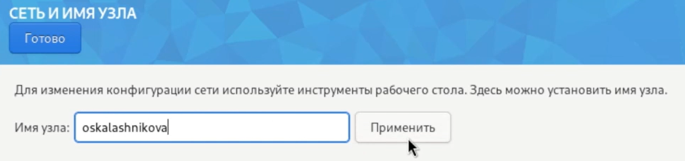{#fig:011 width=70%}

Установливаем имя и пароль для пользователя root (рис. [-@fig:012]).

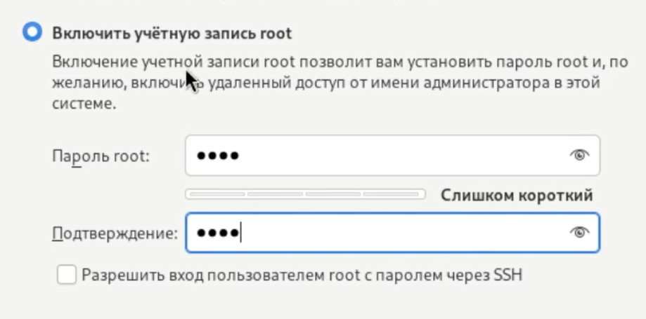{#fig:012 width=70%}

Установливаем имя и пароль для пользователя (рис. [-@fig:013]).

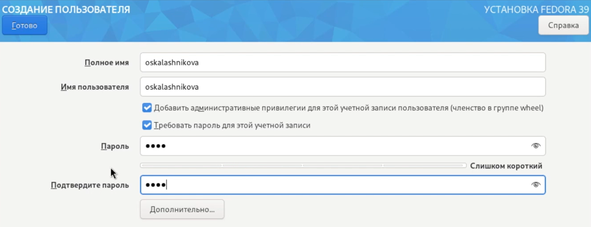{#fig:013 width=70%}

Все изменённые поля представлены на картинке ниже (рис. [-@fig:014]).

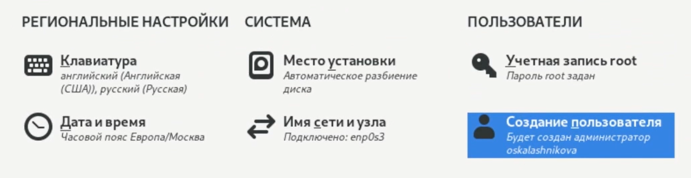{#fig:014 width=70%}

У меня оптический диск не отключается автоматически, так что отключаем носитель информации с образом (рис. [-@fig:015]).

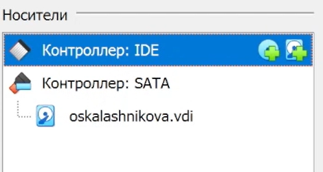{#fig:015 width=70%}

## Обновления

Для начала переключимся на роль супер-пользователя при помощи команды sudo -i (рис. [-@fig:016]).

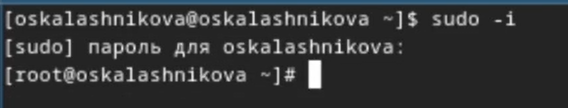{#fig:016 width=70%}

Обновляем все пакеты при помощи команды dnf -y update (рис. [-@fig:017]).

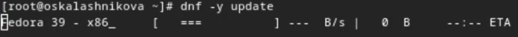{#fig:017 width=70%}

## Повышение комфорта работы

Устанавливаем программы для удобства работы в консоли при помощи dnf -y install tmux mc (рис. [-@fig:018]).

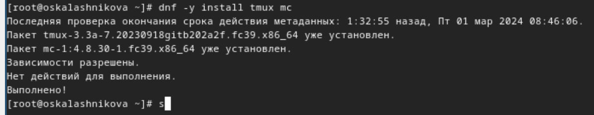{#fig:018 width=70%}

## Автоматическое обновление

Будем использовать автоматическое обновление. Установим программное обеспечение при помощи dnf install dnf-automatic (рис. [-@fig:019]).

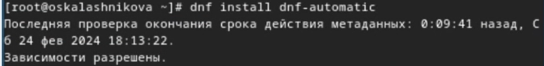{#fig:019 width=70%}

Теперь запускаем таймер при помощи команды systemctl enable --now dnf-automatic.timer  (рис. [-@fig:020]).

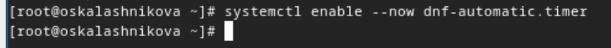{#fig:020 width=70%}

## Отключение SELinux

Сначала зайдём в mc (рис. [-@fig:021]).

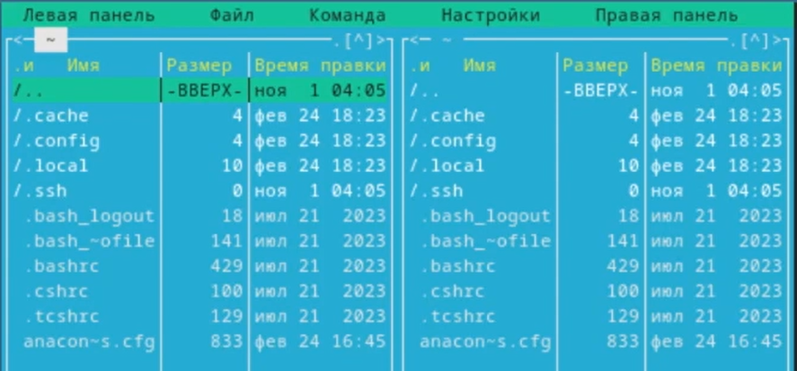{#fig:021 width=70%}

Затем в  файле /etc/selinux/config заменяем значение SELINUX=enforcing на значение SELINUX=permissive (рис. [-@fig:022]).

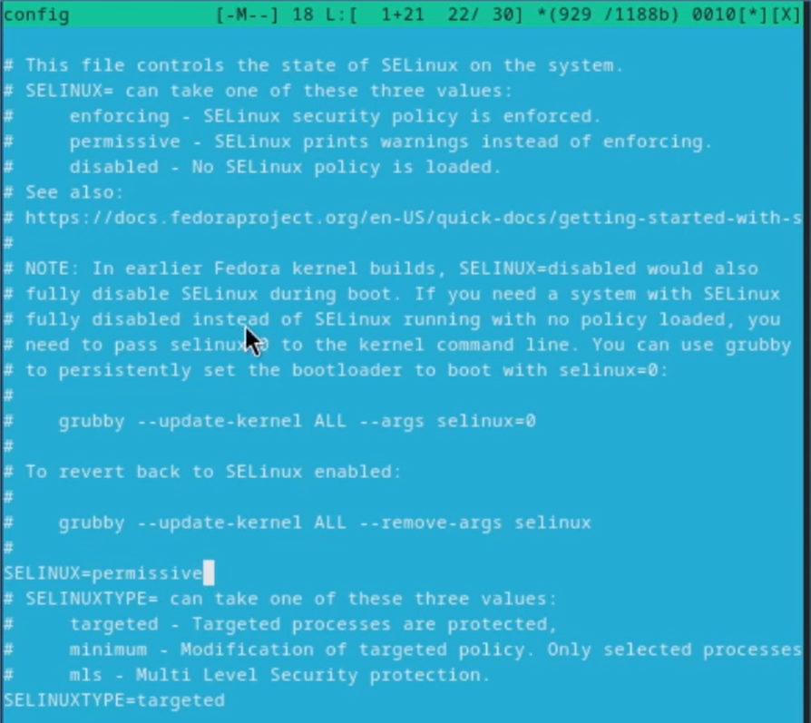{#fig:022 width=70%}

Теперь перезагружаем виртуальную машину (рис. [-@fig:023]).

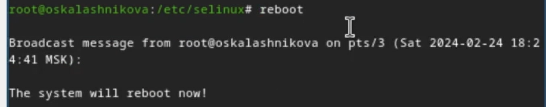{#fig:023 width=70%}

## Установка драйверов для VirtualBox

Запускаем терминальный мультиплексор tmux,переключаемся на рольсупер-пользователя при помощи sudo -i и устанавливаем средства разработки при помощи dnf -y group install "Development Tools" (рис. [-@fig:024]).

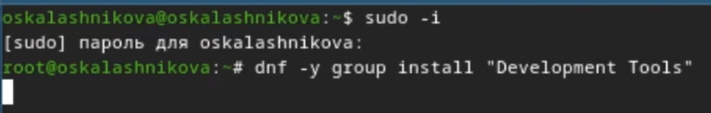{#fig:024 width=70%}

Теперь установим пакет DKMS при помощи dnf -y install dkms (рис. [-@fig:025]).

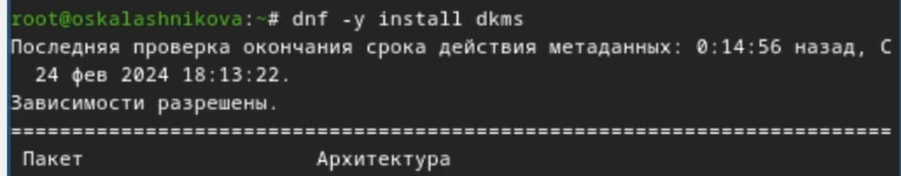{#fig:025 width=70%}

В меню виртуальной машины подключаем образ диска дополнений гостевой ОС (через меню у меня не работает, поэтому подключала вручную) (рис. [-@fig:026]).

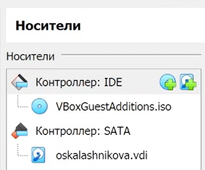{#fig:026 width=70%}

Подмонтируем диск при помощи mount /dev/sr0 /media (рис. [-@fig:027]).

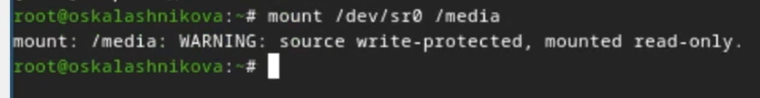{#fig:027 width=70%}

Устанавливаем драйвера при помощи /media/VBoxLinuxAdditions.run (рис. [-@fig:028]).

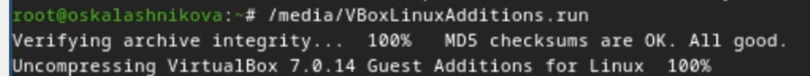{#fig:028 width=70%}

Перезагружаем виртуальную машину(reboot) (рис. [-@fig:029]).

{#fig:029 width=70%}

## Настройка раскладки клавиатуры

Запускаем терминальный мультиплексор tmux (рис. [-@fig:030]).

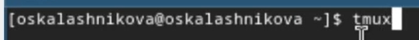{#fig:030 width=70%}

Создаём конфигурационный файл ~/.config/sway/config.d/95-system-keyboard-config.conf(для начала все нужные папки) (рис. [-@fig:031]).

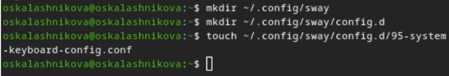{#fig:031 width=70%}

Переходим в папку с конфигурационным файлом ~/.config/sway/config.d/95-system-keyboard-config.conf (рис. [-@fig:032]).

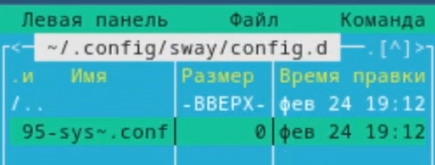{#fig:032 width=70%}

Отредактируем конфигурационный файл ~/.config/sway/config.d/95-system-keyboard-config.conf ( добавим в него exec_always /usr/libexec/sway-systemd/locale1-xkb-config --oneshot) (рис. [-@fig:033]).

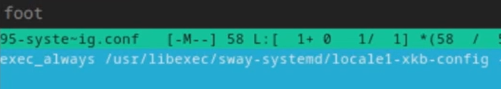{#fig:033 width=70%}

Переключимся на роль супер-пользователя при помощи sudo -i (рис. [-@fig:034]).

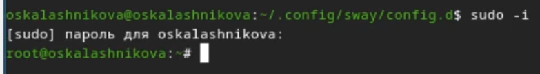{#fig:034 width=70%}

Преходим в папку с конфигурационным файлом /etc/X11/xorg.conf.d/00-keyboard.conf (рис. [-@fig:035]).

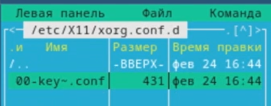{#fig:035 width=70%}

Отредактируем конфигурационный файл /etc/X11/xorg.conf.d/00-keyboard.conf (рис. [-@fig:036]).

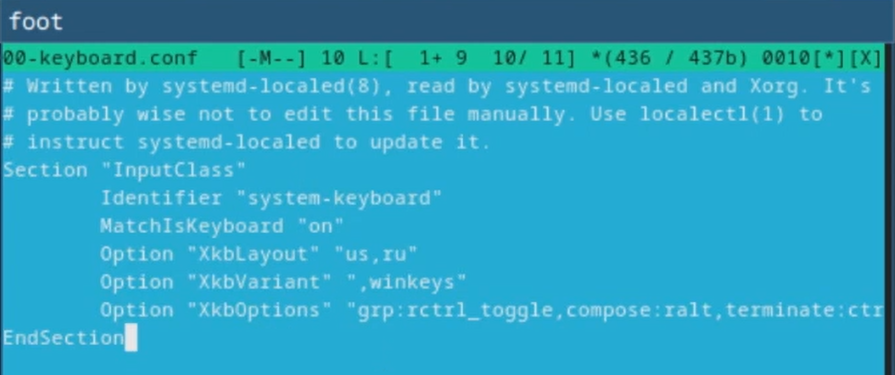{#fig:036 width=70%}

Перегружаем виртуальную машину при помощи reboot и проверяем смену языка (рис. [-@fig:037]).

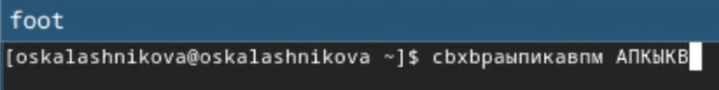{#fig:037 width=70%}

## Подключение общей папки

Внутри виртуальной машины добавляем своего пользователя в группу vboxsf при помощи gpasswd -a oskalashnikova vboxsf (рис. [-@fig:038]).

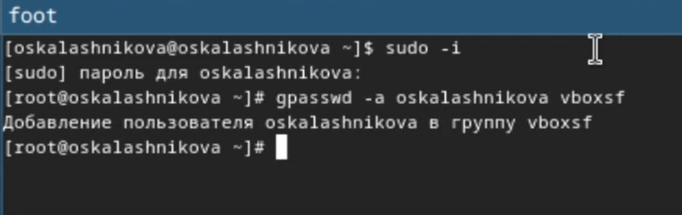{#fig:038 width=70%}

В хостовой системе подключаем разделяемую папку (у меня это windows и команда строится как на фото) (рис. [-@fig:039]).

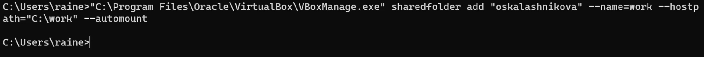{#fig:039 width=70%}

Проверяем подключилась ли папка (рис. [-@fig:040]).

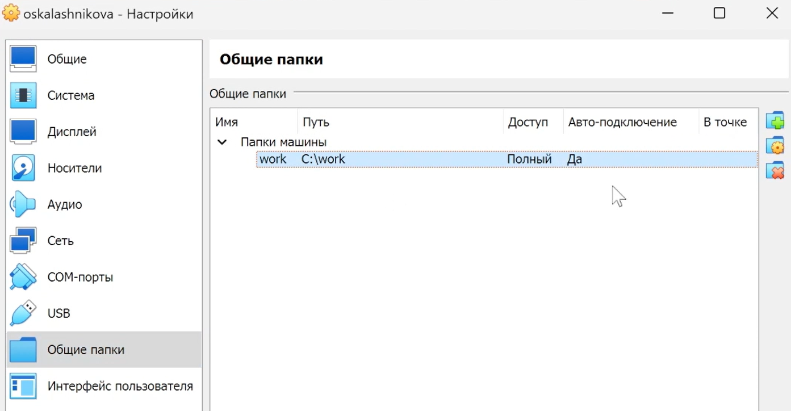{#fig:040 width=70%}

## Установка программного обеспечения для создания документации

Установливаем pandoc и pandoc-crossref вручную при помощи сайта(проверяем версии) (рис. [-@fig:041]).

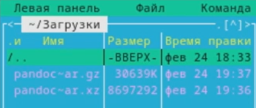{#fig:041 width=70%}

Распаковываем архивы (рис. [-@fig:042]).

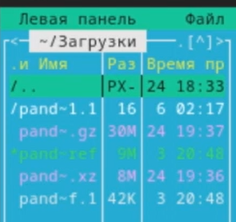{#fig:042 width=70%}

Помещаем файлы в каталог /usr/local/bin (рис. [-@fig:043]).

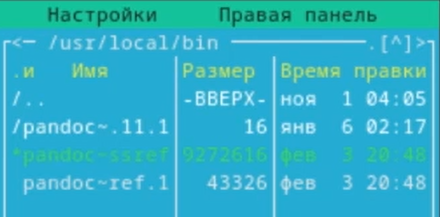{#fig:043 width=70%}

Установим дистрибутив TeXlive при помощи команды dnf -y install texlive-scheme-full (рис. [-@fig:044]).

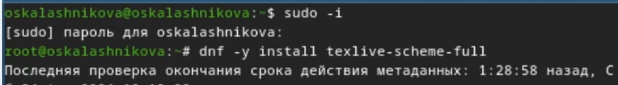{#fig:044 width=70%}

# Домашнее задание

Дождёмся загрузки графического окружения и откроем терминал. В окне терминала проанализируем последовательность загрузки системы, выполнив команду dmesg (рис. [-@fig:045]),(рис. [-@fig:046]).

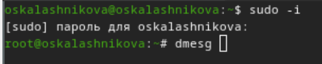{#fig:045 width=70%}

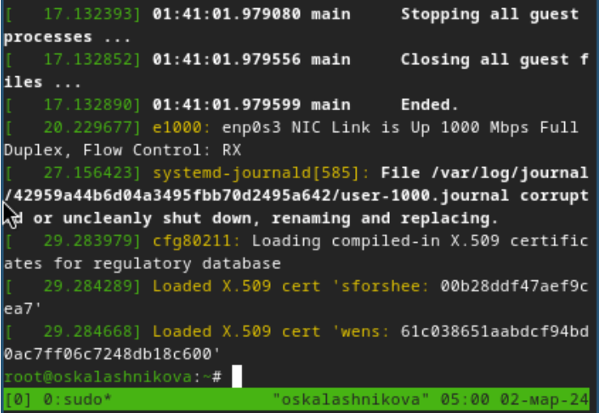{#fig:046 width=70%}

Можнем просто просмотреть вывод этой команды при помощи dmesg | less (рис. [-@fig:047]),(рис. [-@fig:048]).

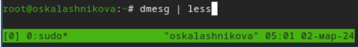{#fig:047 width=70%}

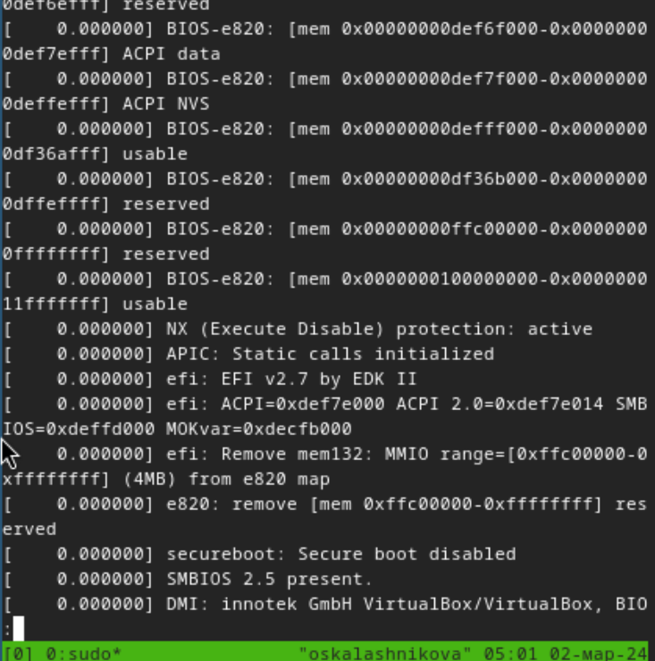{#fig:048 width=70%}

Используя поиск с помощью grep (dmesg | grep -i "то, что ищем") получите следующую информацию:

1. Версия ядра Linux (Linux version) (рис. [-@fig:049]).

{#fig:049 width=70%}

2. Частота процессора (Detected Mhz processor) (рис. [-@fig:050]).

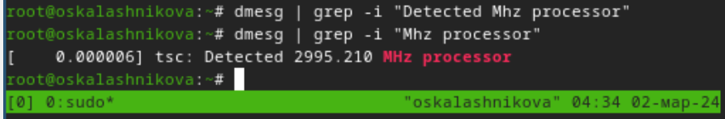{#fig:050 width=70%}

3. Модель процессора (CPU0) (рис. [-@fig:051]).

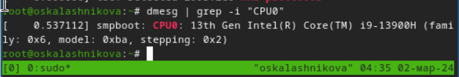{#fig:051 width=70%}

4. Объём доступной оперативной памяти (Memory available) (рис. [-@fig:052]).

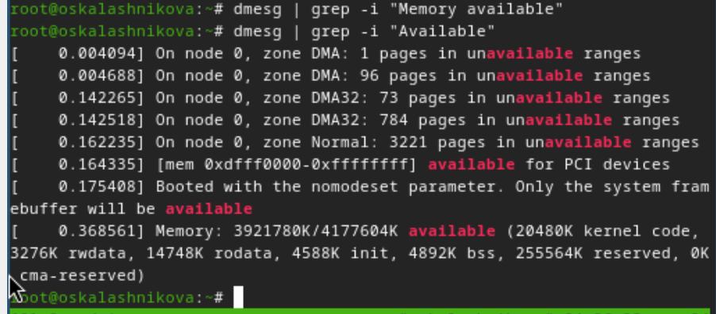{#fig:052 width=70%}

5. Тип обнаруженного гипервизора (Hypervisor detected) (рис. [-@fig:053]).

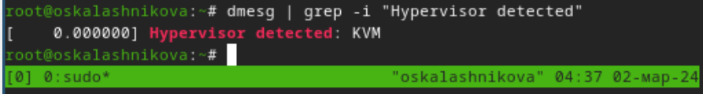{#fig:053 width=70%}

6. Тип файловой системы корневого раздела (рис. [-@fig:054]).

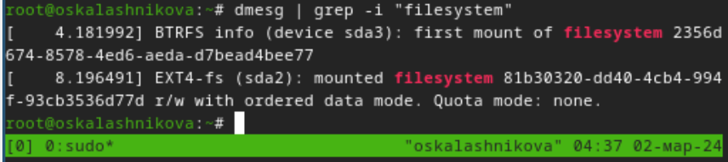{#fig:054 width=70%}

7.Последовательность монтирования файловых систем (рис. [-@fig:055]).

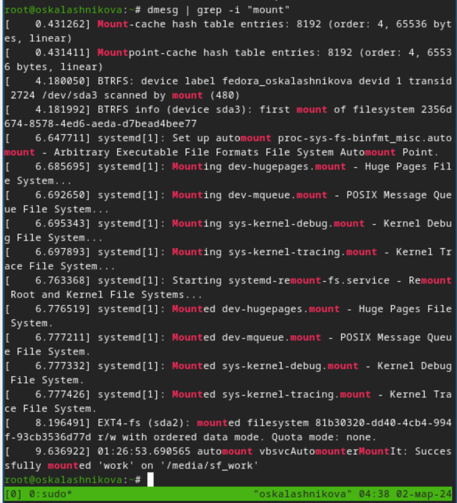{#fig:055 width=70%}

#Контрольные вопросы

1. Какую информацию содержит учётная запись пользователя?

Учетная запись пользователя – это необходимая для системы информация о пользователе, хранящаяся в специальных файлах. Информация используется Linux для аутентификации пользователя и назначения ему прав доступа.
Учетная запись пользователя обычно содержит информацию о самом пользователе, такую как имя, пароль, разрешения доступа, домашний каталог, идентификатор пользователя (UID) и группы (GID) и т.д.

2. Укажите команды терминала и приведите примеры

- для получения справки по команде

help (например help ls)

- для перемещения по файловой системе

cd (cd ~)

- для просмотра содержимого каталога

ls (ls -a)

- для определения объёма каталога

du (du -h/var)

- для создания / удаления каталогов / файлов

mkdir/-rmdir (mkdir ~/Doc)

touch/-rm (rm dinosavr.png)

- для задания определённых прав на файл / каталог

chmod (chmod 766 file)

- для просмотра истории команд

history (history -c)

3. Что такое файловая система? Приведите примеры с краткой характеристикой.

Linux поддерживает деление жесткого диска на разделы. Для подсчета и определения физических границ используется специальная таблица разделов — GPT или MBR. Она содержит метку и номер раздела, а также адреса физического расположения точек начала и конца раздела.Файловая система (ФС) — архитектура хранения данных, которые могут находиться в разделах жесткого диска и ОП. Выдает пользователю доступ к конфигурации ядра. Определяет, какую структуру принимают файлы в каждом из разделов, создает правила для их генерации, а также управляет файлами в соответствии с особенностями каждой конкретной ФС.FAT – одна из старых файловых систем, представленных Microsoft, не поддерживала шифрование, права пользователей к файлам и не имела возможности журналирования
EXT4 – Более современная файловая система, которая активно используется в linux, поддерживает журналирование, шифрование и права пользователей к файлам

4. Как посмотреть, какие файловые системы подмонтированы в ОС?

df

5. Как удалить зависший процесс?

kill

# Выводы

Я приобрела практические навыки установки операционной системы на виртуальную машину, настройки минимально необходимых для дальнейшей работы сервисов.

# Список литературы{.unnumbered}

https://selectel.ru/blog/directory-structure-linux/

https://intuit.ru/studies/courses/23/23/lecture/27143

туис

::: {#refs}
:::
