---
## Front matter
lang: ru-RU
title: Лабораторная работа №2
subtitle: Операционные системы
author:
  - Калашникова Ольга Сергеевна НПИбд-01-23
institute:
  - Российский университет дружбы народов, Москва, Россия
date: 02 марта 2024

## i18n babel
babel-lang: russian
babel-otherlangs: english

## Formatting pdf
toc: false
toc-title: Содержание
slide_level: 2
aspectratio: 169
section-titles: true
theme: metropolis
header-includes:
 - \metroset{progressbar=frametitle,sectionpage=progressbar,numbering=fraction}
 - '\makeatletter'
 - '\beamer@ignorenonframefalse'
 - '\makeatother'

## Fonts 
mainfont: PT Serif 
romanfont: PT Serif 
sansfont: PT Sans 
monofont: PT Mono 
mainfontoptions: Ligatures=TeX 
romanfontoptions: Ligatures=TeX 
sansfontoptions: Ligatures=TeX,Scale=MatchLowercase 
monofontoptions: Scale=MatchLowercase,Scale=0.9

---

## Цель работы

Целью данной работы является изучитение идеологии и применение средств контроля версий, а так же освоение умения по работе с git.

## Задание

1. Создать базовую конфигурацию для работы с git.
2. Создать ключ SSH.
3. Создать ключ PGP.
4. Настроить подписи git.
5. Зарегистрироваться на Github.
6. Создать локальный каталог для выполнения заданий по предмету.

## Установка программного обеспечения

Установим git при помощи dnf install git, а так же установим gh при помощи dnf install gh (в моём случае програмное обспечение уже установлено, так как вышло не с первого раза) (рис. 1).

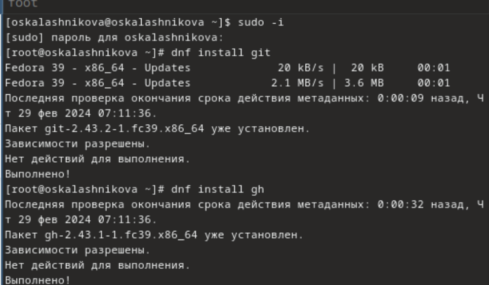{#fig:001 width=40%} 

## Базовая настройка git

Зададим имя владельца репозитория при помощи git config --global user.name "lacrimell" и email при помощи git config --global user.email "lacrimell@yandex.by" (рис. 2).

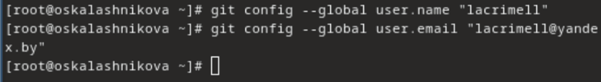{#fig:002 width=40%}

## Базовая настройка git

Настроим utf-8 в выводе сообщений git при помощи git config --global core.quotepath false (рис.3).

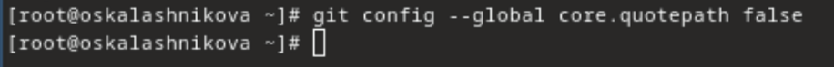{#fig:003 width=40%}

## Базовая настройка git

Зададим имя начальной ветки (будем называть её master) при помощи git config --global init.defaultBranch master, далее параметр autocrlf с помощью git config --global core.autocrlf input и параметр safecrlf при помощи git config --global core.safecrlf warn (рис.4).

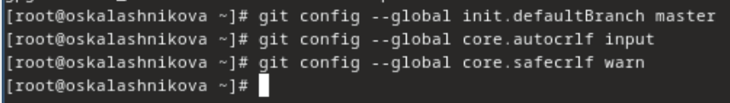{#fig:004 width=50%}

## Создайте ключи ssh

Gо алгоритму rsa с ключём размером 4096 бит создаём ключ ssh при помощи ssh-keygen -t rsa -b 4096, а  по алгоритму ed25519 с  ssh-keygen -t ed25519 (рис.5).

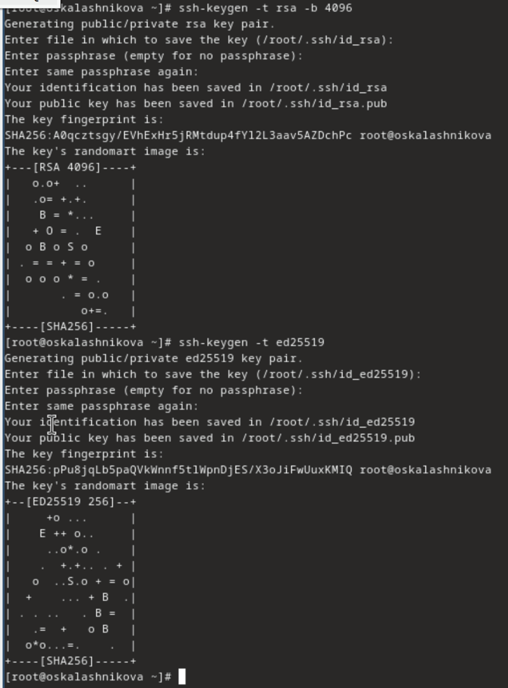{#fig:005 width=30%}

## Создайте ключи pgp

Генерируем ключ при помощи gpg --full-generate-key и выбираем тип RSA and RSA, размер 4096,срок действия не истекает никогда (рис.6).

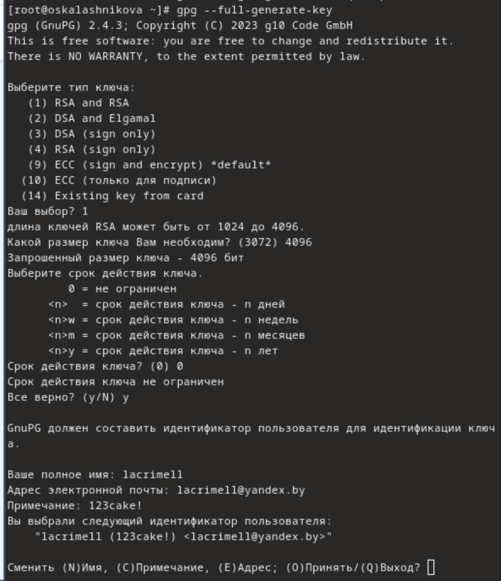{#fig:006 width=30%}

## Создайте ключи pgp

Вводим имя, адрес почты используемый на GitHub.Я так же ввела комментарий, чтобы не забыть пароль (рис. 7).

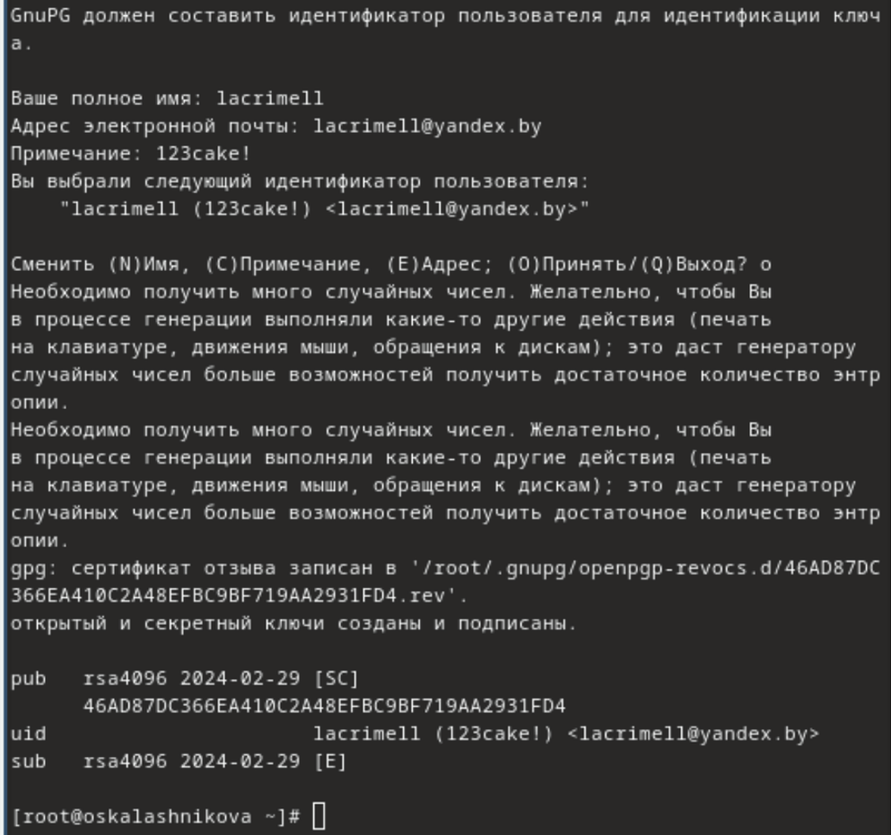{#fig:007 width=40%}

## Добавление PGP ключа в GitHub

У меня уже была создана учетная запись и заполнены основные данные на https://github.com, так что я перешла сразу к выводу список ключей при помощи gpg --list-secret-keys --keyid-format LONG (рис. 8).

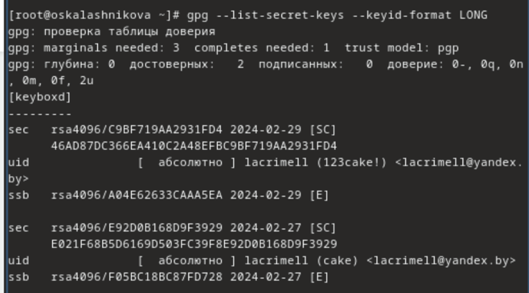{#fig:008 width=40%}

## Добавление PGP ключа в GitHub

Далее мы должны скопируйте сгенерированный PGP ключ в буфер обмена при помощи gpg --armor --export <PGP Fingerprint> | xclip -sel clip, но данная команда у меня не сработала и я копировала вручную (рис.9).

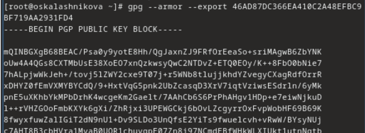{#fig:009 width=40%}

## Добавление PGP ключа в GitHub

Переходим в настройки GitHub (https://github.com/settings/keys), нажимаем на кнопку New GPG key и вставляем полученный ключ в поле ввода (рис.10).

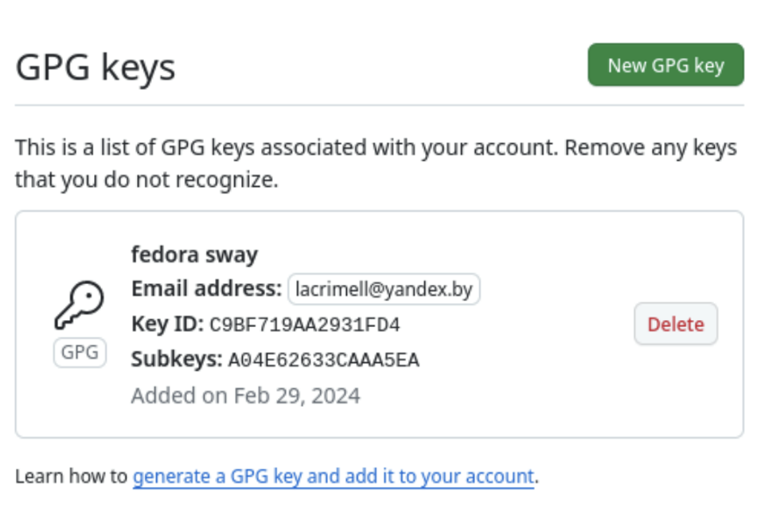{#fig:010 width=40%}

## Настройка автоматических подписей коммитов git

Используя введёный email, указываем Git применять его при подписи коммитов с помощью git config --global user.signingkey <PGP Fingerprint>, git config --global commit.gpgsign true,git config --global gpg.program $(which gpg2) (рис.11).

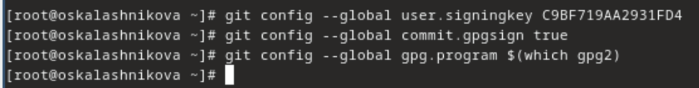{#fig:011 width=40%}

## Настройка gh

Авторизируемся при помощи gh auth login. Утилита задаёт несколько наводящих вопросов, после авторизируемся через браузер (рис.12).

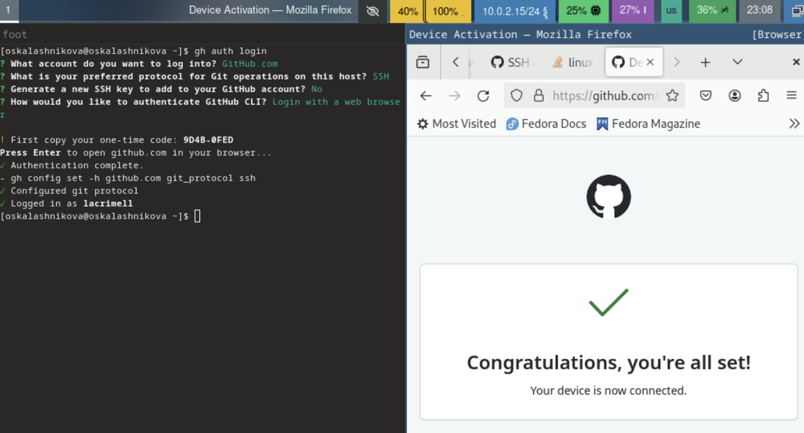{#fig:012 width=40%}

## Сознание репозитория курса на основе шаблона

Cоздаём папку при помощи mkdir -p ~/work/study/2023-2024/"Операционные системы" и переходим в неё cd ~/work/study/2023-2024/"Операционные системы" (рис.13).

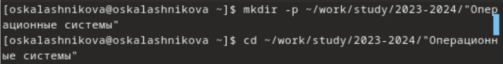{#fig:013 width=40%}

## Сознание репозитория курса на основе шаблона

Создаём репозиторий gh repo create study_2023-2024_os-intro --template=yamadharma/course-directory-student-template --public (рис.14).

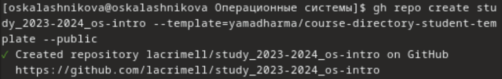{#fig:014 width=40%}

## Сознание репозитория курса на основе шаблона

Клонируем его на виртуальную машину git clone --recursive git@github.com:oskalashnikova/study_2023-2024_os-intro.git os-intro (рис.15).

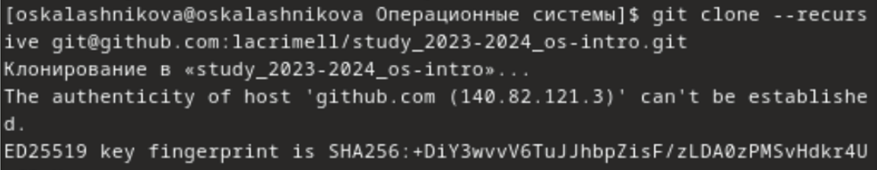{#fig:015 width=40%}

## Сознание репозитория курса на основе шаблона

Проверяем с помощью mc (рис.16).

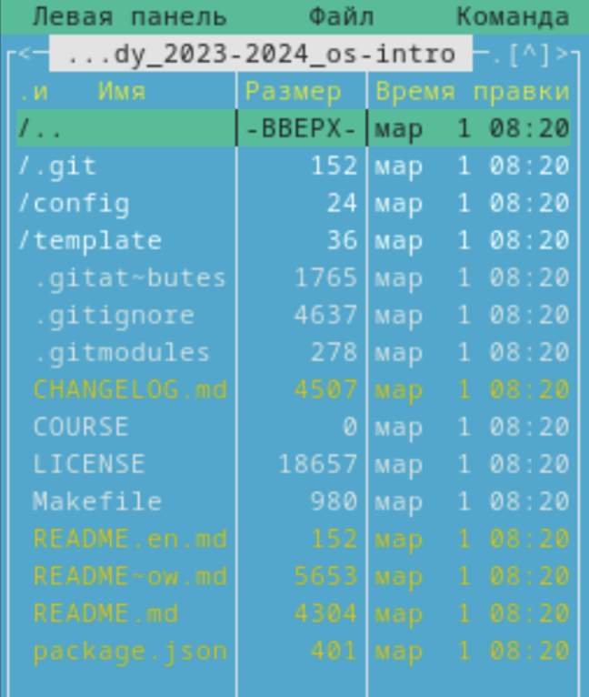{#fig:016 width=30%}

## Настройка каталога курса

Переходим в каталог курса при помощи cd ~/work/study/2022-2023/"Операционные системы"/os-intro и удаляем лишние файлы с помощью rm package.json (рис.17).

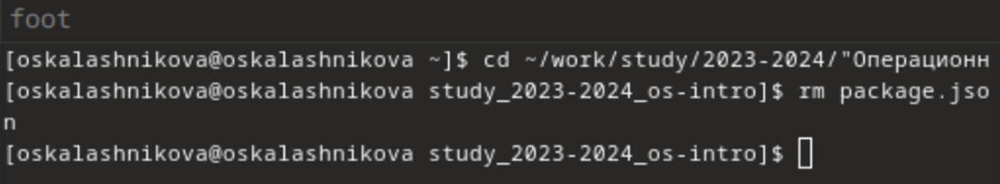{#fig:017 width=40%}

## Настройка каталога курса

Проверяем, удалился ли файл (рис.18).

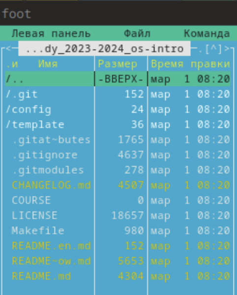{#fig:018 width=30%}

## Настройка каталога курса

Создаём необходимые каталоги при помощи echo os-intro > COURSE (рис.19).

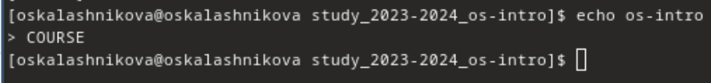{#fig:019 width=40%}

## Настройка каталога курса

Проверяем создался ли (рис.20).

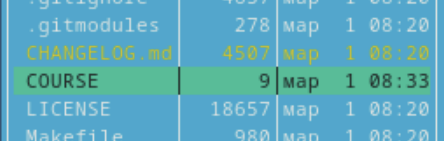{#fig:020 width=40%}

## Настройка каталога курса

Используем make (рис.21).

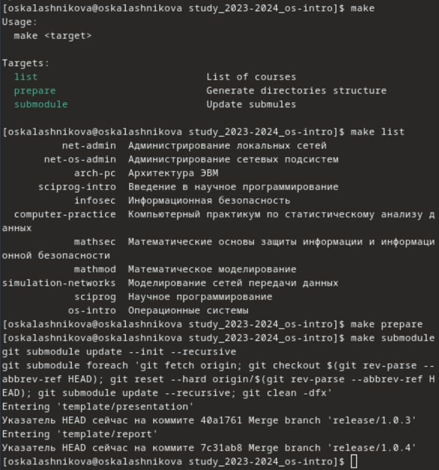{#fig:021 width=40%}

## Настройка каталога курса

Отправляем файлы на сервер 1 (рис.22).

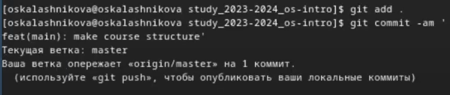{#fig:022 width=40%}

## Настройка каталога курса

Отправляем файлы на сервер 2 (рис.23).

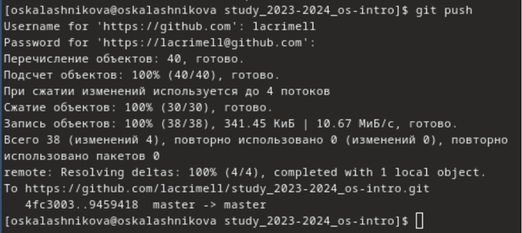{#fig:023 width=40%}

## Выводы

Я изучила идеологию и применение средств контроля версий, атак же освоила умения по работе с git

## Список литературы{.unnumbered}

https://git-scm.com/book/ru/v2/Основы-Git-Работа-с-удалёнными-репозиториями

https://devpractice.ru/git-for-beginners-part-1-what-is-vcs/

https://blog.skillfactory.ru/glossary/git/

туис

::: {#refs}
:::