---
## Front matter
title: "Отчёт по лабораторной работе №2"
subtitle: "Операционные системы"
author: "Калашникова Ольга Сергеевна"

## Generic otions
lang: ru-RU
toc-title: "Содержание"

## Bibliography
bibliography: bib/cite.bib
csl: pandoc/csl/gost-r-7-0-5-2008-numeric.csl

## Pdf output format
toc: true # Table of contents
toc-depth: 2
lof: true # List of figures
lot: true # List of tables
fontsize: 12pt
linestretch: 1.5
papersize: a4
documentclass: scrreprt
## I18n polyglossia
polyglossia-lang:
  name: russian
  options:
	- spelling=modern
	- babelshorthands=true
polyglossia-otherlangs:
  name: english
## I18n babel
babel-lang: russian
babel-otherlangs: english
## Fonts
mainfont: PT Serif
romanfont: PT Serif
sansfont: PT Sans
monofont: PT Mono
mainfontoptions: Ligatures=TeX
romanfontoptions: Ligatures=TeX
sansfontoptions: Ligatures=TeX,Scale=MatchLowercase
monofontoptions: Scale=MatchLowercase,Scale=0.9
## Biblatex
biblatex: true
biblio-style: "gost-numeric"
biblatexoptions:
  - parentracker=true
  - backend=biber
  - hyperref=auto
  - language=auto
  - autolang=other*
  - citestyle=gost-numeric
## Pandoc-crossref LaTeX customization
figureTitle: "Рис."
tableTitle: "Таблица"
listingTitle: "Листинг"
lofTitle: "Список иллюстраций"
lotTitle: "Список таблиц"
lolTitle: "Листинги"
## Misc options
indent: true
header-includes:
  - \usepackage{indentfirst}
  - \usepackage{float} # keep figures where there are in the text
  - \floatplacement{figure}{H} # keep figures where there are in the text
---

# Цель работы

Целью данной работы является изучитение идеологии и применение средств контроля версий, а так же освоение умения по работе с git.

# Задание

1. Создать базовую конфигурацию для работы с git.
2. Создать ключ SSH.
3. Создать ключ PGP.
4. Настроить подписи git.
5. Зарегистрироваться на Github.
6. Создать локальный каталог для выполнения заданий по предмету.

# Выполнение лабораторной работы

## Установка программного обеспечения

Установим git при помощи dnf install git, а так же установим gh при помощи dnf install gh (в моём случае програмное обспечение уже установлено, так как вышло не с первого раза) (рис. [-@fig:001]).

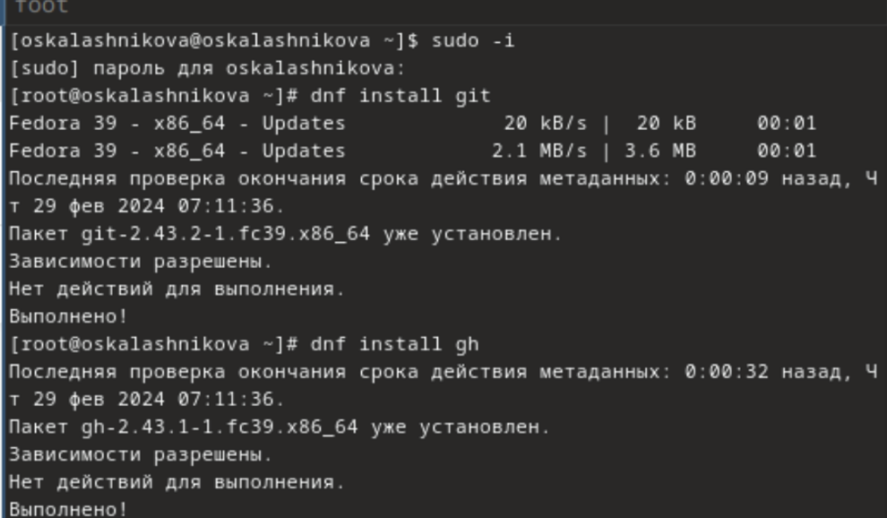{#fig:001 width=70%} 

## Базовая настройка git

Зададим имя владельца репозитория при помощи git config --global user.name "lacrimell" и email при помощи git config --global user.email "lacrimell@yandex.by" (рис. [-@fig:002]).

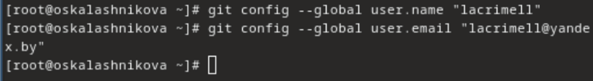{#fig:002 width=70%} 

Настроим utf-8 в выводе сообщений git при помощи git config --global core.quotepath false (рис. [-@fig:003]).

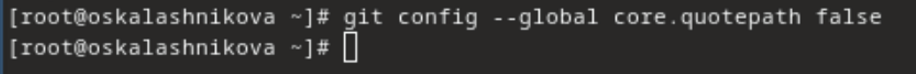{#fig:003 width=70%}

Зададим имя начальной ветки (будем называть её master) при помощи git config --global init.defaultBranch master, далее параметр autocrlf с помощью git config --global core.autocrlf input и параметр safecrlf при помощи git config --global core.safecrlf warn (рис. [-@fig:004]).

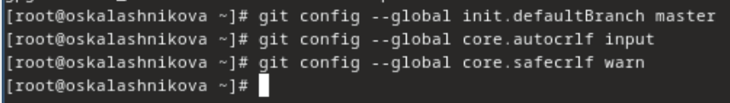{#fig:004 width=70%}

## Создайте ключи ssh

Gо алгоритму rsa с ключём размером 4096 бит создаём ключ ssh при помощи ssh-keygen -t rsa -b 4096, а  по алгоритму ed25519 с  ssh-keygen -t ed25519 (рис. [-@fig:005]).

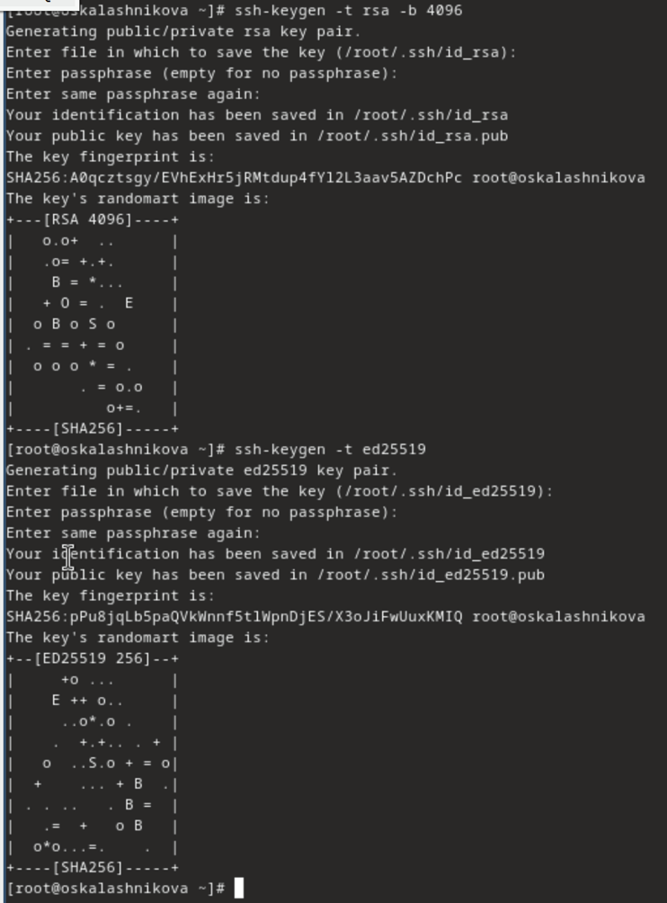{#fig:005 width=70%}

## Создайте ключи pgp

Генерируем ключ при помощи gpg --full-generate-key и выбираем тип RSA and RSA, размер 4096,срок действия не истекает никогда (рис. [-@fig:006]).

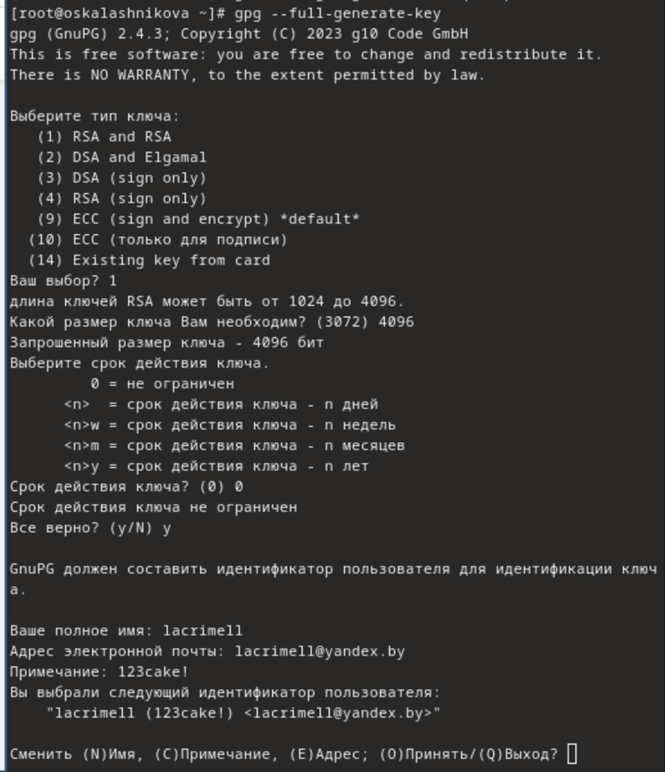{#fig:006 width=70%}

Вводим имя, адрес почты используемый на GitHub.Я так же ввела комментарий, чтобы не забыть пароль (рис. [-@fig:007]).

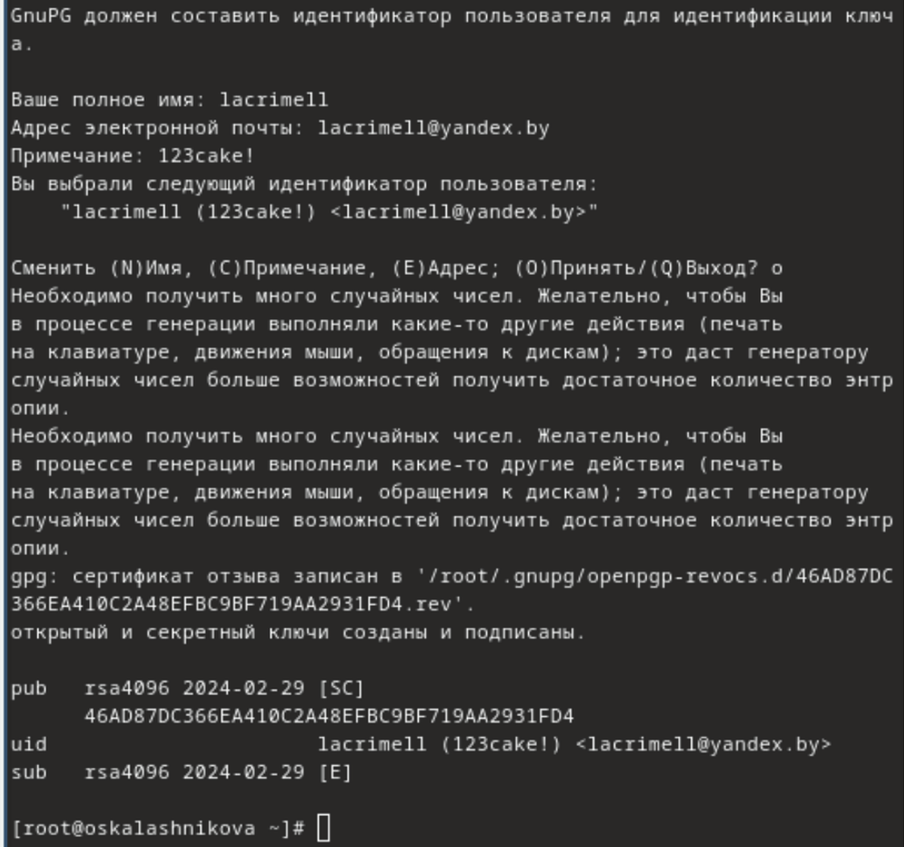{#fig:007 width=70%}

## Добавление PGP ключа в GitHub

У меня уже была создана учетная запись и заполнены основные данные на https://github.com, так что я перешла сразу к выводу список ключей при помощи gpg --list-secret-keys --keyid-format LONG (рис. [-@fig:008]).

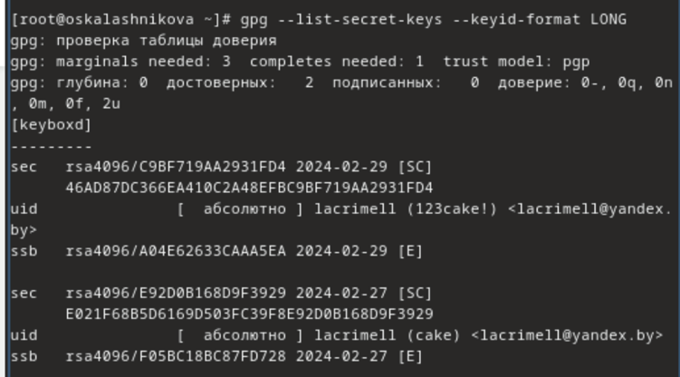{#fig:008 width=70%}

Далее мы должны скопируйте сгенерированный PGP ключ в буфер обмена при помощи gpg --armor --export <PGP Fingerprint> | xclip -sel clip, но данная команда у меня не сработала и я копировала вручную (рис. [-@fig:009]).

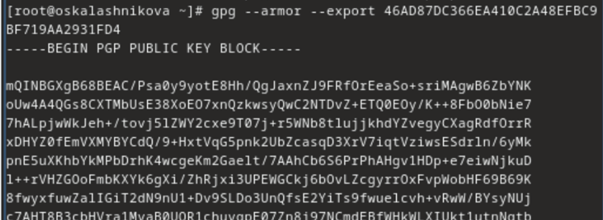{#fig:009 width=70%}

Переходим в настройки GitHub (https://github.com/settings/keys), нажимаем на кнопку New GPG key и вставляем полученный ключ в поле ввода (рис. [-@fig:010]).

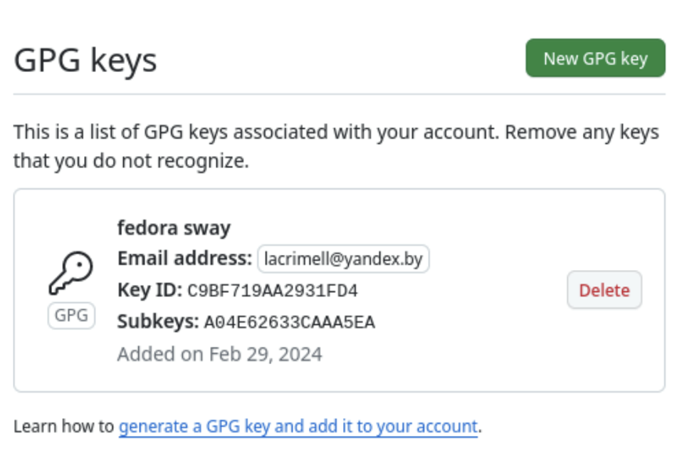{#fig:010 width=70%}

##Настройка автоматических подписей коммитов git

Используя введёный email, указываем Git применять его при подписи коммитов с помощью git config --global user.signingkey <PGP Fingerprint>, git config --global commit.gpgsign true,git config --global gpg.program $(which gpg2) (рис. [-@fig:011]).

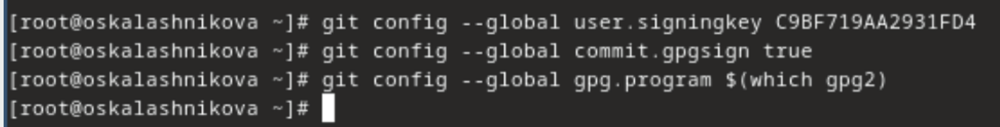{#fig:011 width=70%}

## Настройка gh

Авторизируемся при помощи gh auth login. Утилита задаёт несколько наводящих вопросов, после авторизируемся через браузер (рис. [-@fig:012]).

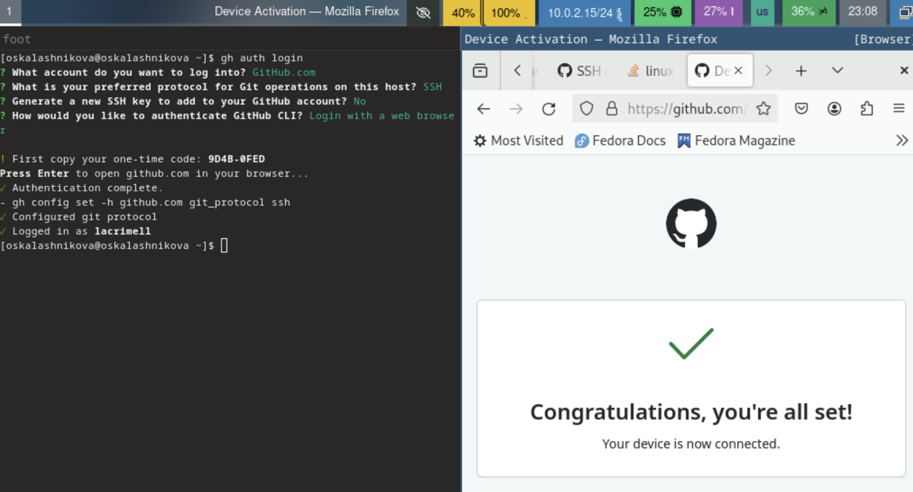{#fig:012 width=70%}

## Сознание репозитория курса на основе шаблона

Cоздаём папку при помощи mkdir -p ~/work/study/2023-2024/"Операционные системы" и переходим в неё cd ~/work/study/2023-2024/"Операционные системы" (рис. [-@fig:013]).

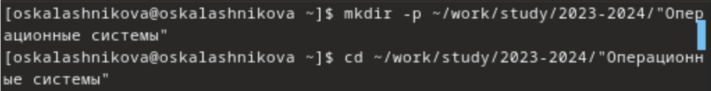{#fig:013 width=70%}

Создаём репозиторий gh repo create study_2023-2024_os-intro --template=yamadharma/course-directory-student-template --public (рис. [-@fig:014]).

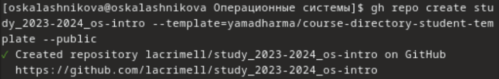{#fig:014 width=70%}

Клонируем его на виртуальную машину git clone --recursive git@github.com:oskalashnikova/study_2023-2024_os-intro.git os-intro (рис. [-@fig:015]).

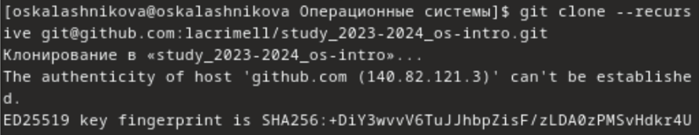{#fig:015 width=70%}

Проверяем с помощью mc (рис. [-@fig:016]).

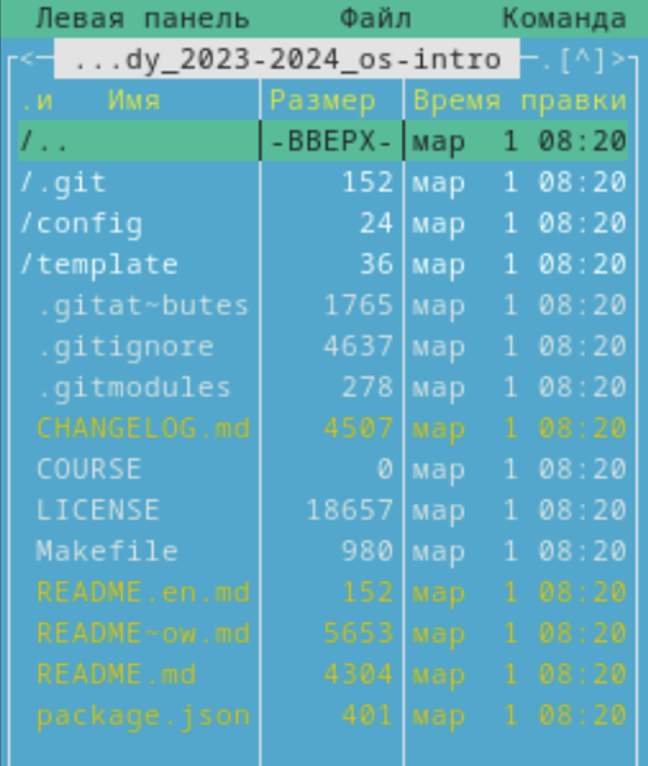{#fig:016 width=70%}

## Настройка каталога курса

Переходим в каталог курса при помощи cd ~/work/study/2022-2023/"Операционные системы"/os-intro и удаляем лишние файлы с помощью rm package.json (рис. [-@fig:017]).

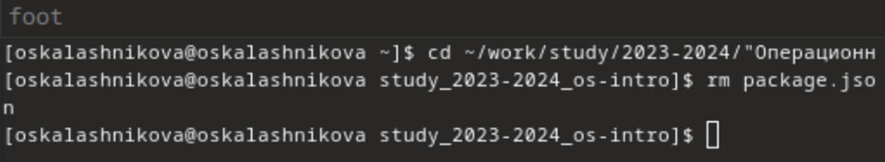{#fig:017 width=70%}

Проверяем, удалился ли файл (рис. [-@fig:018]).

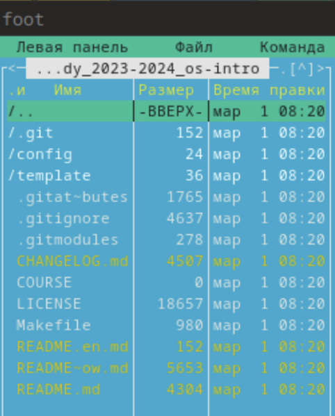{#fig:018 width=70%}

Создаём необходимые каталоги при помощи echo os-intro > COURSE (рис. [-@fig:019]).

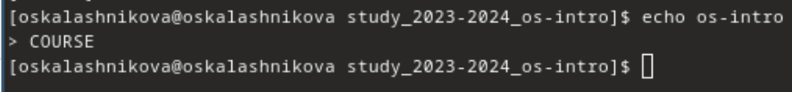{#fig:019 width=70%}

Проверяем создался ли (рис. [-@fig:020]).

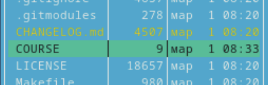{#fig:020 width=70%}

Используем make (рис. [-@fig:021]).

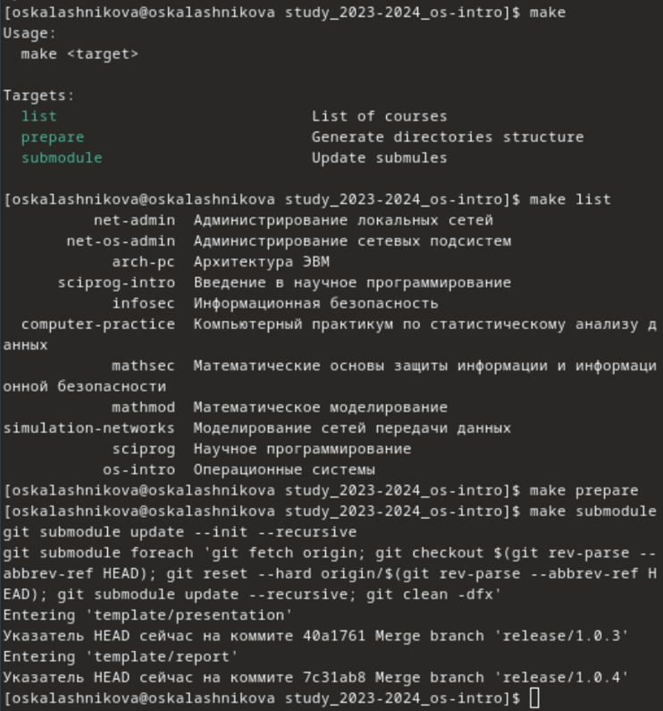{#fig:021 width=70%}

Отправляем файлы на сервер (рис. [-@fig:022]), (рис. [-@fig:023]).

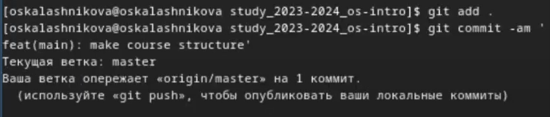{#fig:022 width=70%}

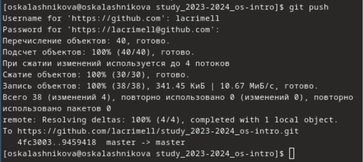{#fig:023 width=70%}

# Контрольные вопросы

1. Что такое системы контроля версий (VCS) и для решения каких задач они предназначаются?
Системы контроля версий (VCS) позволяют хранить проекты, отслеживать изменения, управлять релизами и контролировать версии проектов. Они могут использоваться для индивидуальной и командной работы, обеспечивая контроль над изменениями и возможность отката к предыдущим версиям.

2. Объясните следующие понятия VCS и их отношения: хранилище, commit, история, рабочая копия.
 - Хранилище: это репозиторий, где хранятся все файлы и версии проекта.
   - Commit: это фиксация изменений в репозитории.
   - История: представляет собой запись изменений файлов проекта.
   - Рабочая копия: это копия репозитория, с которой работает разработчик.

3. Что представляют собой и чем отличаются централизованные и децентрализованные VCS? Приведите примеры VCS каждого вида.
Централизованные VCS имеют один центральный репозиторий, в то время как децентрализованные VCS позволяют использовать несколько репозиториев и объединять изменения между ними. Примеры: CVS (централизованная) и Git (децентрализованная).

4. Опишите действия с VCS при единоличной работе с хранилищем.
Создается репозиторий, в котором разрабатывается проект. После внесения изменений файлы добавляются в репозиторий.

5. Опишите порядок работы с общим хранилищем VCS.
Разработчик клонирует репозиторий, вносит изменения, фиксирует их, и выгружает на сервер. Разработчики могут объединять свои версии в общем репозитории.

6. Каковы основные задачи, решаемые инструментальным средством git?
Git предназначен для хранения файлов проекта, контроля версий, обеспечения командной работы и отслеживания изменений.

7. Назовите и дайте краткую характеристику командам git.
- git clone: клонирует проект с сервера на компьютер.
- git add: добавляет файлы для выгрузки на сервер.
- git commit: фиксирует изменения репозитория.
- git push: выгружает изменения на сервер.
- git pull: получает изменения с сервера.
- git rm: удаляет файл.
- git status: отображает статус репозитория.

8. Приведите примеры использования при работе с локальным и удалённым репозиториями.
- Локальный: git commit -am "added files" — создает коммит.
- Удаленный: git push — отправляет данные на удаленный сервер.

9. Что такое и зачем могут быть нужны ветви (branches)?
Как и зачем можно игнорировать некоторые файлы при commit?

Ветви (branches) представляют собой независимые линии разработки, позволяющие параллельно вносить изменения в проект, которые могут быть объединены позднее.

10. Как и зачем можно игнорировать некоторые файлы при commit?
Игнорировать файлы можно, добавив их в .gitignore. Это полезно, когда не нужно добавлять определенные файлы в репозиторий, например, файлы виртуального окружения (например, venv).

# Выводы

Я изучила идеологию и применение средств контроля версий, а так же освоила умения по работе с git

# Список литературы{.unnumbered}

https://git-scm.com/book/ru/v2/Основы-Git-Работа-с-удалёнными-репозиториями

https://devpractice.ru/git-for-beginners-part-1-what-is-vcs/

https://blog.skillfactory.ru/glossary/git/

туис

::: {#refs}
:::
