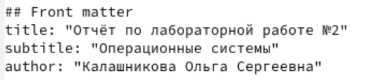
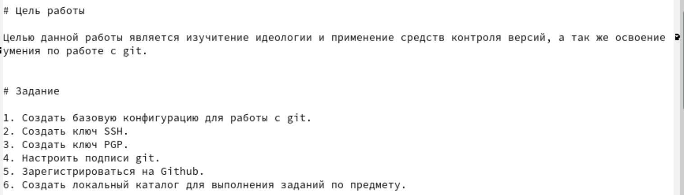
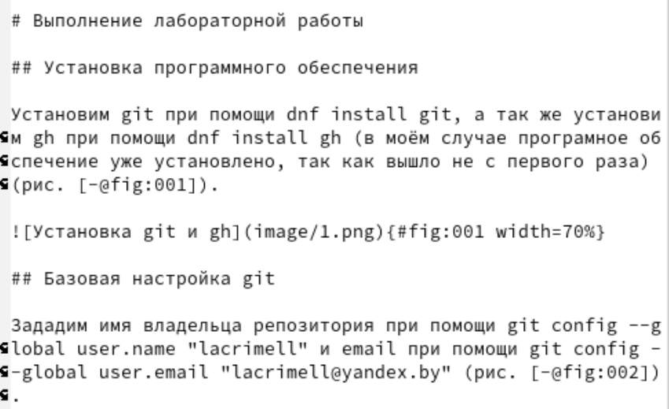
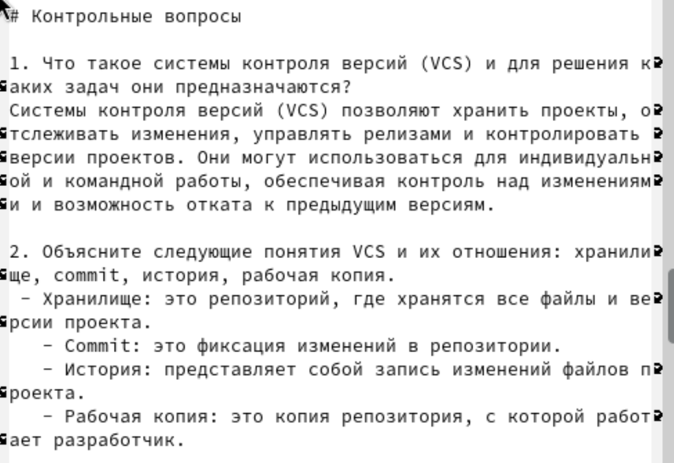
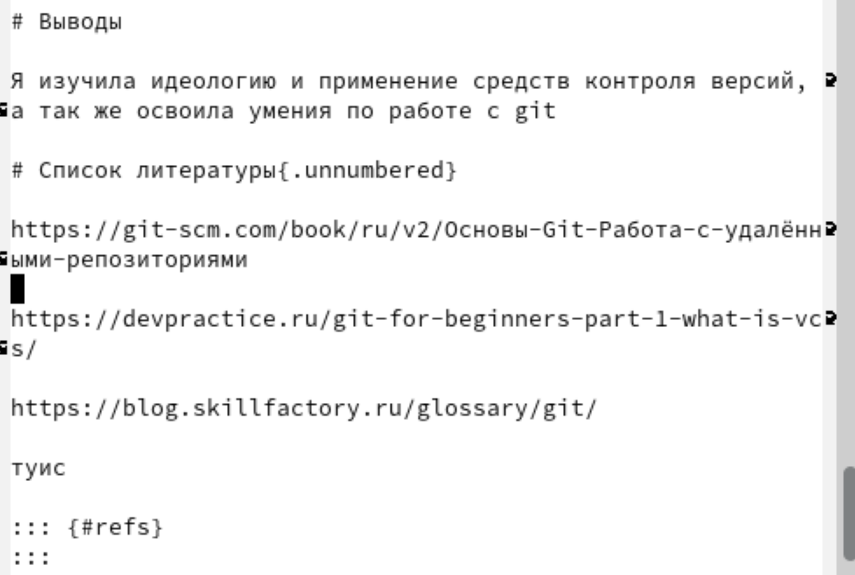

---
## Front matter
lang: ru-RU
title: Лабораторная работа №2
subtitle: Операционные системы
author:
  - Калашникова Ольга Сергеевна НПИбд-01-23
institute:
  - Российский университет дружбы народов, Москва, Россия
date: 02 марта 2024

## i18n babel
babel-lang: russian
babel-otherlangs: english

## Formatting pdf
toc: false
toc-title: Содержание
slide_level: 2
aspectratio: 169
section-titles: true
theme: metropolis
header-includes:
 - \metroset{progressbar=frametitle,sectionpage=progressbar,numbering=fraction}
 - '\makeatletter'
 - '\beamer@ignorenonframefalse'
 - '\makeatother'

## Fonts 
mainfont: PT Serif 
romanfont: PT Serif 
sansfont: PT Sans 
monofont: PT Mono 
mainfontoptions: Ligatures=TeX 
romanfontoptions: Ligatures=TeX 
sansfontoptions: Ligatures=TeX,Scale=MatchLowercase 
monofontoptions: Scale=MatchLowercase,Scale=0.9

---

## Цель работы

После выполнения данной работы мы должны научиться оформлять отчёты с помощью легковесного языка разметки Markdown.

## Задание

- Сделайте отчёт по предыдущей лабораторной работе в формате Markdown.
– В качестве отчёта просьба предоставить отчёты в 3 форматах: pdf, docx и md (в архиве, поскольку он должен содержать скриншоты, Makefile и т.д.)

## Выполнение лабораторной работы

Начинаем оформление с заголовка. Вписываем какая лабораторная работа, дисциплину и Имя. Это будет наш титульник(рис.1).

{#fig:001 width=40%}

## Выполнение лабораторной работы

Заполняем цель работы и задание. Для обозначения абзацев выделяем пустую строку. Для создания пронумерованного списка, ставим номер, точку и пробел перед текстом (рис.2).

{#fig:002 width=40%}

## Выполнение лабораторной работы

Переходим к оформлению основной части. Для подзаголовка использвуем два символа октоторп. Картинки вставляем при помощи способа, указанного в примере (изображения которые мы вставляем должны находиться в указанной папке). (рис.3).

{#fig:003 width=40%}

## Выполнение лабораторной работы

Далее оформляем контрольные вопросы, я использую пронумерованный список и обычный, он задаётся при помощи "- " (рис.4).

{#fig:004 width=40%}

## Выполнение лабораторной работы

В завершении работы пишем вывод и источники. Ссылки на источники можно вставить в файл bib (рис.5).

{#fig:005 width=40%}

## Выводы

Я научилась оформлять отчёты с помощью легковесного языка разметки Markdown.

## Список литературы{.unnumbered}

::: {#refs}
:::
