---
## Front matter
lang: ru-RU
title: Лабораторная работа №4
subtitle: Операционные системы
author:
  - Калашникова Ольга Сергеевна НПИбд-01-23
institute:
  - Российский университет дружбы народов, Москва, Россия
date: 09 марта 2024

## i18n babel
babel-lang: russian
babel-otherlangs: english

## Formatting pdf
toc: false
toc-title: Содержание
slide_level: 2
aspectratio: 169
section-titles: true
theme: metropolis
header-includes:
 - \metroset{progressbar=frametitle,sectionpage=progressbar,numbering=fraction}
 - '\makeatletter'
 - '\beamer@ignorenonframefalse'
 - '\makeatother'

## Fonts 
mainfont: PT Serif 
romanfont: PT Serif 
sansfont: PT Sans 
monofont: PT Mono 
mainfontoptions: Ligatures=TeX 
romanfontoptions: Ligatures=TeX 
sansfontoptions: Ligatures=TeX,Scale=MatchLowercase 
monofontoptions: Scale=MatchLowercase,Scale=0.9

---

## Цель работы

Целью данной работы является получение навыков правильной работы с репозиториями git.

## Задание

1. Выполнить работу для тестового репозитория.

2. Преобразовать рабочий репозиторий в репозиторий с git-flow и conventional commits.

## Установка git-flow

Установка из коллекции репозиториев Copr.Для начала включаем репозиторий corp при помощи команды dnf copr enable elegos/gitflow  (рис.1).

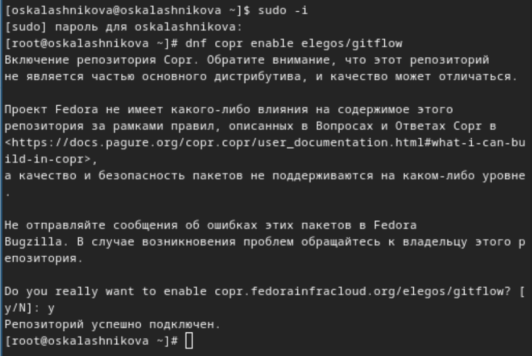{#fig:001 width=40%}

## Установка git-flow

Устанавливаем пакет gitflow при помощи dnf install gitflow  (рис.2).

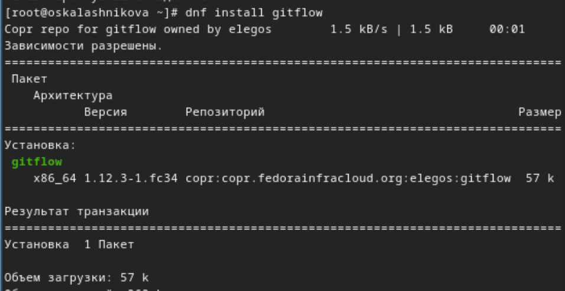{#fig:002 width=40%}

## Установка Node.js

На Node.js базируется программное обеспечение для семантического версионирования и общепринятых коммитов. Устанавливаем Node.js при помощи команды dnf install nodejs  (рис.3).

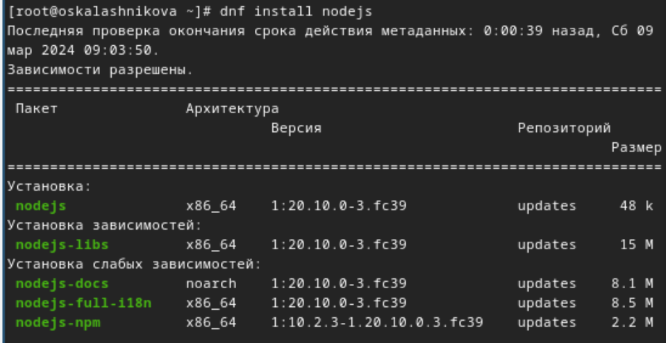{#fig:003 width=40%}

## Установка Node.js

Устанавливаем пакет pnpm при помощи apt-get install pnpm (в моём случае dnf install pnpm) (рис.4).

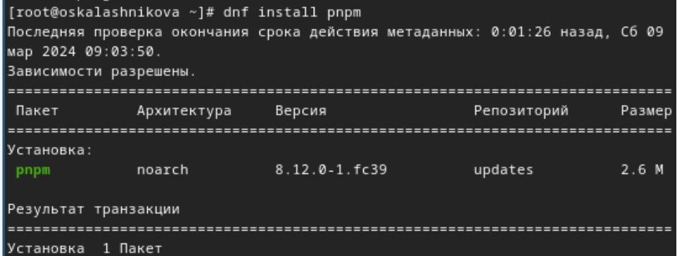{#fig:004 width=40%}

## Настройка Node.js

Для работы с Node.js добавляем каталог с исполняемыми файлами, устанавливаемыми yarn, в переменную PATH.Запускаем при помощи pnpm setup (рис.5).

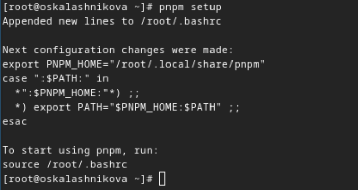{#fig:005 width=40%}

## Настройка Node.js

 Выполняем source ~/.bashrc (рис.6).

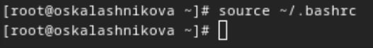{#fig:006 width=40%}

## Общепринятые коммиты (commitizen)

Данная программа используется для помощи в форматировании коммитов. Устанавливаем пакет commitizen при помощи pnpm add -g commitizen (При этом устанавливается скрипт git-cz, который мы и будем использовать для коммитов) (рис.7).

{#fig:007 width=40%}

## Общепринятые коммиты (standard-changelog)

Данная программа используется для помощи в создании логов. Устанавливаем командой pnpm add -g standard-changelog (рис.8).

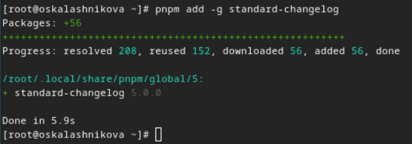{#fig:008 width=40%}

## Создание репозитория git и подключение репозитория к github

На самом GitHub создаём новый репозиторий с названием git-extended. Копируем его (рис.9).

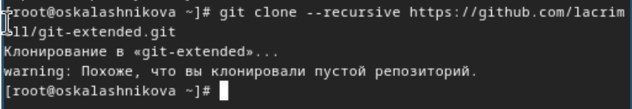{#fig:009 width=40%}

## Создание репозитория git и подключение репозитория к github

Делаем первый коммит (для начала я создала файл при помощи touch чтобы было измнение) (рис.10).

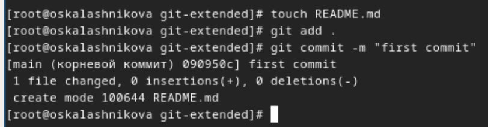{#fig:010 width=40%}

## Создание репозитория git и подключение репозитория к github

Выкладываем на github (git push -u origin main)(рис.11).

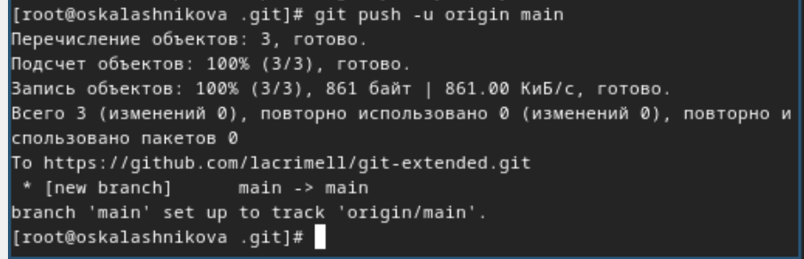{#fig:011 width=40%}

## Создание репозитория git и подключение репозитория к github

Проверяем (рис.12).

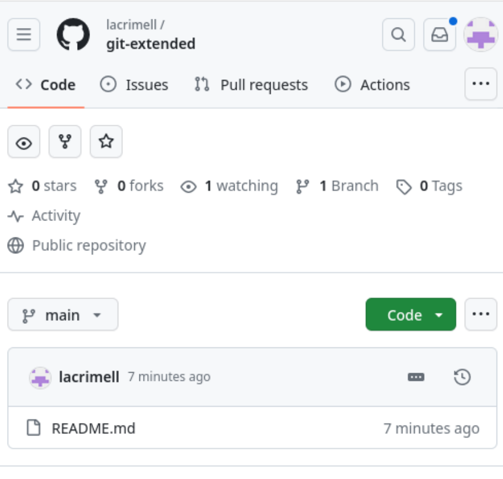{#fig:012 width=40%}

## Конфигурация общепринятых коммитов

Конфигурация для пакетов Node.js pnpm init (с помощью текстового редактора меняю нужные поля) (рис.13)

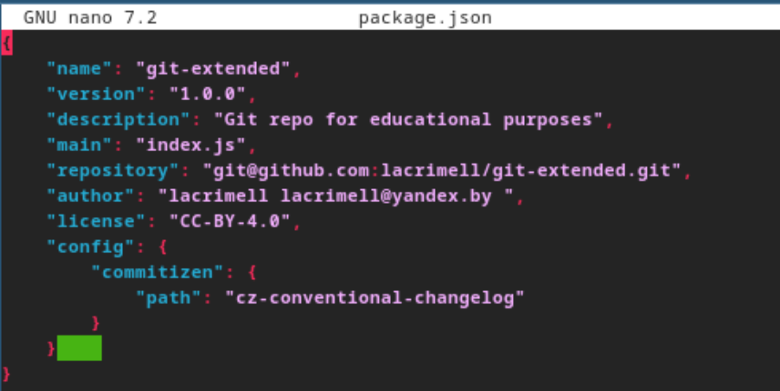{#fig:013 width=40%}

## Конфигурация общепринятых коммитов

Добавляем новые файлы при помощи git add и выполняем коммит при помощи git cz (рис. 14).

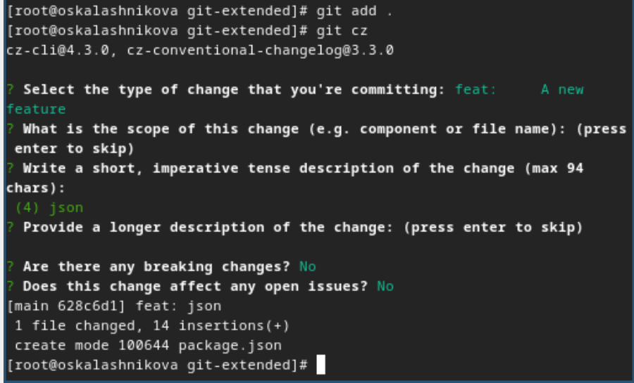{#fig:014 width=40%}

## Конфигурация общепринятых коммитов

Отправляем на github при помощи git push (рис.15).

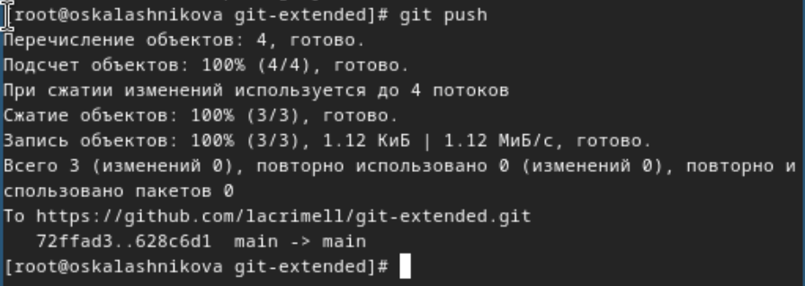{#fig:015 width=40%}

## Конфигурация git-flow

Инициализируем git-flow при ппомощи git flow init (Префикс для ярлыков устанавливаем в v) и проверяем что мы на той ветке (рис.16).

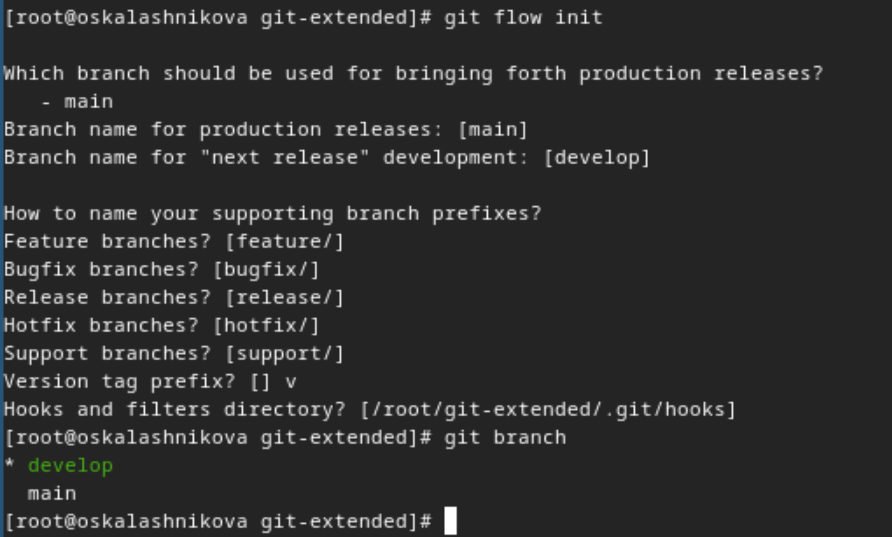{#fig:016 width=40%}

## Конфигурация git-flow

Загружаем весь репозиторий в хранилище с помощью git push --all (рис.17).

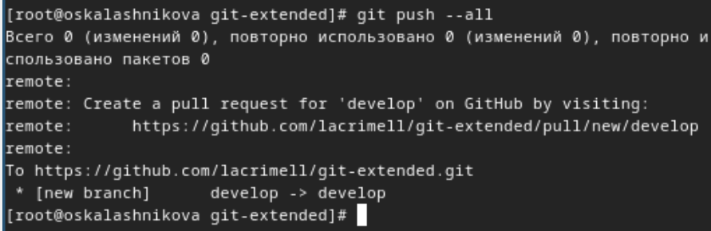{#fig:017 width=40%}

## Конфигурация git-flow

Установливаем внешнюю ветку как вышестоящую для этой ветки (рис.18).

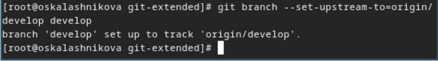{#fig:018 width=40%}

## Конфигурация git-flow

Создадим релиз с версией 1.0.0 (рис.19).

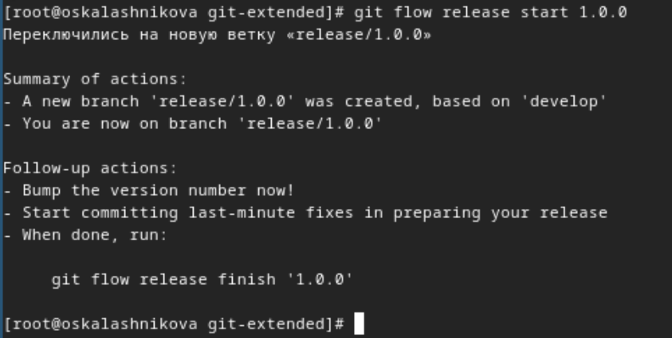{#fig:019 width=40%}

## Конфигурация git-flow

Создадим журнал изменений (рис.20).

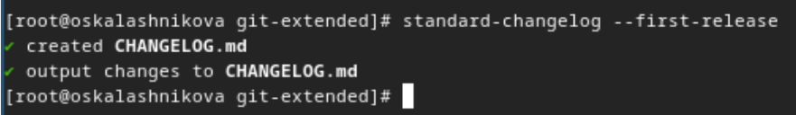{#fig:020 width=40%}

## Конфигурация git-flow

Добавим журнал изменений в индекс (рис.21).

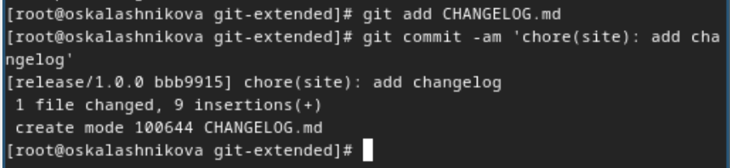{#fig:021 width=40%}

## Конфигурация git-flow

Зальём релизную ветку в основную ветку при помощи git flow release finish 1.0.0 (рис.22).

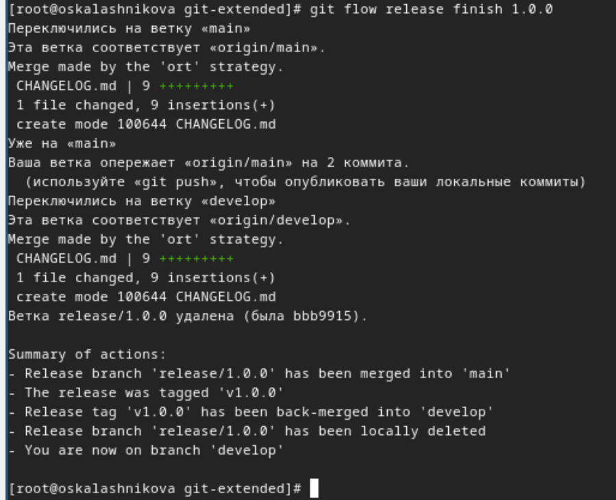{#fig:022 width=40%}

## Конфигурация git-flow

Отправим данные на github (git push --all) (рис.24).

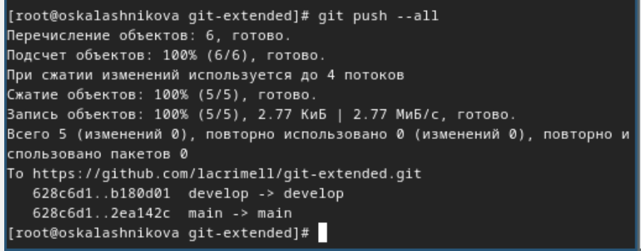{#fig:023 width=40%}

## Конфигурация git-flow

Отправим данные на github (git push --tags) (рис.24).

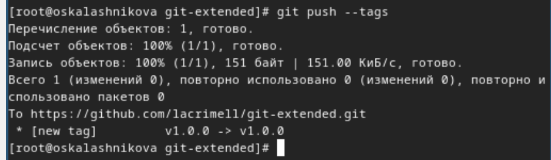{#fig:024 width=40%}

## Конфигурация git-flo

Создадим релиз на github. Для этого будем использовать утилиты работы с github (рис. 25).

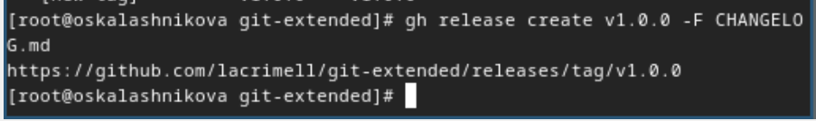{#fig:025 width=40%}

## Разработка новой функциональности

Создадим ветку для новой функциональности при помощи git flow feature start feature_branch (рис.26).

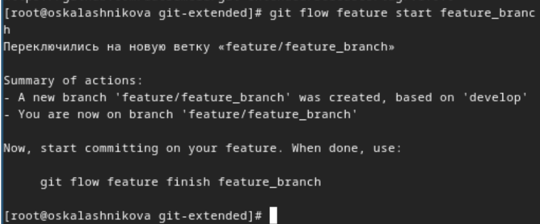{#fig:026 width=40%}

## Разработка новой функциональности

Далее, продолжаем работу c git как обычно.(В задании ничего больше не указано). По окончании разработки новой функциональности следующим шагом следует объединить ветку feature_branch c develop при помощи git flow feature finish feature_branch (рис.27).

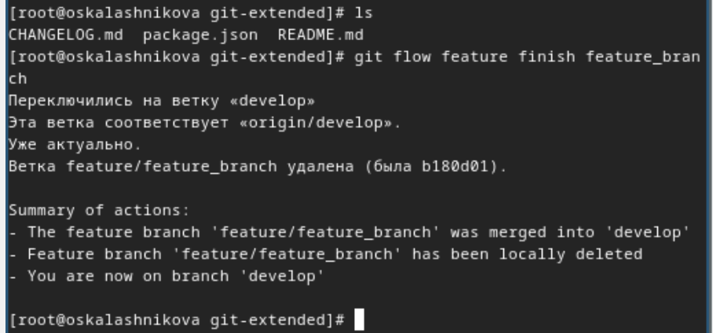{#fig:027 width=30%}

## Создание релиза git-flow

Создадим релиз с версией 1.2.3 при помощи команды git flow release start 1.2.3 (рис.28).

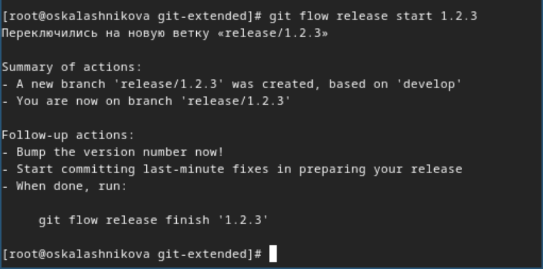{#fig:028 width=40%}

## Создание релиза git-flow

Обновите номер версии в файле package.json. Установите её в 1.2.3. (рис.29).

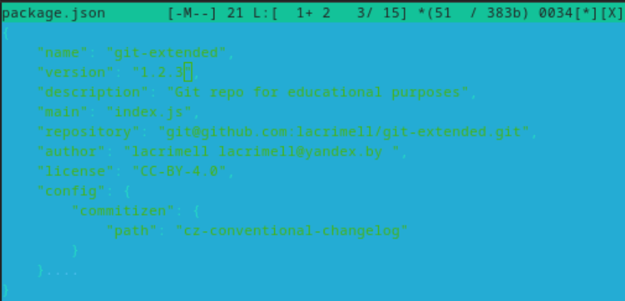{#fig:029 width=40%}

## Создание релиза git-flow

Создадим и добавим журнал изменений в индекс (рис.30).

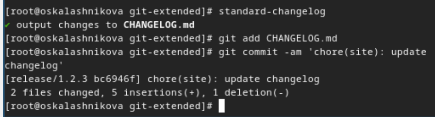{#fig:030 width=40%}

## Создание релиза git-flow

Зальём релизную ветку в основную ветку при помощи команды git flow release finish 1.2.3 (рис.31).

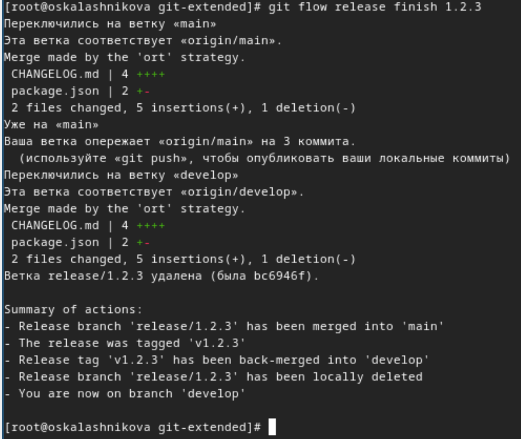{#fig:031 width=40%}

## Создание релиза git-flow

Отправим данные на github (рис.32).

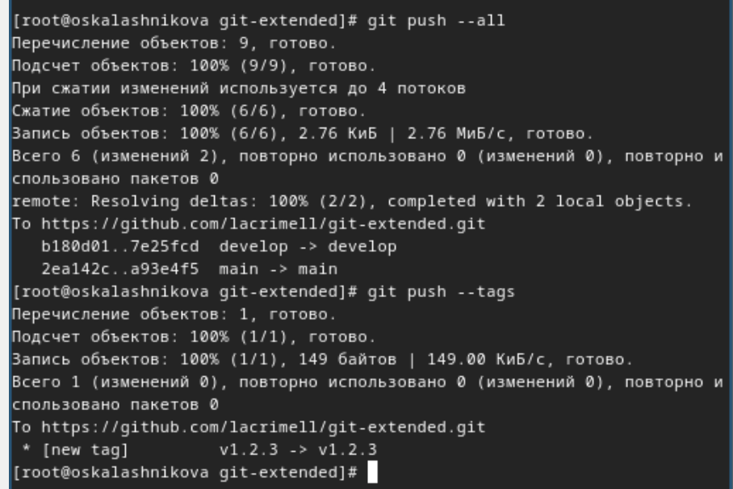{#fig:032 width=40%}

## Создание релиза git-flow

Создаём релиз на github с комментарием из журнала изменений (рис.33).

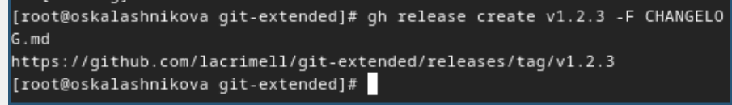{#fig:033 width=40%}

## Выводы

Я получила навыки правильной работы с репозиториями git.

## Список литературы{.unnumbered}

Туис

::: {#refs}
:::
