---
## Front matter
title: "Отчёт по лабораторной работе №2"
subtitle: "Операционные системы"
author: "Калашникова Ольга Сергеевна"

## Generic otions
lang: ru-RU
toc-title: "Содержание"

## Bibliography
bibliography: bib/cite.bib
csl: pandoc/csl/gost-r-7-0-5-2008-numeric.csl

## Pdf output format
toc: true # Table of contents
toc-depth: 2
lof: true # List of figures
lot: true # List of tables
fontsize: 12pt
linestretch: 1.5
papersize: a4
documentclass: scrreprt
## I18n polyglossia
polyglossia-lang:
  name: russian
  options:
	- spelling=modern
	- babelshorthands=true
polyglossia-otherlangs:
  name: english
## I18n babel
babel-lang: russian
babel-otherlangs: english
## Fonts
mainfont: PT Serif
romanfont: PT Serif
sansfont: PT Sans
monofont: PT Mono
mainfontoptions: Ligatures=TeX
romanfontoptions: Ligatures=TeX
sansfontoptions: Ligatures=TeX,Scale=MatchLowercase
monofontoptions: Scale=MatchLowercase,Scale=0.9
## Biblatex
biblatex: true
biblio-style: "gost-numeric"
biblatexoptions:
  - parentracker=true
  - backend=biber
  - hyperref=auto
  - language=auto
  - autolang=other*
  - citestyle=gost-numeric
## Pandoc-crossref LaTeX customization
figureTitle: "Рис."
tableTitle: "Таблица"
listingTitle: "Листинг"
lofTitle: "Список иллюстраций"
lotTitle: "Список таблиц"
lolTitle: "Листинги"
## Misc options
indent: true
header-includes:
  - \usepackage{indentfirst}
  - \usepackage{float} # keep figures where there are in the text
  - \floatplacement{figure}{H} # keep figures where there are in the text
---

# Цель работы

Целью данной работы является получение навыков правильной работы с репозиториями git.

# Задание

1. Выполнить работу для тестового репозитория.

2. Преобразовать рабочий репозиторий в репозиторий с git-flow и conventional commits.

# Выполнение лабораторной работы

## Установка git-flow

Установка из коллекции репозиториев Copr.Для начала включаем репозиторий corp при помощи команды dnf copr enable elegos/gitflow  (рис. [-@fig:001]).

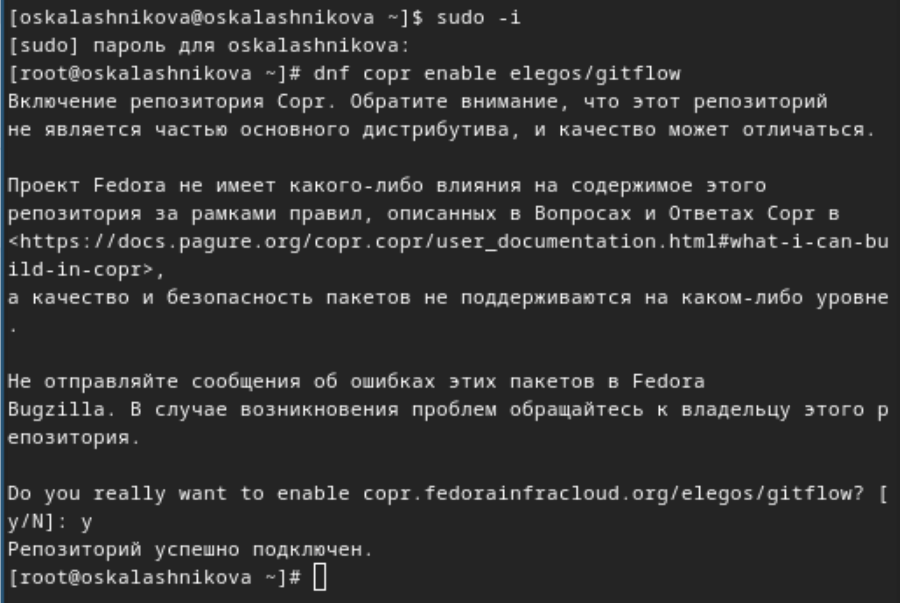{#fig:001 width=70%}

Устанавливаем пакет gitflow при помощи dnf install gitflow  (рис. [-@fig:002]).

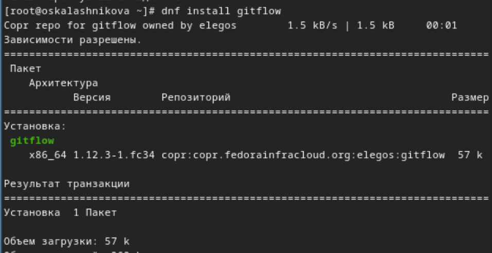{#fig:002 width=70%}

## Установка Node.js

На Node.js базируется программное обеспечение для семантического версионирования и общепринятых коммитов. Устанавливаем Node.js при помощи команды dnf install nodejs  (рис. [-@fig:003]).

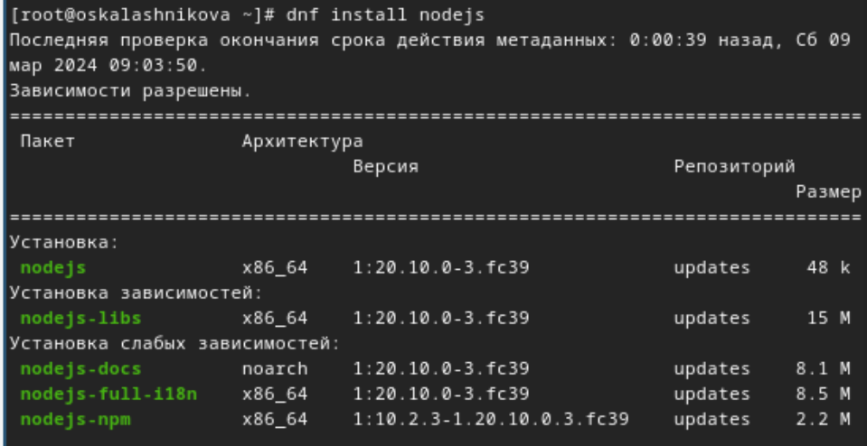{#fig:003 width=70%}

Устанавливаем пакет pnpm при помощи apt-get install pnpm (в моём случае dnf install pnpm) (рис. [-@fig:004]).

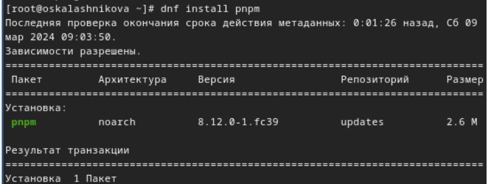{#fig:004 width=70%}

## Настройка Node.js

Для работы с Node.js добавляем каталог с исполняемыми файлами, устанавливаемыми yarn, в переменную PATH.

Запускаем при помощи pnpm setup (рис. [-@fig:005]).

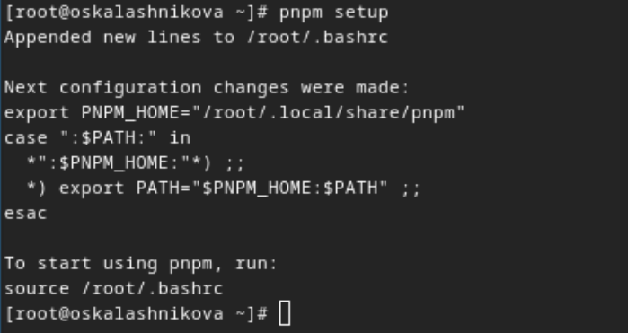{#fig:005 width=70%}

 Выполняем source ~/.bashrc (рис. [-@fig:006]).

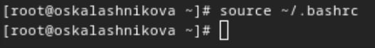{#fig:006 width=70%}

## Общепринятые коммиты (commitizen)

Данная программа используется для помощи в форматировании коммитов. Устанавливаем пакет commitizen при помощи pnpm add -g commitizen (При этом устанавливается скрипт git-cz, который мы и будем использовать для коммитов) (рис. [-@fig:007]).

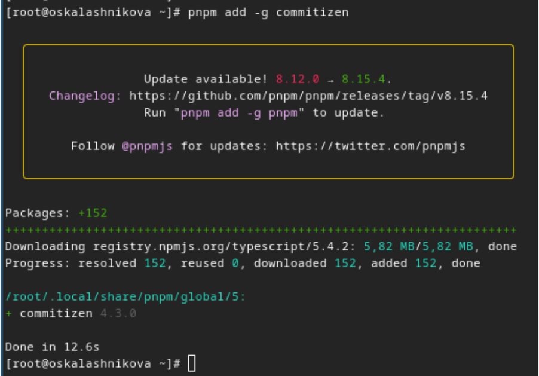{#fig:007 width=70%}

## Общепринятые коммиты (standard-changelog)

Данная программа используется для помощи в создании логов. Устанавливаем командой pnpm add -g standard-changelog (рис. [-@fig:008]).

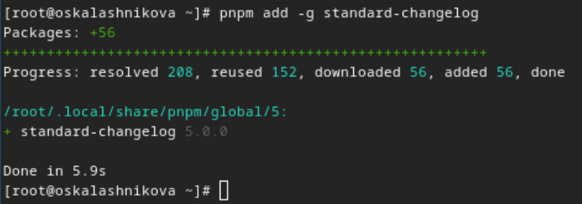{#fig:008 width=70%}

## Создание репозитория git и подключение репозитория к github

На самом GitHub создаём новый репозиторий с названием git-extended. Копируем его (рис. [-@fig:009]).

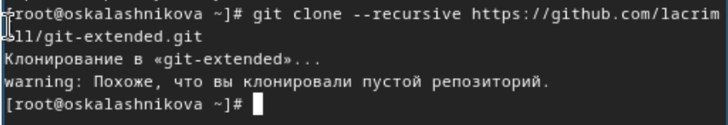{#fig:009 width=70%}

Делаем первый коммит (для начала я создала файл при помощи touch чтобы было измнение) (рис. [-@fig:010]).

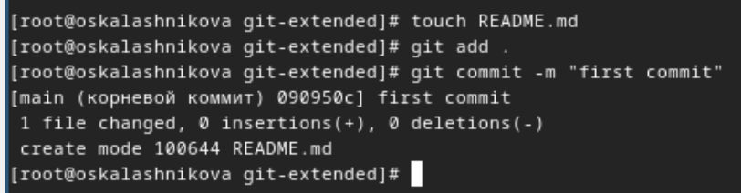{#fig:010 width=70%}

Выкладываем на github (git push -u origin main)(рис. [-@fig:011]).

{#fig:011 width=70%}

Проверяем (рис. [-@fig:012]).

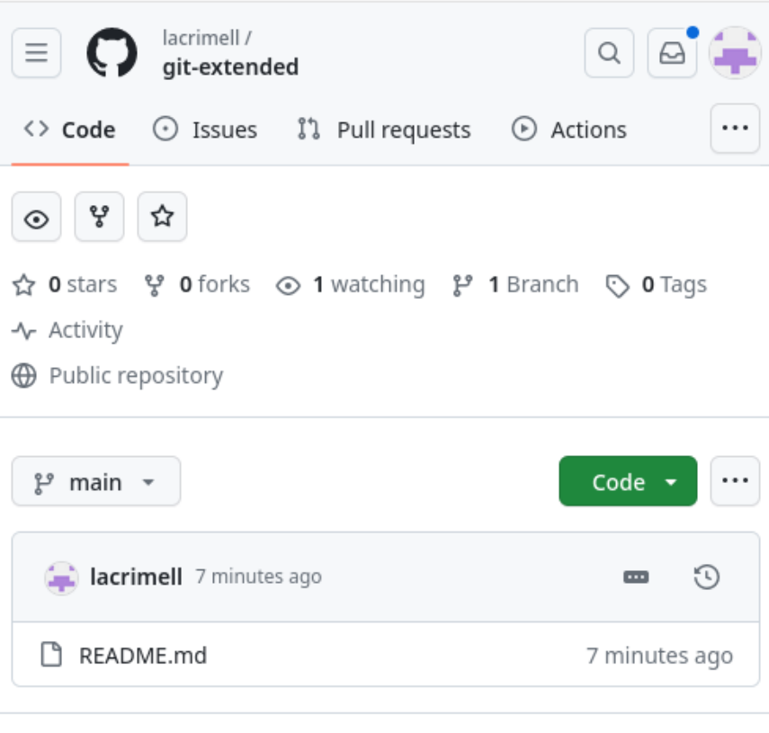{#fig:012 width=70%}

## Конфигурация общепринятых коммитов

Конфигурация для пакетов Node.js pnpm init (с помощью текстового редактора меняю нужные поля) (рис. [-@fig:013]).

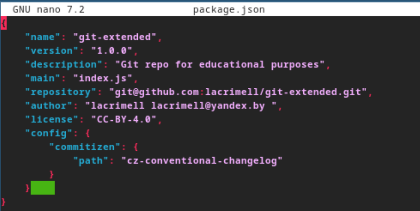{#fig:013 width=70%}

Добавляем новые файлы при помощи git add и выполняем коммит при помощи git cz (рис. [-@fig:014]).

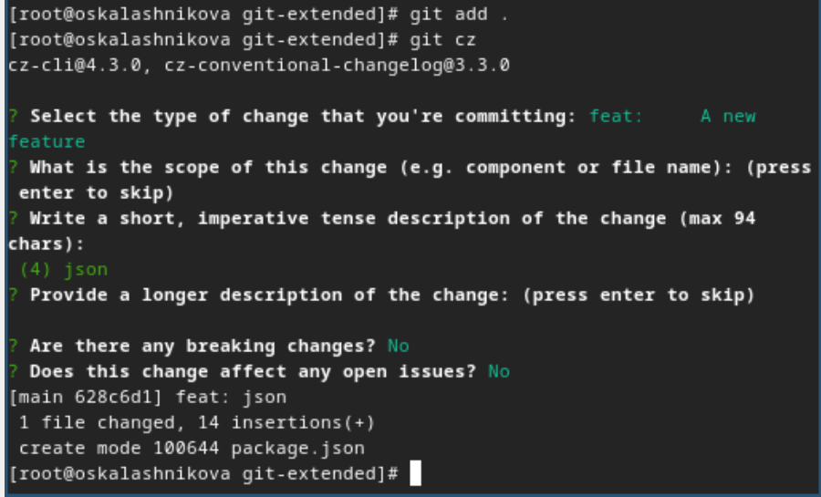{#fig:014 width=70%}

Отправляем на github при помощи git push (рис. [-@fig:015]).

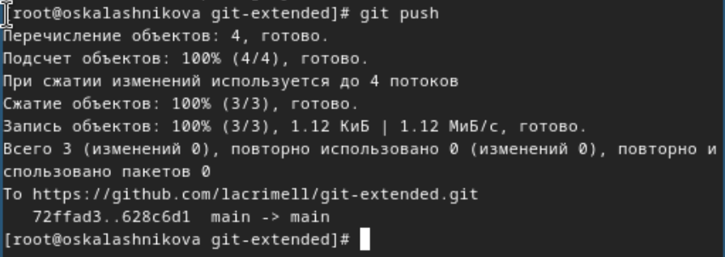{#fig:015 width=70%}

## Конфигурация git-flow

Инициализируем git-flow при ппомощи git flow init (Префикс для ярлыков устанавливаем в v) и проверяем что мы на той ветке (рис. [-@fig:016]).

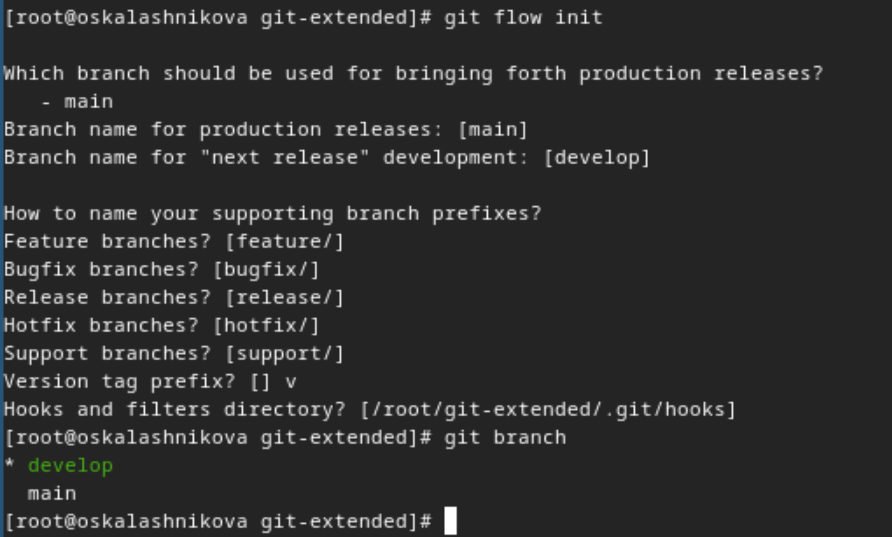{#fig:016 width=70%}

Загружаем весь репозиторий в хранилище с помощью git push --all (рис. [-@fig:017]).

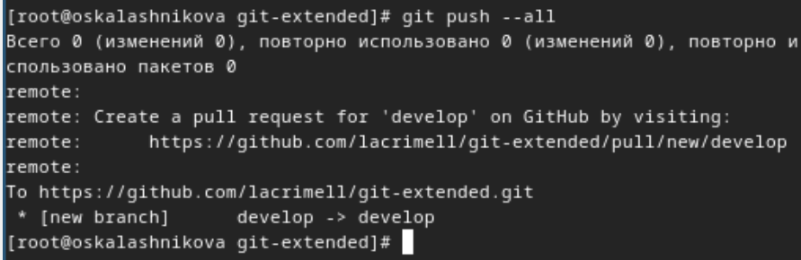{#fig:017 width=70%}

Установливаем внешнюю ветку как вышестоящую для этой ветки (рис. [-@fig:018]).

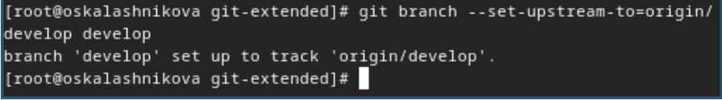{#fig:018 width=70%}

Создадим релиз с версией 1.0.0 (рис. [-@fig:019]).

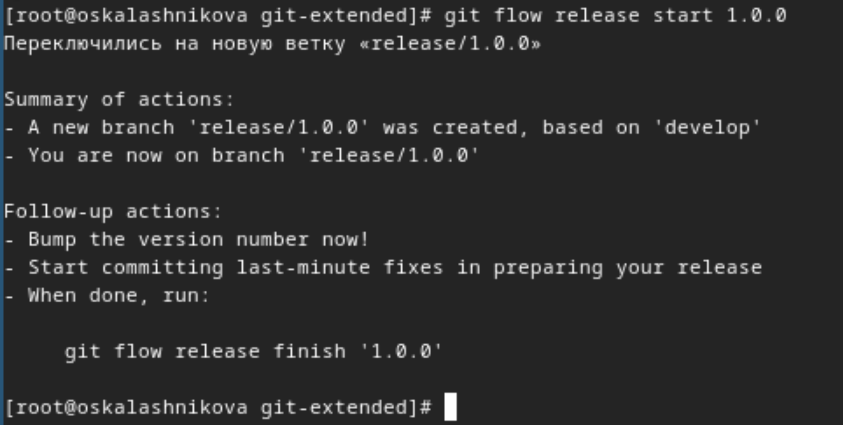{#fig:019 width=70%}

Создадим журнал изменений (рис. [-@fig:020]).

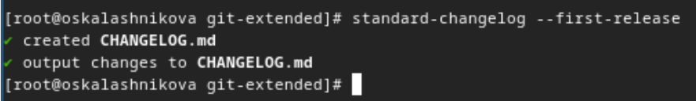{#fig:020 width=70%}

Добавим журнал изменений в индекс (рис. [-@fig:021]).

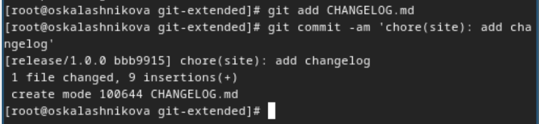{#fig:021 width=70%}

Зальём релизную ветку в основную ветку при помощи git flow release finish 1.0.0 (рис. [-@fig:022]).

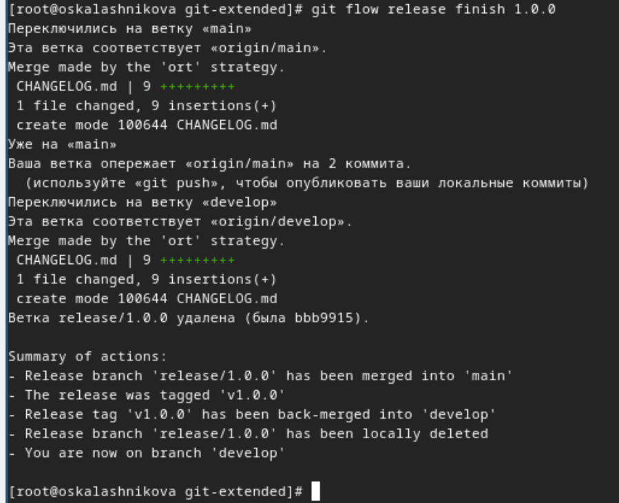{#fig:022 width=70%}

Отправим данные на github (git push --all) (рис. [-@fig:023]).

{#fig:023 width=70%}

Отправим данные на github (git push --tags) (рис. [-@fig:024]).

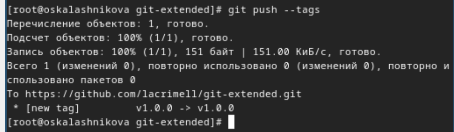{#fig:024 width=70%}

Создадим релиз на github. Для этого будем использовать утилиты работы с github (рис. [-@fig:025]).

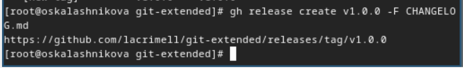{#fig:025 width=70%}

## Разработка новой функциональности

Создадим ветку для новой функциональности при помощи git flow feature start feature_branch (рис. [-@fig:026]).

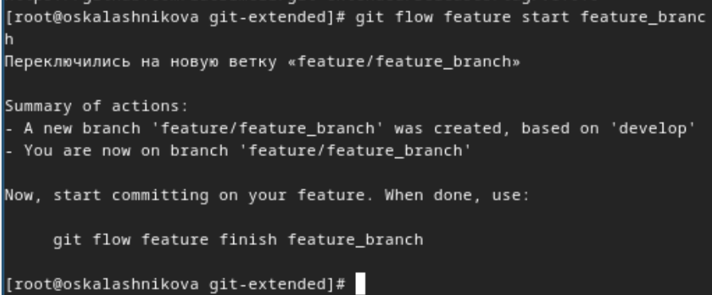{#fig:026 width=70%}

Далее, продолжаем работу c git как обычно.(В задании ничего больше не указано). По окончании разработки новой функциональности следующим шагом следует объединить ветку feature_branch c develop при помощи git flow feature finish feature_branch (рис. [-@fig:027]).

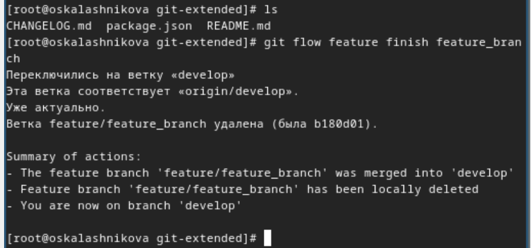{#fig:027 width=70%}

## Создание релиза git-flow

Создадим релиз с версией 1.2.3 при помощи команды git flow release start 1.2.3 (рис. [-@fig:028]).

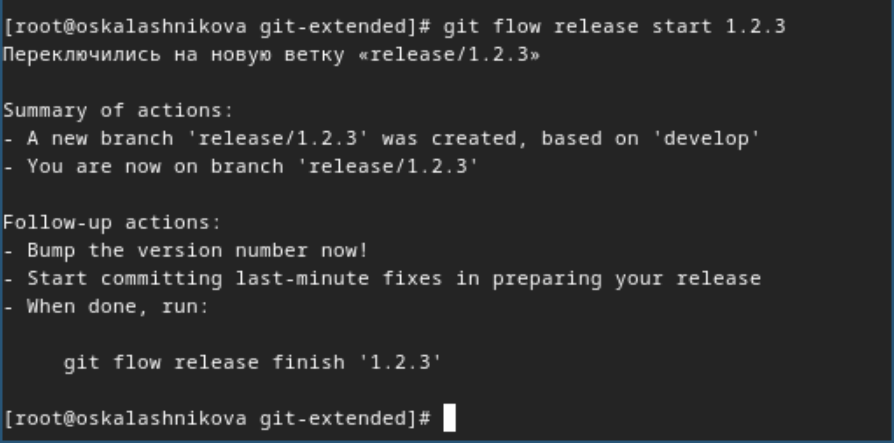{#fig:028 width=70%}

Обновите номер версии в файле package.json. Установите её в 1.2.3. (рис. [-@fig:029]).

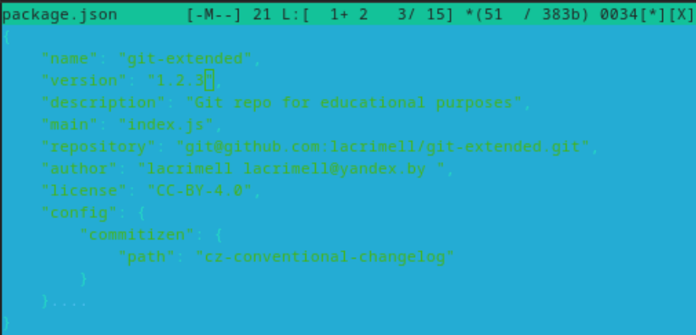{#fig:029 width=70%}

Создадим и добавим журнал изменений в индекс (рис. [-@fig:030]).

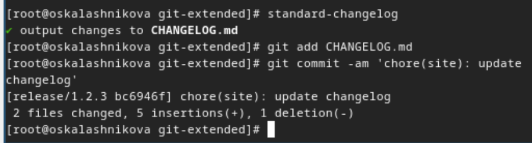{#fig:030 width=70%}

Зальём релизную ветку в основную ветку при помощи команды git flow release finish 1.2.3 (рис. [-@fig:031]).

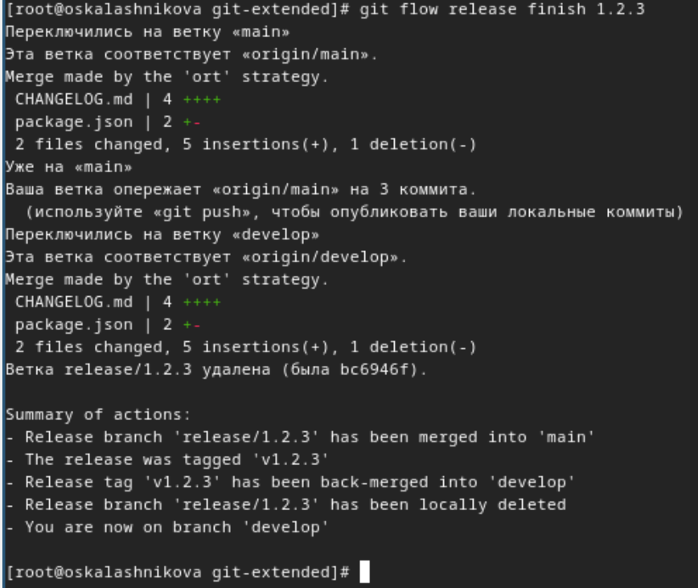{#fig:031 width=70%}

Отправим данные на github (рис. [-@fig:032]).

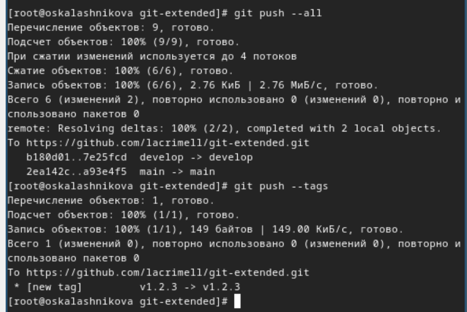{#fig:032 width=70%}

Создаём релиз на github с комментарием из журнала изменений (рис. [-@fig:033]).

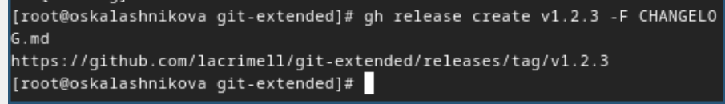{#fig:033 width=70%}

# Выводы

Я получила навыки правильной работы с репозиториями git.

# Список литературы{.unnumbered}

::: {#refs}
:::
