---
## Front matter
lang: ru-RU
title: Лабораторная работа №5
subtitle: Операционные системы
author:
  - Калашникова Ольга Сергеевна НПИбд-01-23
institute:
  - Российский университет дружбы народов, Москва, Россия
date: 16 марта 2024

## i18n babel
babel-lang: russian
babel-otherlangs: english

## Formatting pdf
toc: false
toc-title: Содержание
slide_level: 2
aspectratio: 169
section-titles: true
theme: metropolis
header-includes:
 - \metroset{progressbar=frametitle,sectionpage=progressbar,numbering=fraction}
 - '\makeatletter'
 - '\beamer@ignorenonframefalse'
 - '\makeatother'

## Fonts 
mainfont: PT Serif 
romanfont: PT Serif 
sansfont: PT Sans 
monofont: PT Mono 
mainfontoptions: Ligatures=TeX 
romanfontoptions: Ligatures=TeX 
sansfontoptions: Ligatures=TeX,Scale=MatchLowercase 
monofontoptions: Scale=MatchLowercase,Scale=0.9

---

## Цель работы

Научиться пользоваться pass и chezmoi

## Задание

- Настроить ОС, синхронизируя её с данной.

- Научиться использовать программы для управления паролями.

## Менеджер паролей pass

Для начала необходимо скачать pass pass-otp (рис. [-@fig:001]).

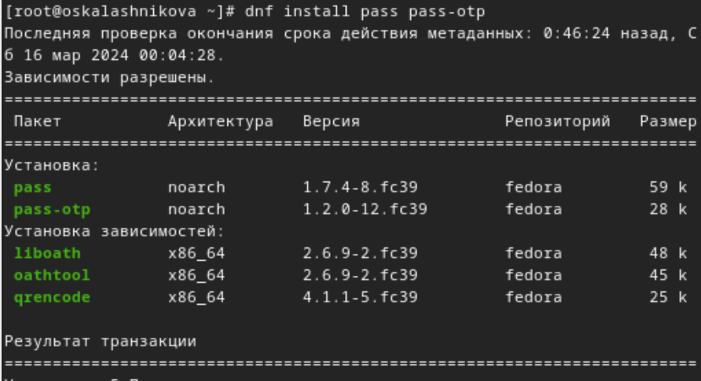{#fig:001 width=30%}

## Менеджер паролей pass

Уставновим gopass (рис. [-@fig:002])

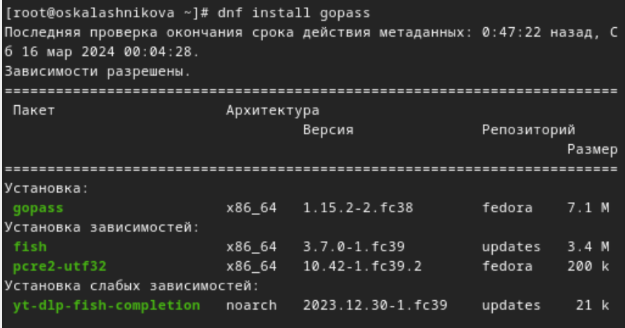{#fig:002 width=30%}

## Менеджер паролей pass

Просмотрим список ключей при помощи gpg --list-secret-keys (рис. [-@fig:003])

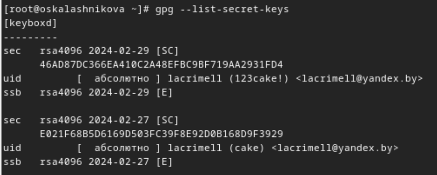{#fig:003 width=30%}

## Менеджер паролей pass

Инициализируем pass, указав свой gpg-id(рис. [-@fig:004])

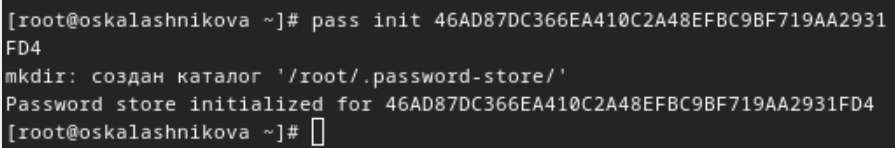{#fig:004 width=30%}

## Менеджер паролей pass

Проинициализируем репозиторий в git для pass (рис. [-@fig:005])

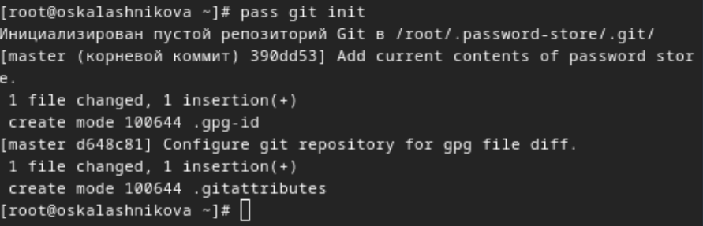{#fig:005 width=30%}

## Менеджер паролей pass

Создадим репозиторий pass, после пробуем получить данные (рис. [-@fig:007])
 
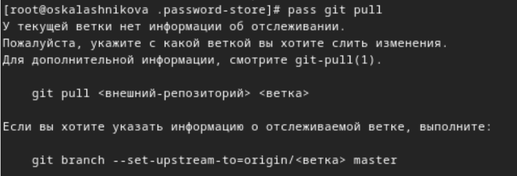{#fig:006 width=30%}

## Менеджер паролей pass

Выложим изменения на Github и после этого получается получить данные (рис. [-@fig:007])
 
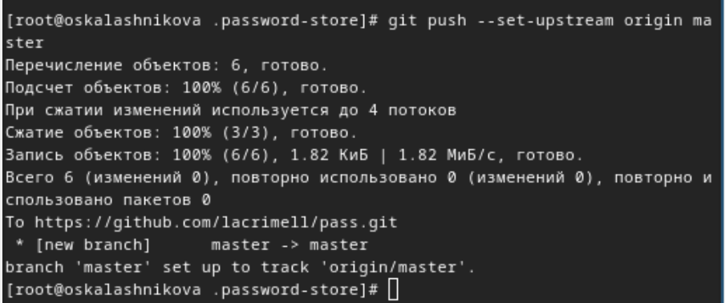{#fig:007 width=30%}

## Менеджер паролей pass

Вручную закоммитим и выложим изменения, проверяем статус pass репозитория (рис. [-@fig:008])
 
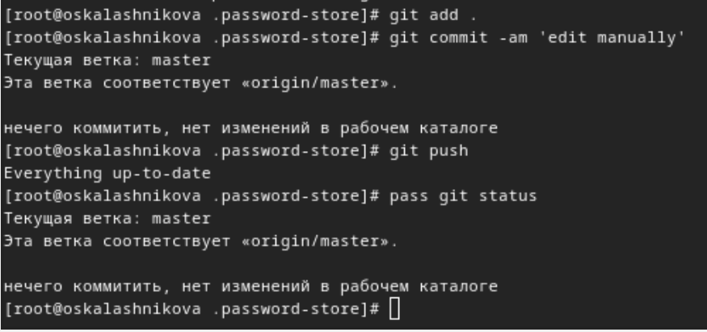{#fig:008 width=30%}

## Настройка интерфейса с броузером

Устанавливаем программу, обеспечивающую интерфейс native messaging (рис. [-@fig:009])
 
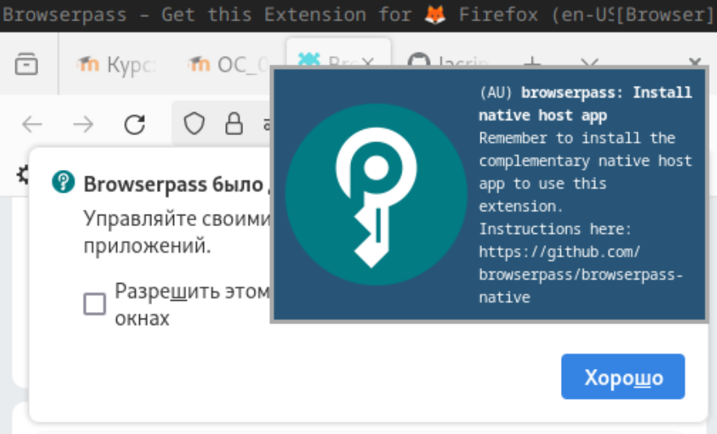{#fig:009 width=30%}

## Настройка интерфейса с броузером

Подключим репозиторий для browserpass (рис. [-@fig:010])
 
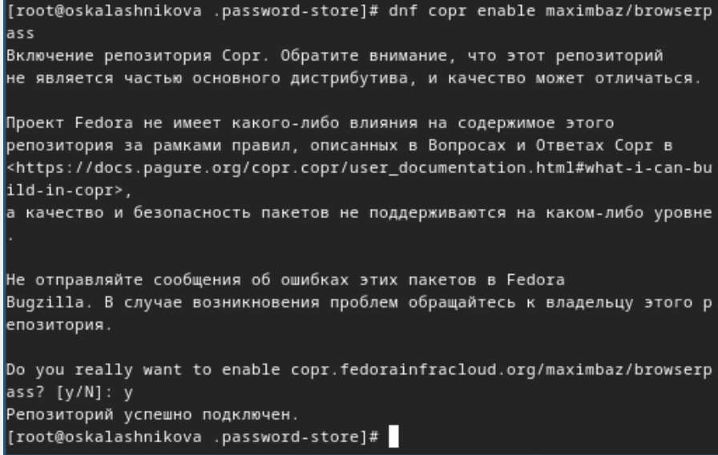{#fig:010 width=30%}

## Настройка интерфейса с броузером

Установим browserpass (рис. [-@fig:011])
 
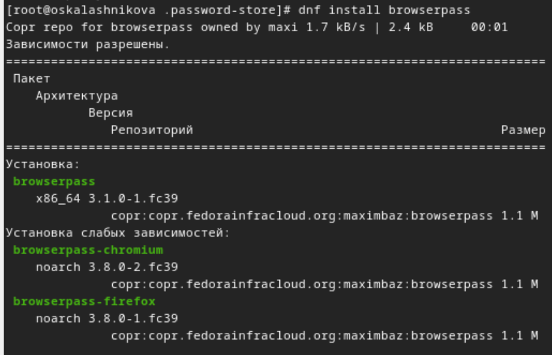{#fig:011 width=30%}

## Сохранение пароля

Создадим файл с паролем (рис. [-@fig:012])
 
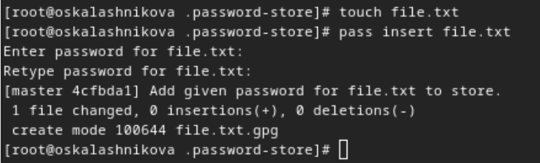{#fig:012 width=30%}

## Сохранение пароля

Отображаем пароль для указанного имени файла (рис. [-@fig:013])
 
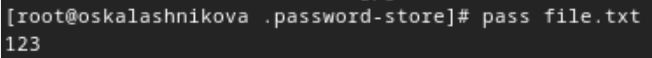{#fig:013 width=30%}

## Сохранение пароля

Заменяем существующий пароль (рис. [-@fig:014])
 
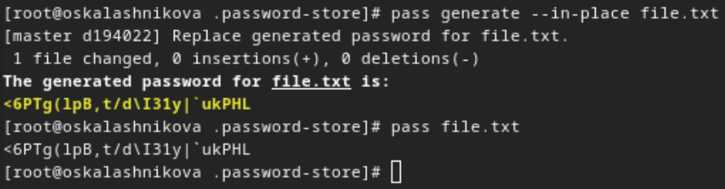{#fig:014 width=30%}

## Управление файлами конфигурации

Установливаем дополнительное программное обеспечение (рис. [-@fig:015])
 
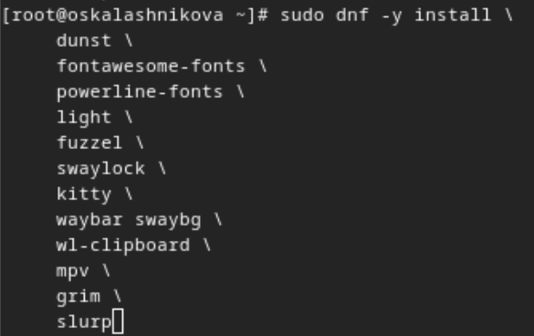{#fig:015 width=30%}

## Управление файлами конфигурации

Включение стороннего репозитория (рис. [-@fig:016])
 
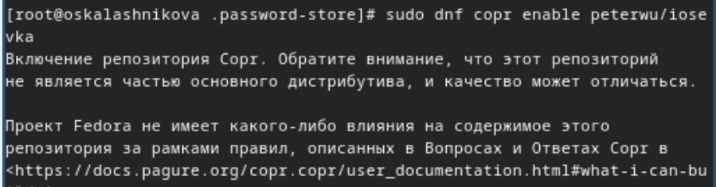{#fig:016 width=30%}

## Управление файлами конфигурации

Найдём шрифты (рис. [-@fig:017])
 
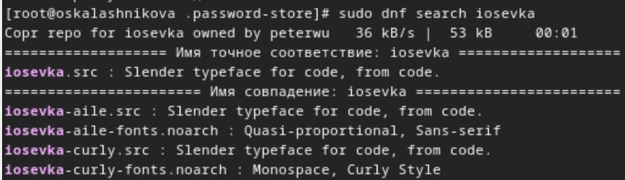{#fig:017 width=30%}

## Управление файлами конфигурации

И установим (рис. [-@fig:018])
 
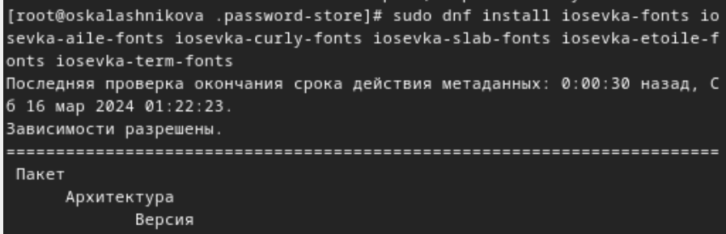{#fig:018 width=70%}

## Управление файлами конфигурации

Установим бинарный файл chezmoi (рис. [-@fig:019])
 
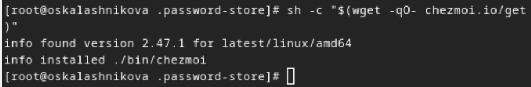{#fig:019 width=30%}

## Создание собственного репозитория с помощью утилит

Создадим репозиторий из шаблона (рис. [-@fig:020])
 
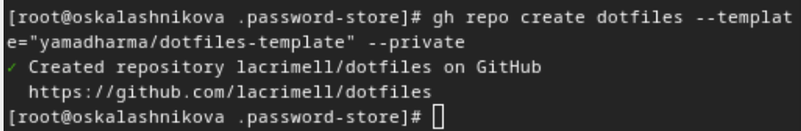{#fig:020 width=30%}

## Создание собственного репозитория с помощью утилит

Проверяем, что он создался (рис. [-@fig:021])
 
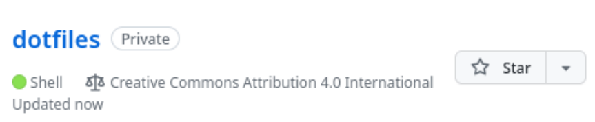{#fig:021 width=30%}

## Подключение репозитория к своей системе

Инициализируем chezmoi, указав только что созданный репозиторий (рис. [-@fig:022])
 
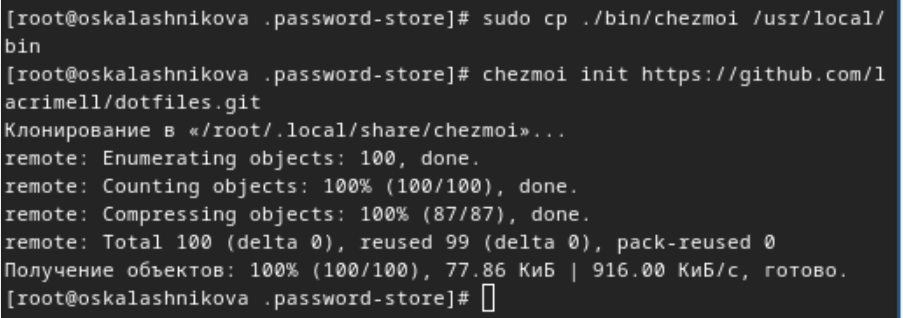{#fig:022 width=30%}

## Подключение репозитория к своей системе

Проверяем, какие изменения внесёт chezmoi в домашний каталог, запустив chezmoi diff и запускаем chezmoi apply -v (у меня не получилось сделать хороший скрин так как слишком много изменений) (рис. [-@fig:023])
 
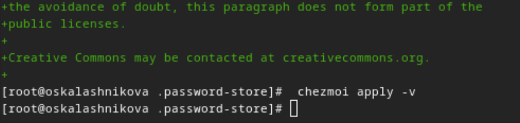{#fig:023 width=30%}

## Использование chezmoi на нескольких машинах

Использую свою старую виртуальную машину ubunty. Инициализируйте chezmoi с вашим репозиторием dotfiles  (рис. [-@fig:024])
 
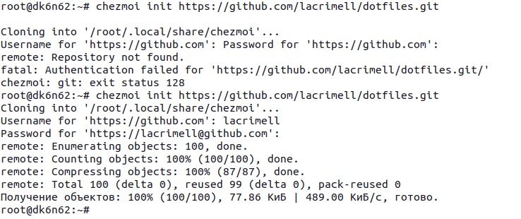{#fig:024 width=30%}

## Использование chezmoi на нескольких машинах

Проверяем, какие изменения внесёт chezmoi в домашний каталог, запустив chezmoi diff и запускаем chezmoi apply -v (у меня не получилось сделать хороший скрин так как слишком много изменений) (рис. [-@fig:025])
 
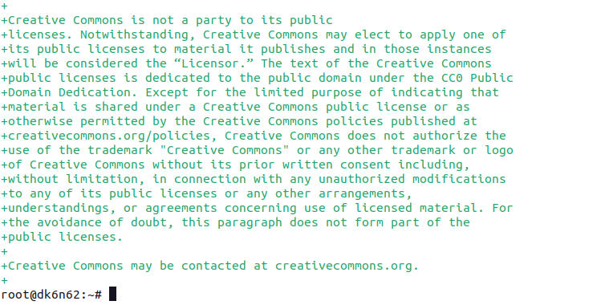{#fig:025 width=30%}

## Использование chezmoi на нескольких машинах

Установить свои dotfiles на новый компьютер с помощью команды (рис. [-@fig:026])
 
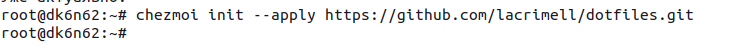{#fig:026 width=30%}

## Ежедневные операции c chezmoi

Фиксируйте и отправляйте изменения в репозиторий на основной машине (рис. [-@fig:027])
 
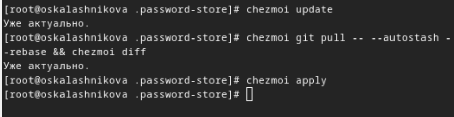{#fig:027 width=30%}

## Ежедневные операции c chezmoi

Изменение файла для автоматической фиксации (рис. [-@fig:028])
 
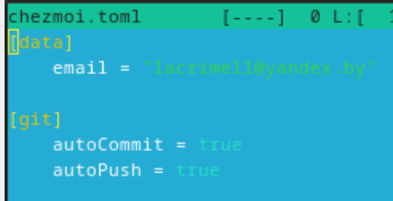{#fig:028 width=30%}

## Выводы

В результате выполнения лабораторной работы были настроены программы для управления паролями, а также появился навык синхронизации настроек ОС

