---
## Front matter
title: "Отчёт по лабораторной работе №5"
subtitle: "Операционные системы"
author: "Калашникова Ольга Сергеевна"

## Generic otions
lang: ru-RU
toc-title: "Содержание"

## Bibliography
bibliography: bib/cite.bib
csl: pandoc/csl/gost-r-7-0-5-2008-numeric.csl

## Pdf output format
toc: true # Table of contents
toc-depth: 2
lof: true # List of figures
lot: true # List of tables
fontsize: 12pt
linestretch: 1.5
papersize: a4
documentclass: scrreprt
## I18n polyglossia
polyglossia-lang:
  name: russian
  options:
	- spelling=modern
	- babelshorthands=true
polyglossia-otherlangs:
  name: english
## I18n babel
babel-lang: russian
babel-otherlangs: english
## Fonts
mainfont: PT Serif
romanfont: PT Serif
sansfont: PT Sans
monofont: PT Mono
mainfontoptions: Ligatures=TeX
romanfontoptions: Ligatures=TeX
sansfontoptions: Ligatures=TeX,Scale=MatchLowercase
monofontoptions: Scale=MatchLowercase,Scale=0.9
## Biblatex
biblatex: true
biblio-style: "gost-numeric"
biblatexoptions:
  - parentracker=true
  - backend=biber
  - hyperref=auto
  - language=auto
  - autolang=other*
  - citestyle=gost-numeric
## Pandoc-crossref LaTeX customization
figureTitle: "Рис."
tableTitle: "Таблица"
listingTitle: "Листинг"
lofTitle: "Список иллюстраций"
lotTitle: "Список таблиц"
lolTitle: "Листинги"
## Misc options
indent: true
header-includes:
  - \usepackage{indentfirst}
  - \usepackage{float} # keep figures where there are in the text
  - \floatplacement{figure}{H} # keep figures where there are in the text
---

# Цель работы

Научиться пользоваться pass и chezmoi

# Задание

- Настроить ОС, синхронизируя её с данной.

- Научиться использовать программы для управления паролями.

# Выполнение лабораторной работы

Для начала необходимо скачать pass pass-otp (рис. [-@fig:001]).

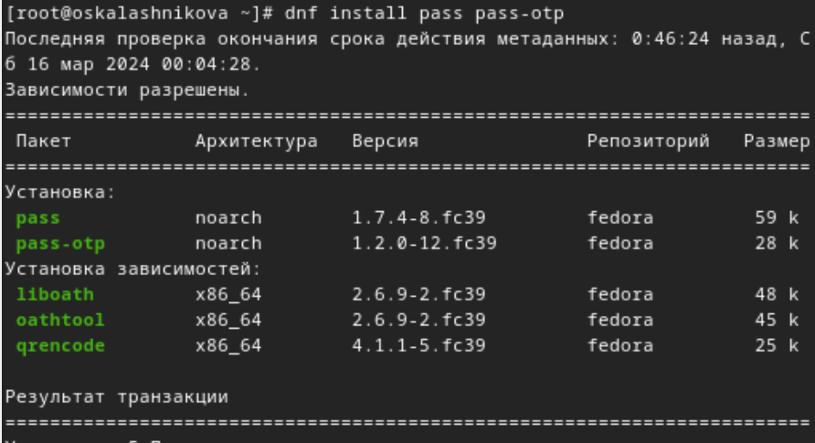{#fig:001 width=70%}

Уставновим gopass (рис. [-@fig:002])

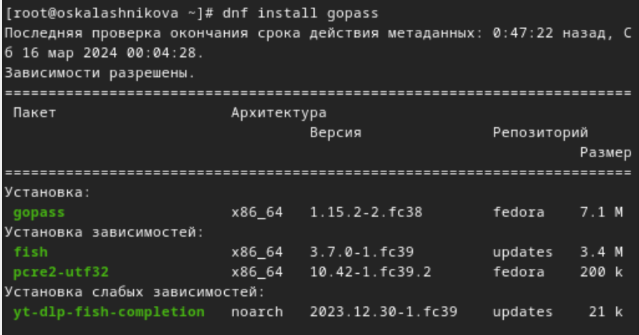{#fig:002 width=70%}

Просмотрим список ключей при помощи gpg --list-secret-keys (рис. [-@fig:003])

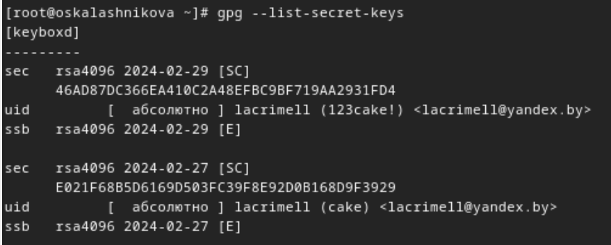{#fig:003 width=70%}

Инициализируем pass, указав свой gpg-id(рис. [-@fig:004])

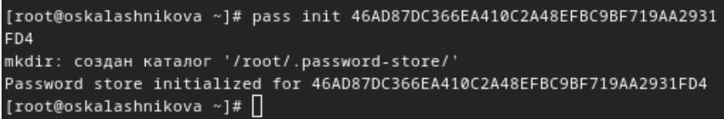{#fig:004 width=70%}

Проинициализируем репозиторий в git для pass (рис. [-@fig:005])

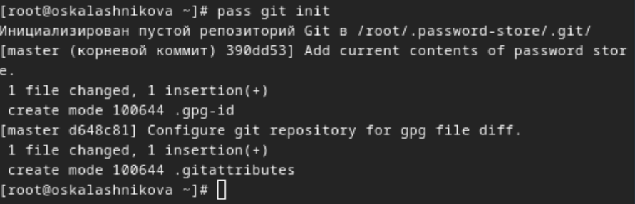{#fig:005 width=70%}

Создадим репозиторий pass, после пробуем получить данные (рис. [-@fig:007])
 
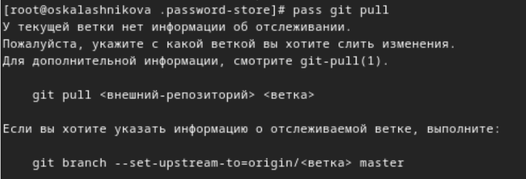{#fig:006 width=70%}

Выложим изменения на Github и после этого получается получить данные (рис. [-@fig:007])
 
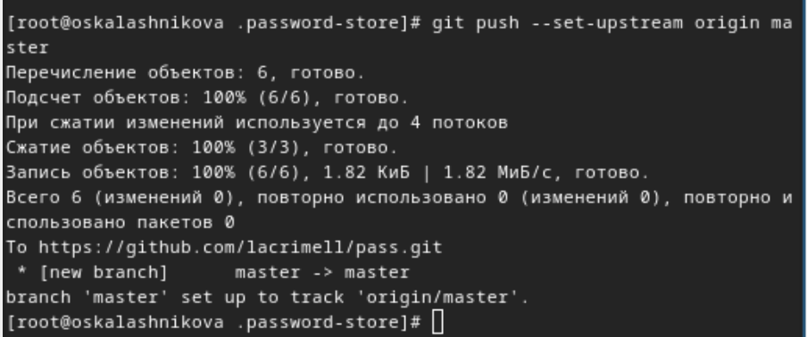{#fig:007 width=70%}

Вручную закоммитим и выложим изменения, проверяем статус pass репозитория (рис. [-@fig:008])
 
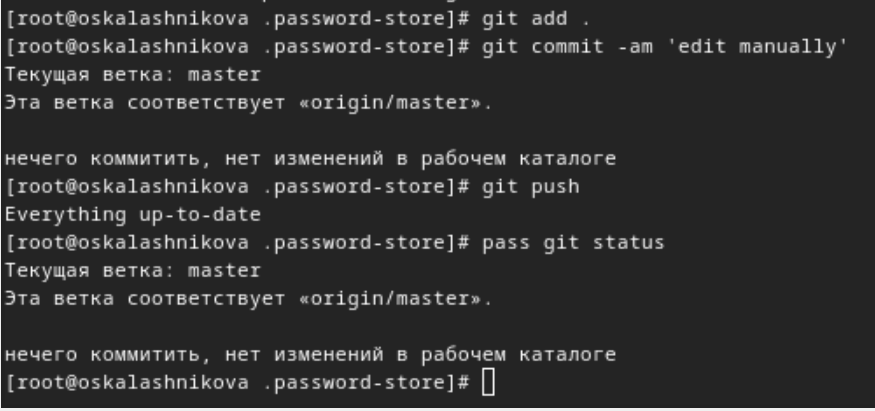{#fig:008 width=70%}

Устанавливаем программу, обеспечивающую интерфейс native messaging (рис. [-@fig:009])
 
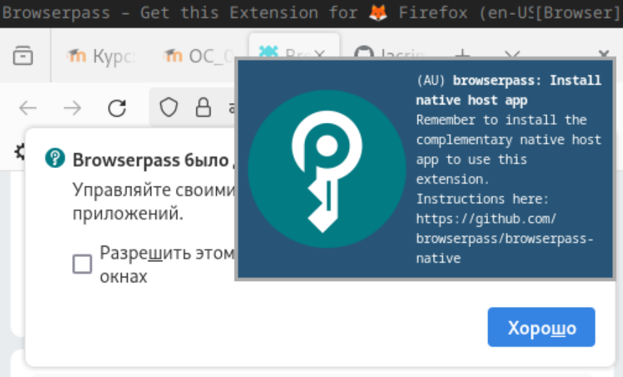{#fig:009 width=70%}

Подключим репозиторий для browserpass (рис. [-@fig:010])
 
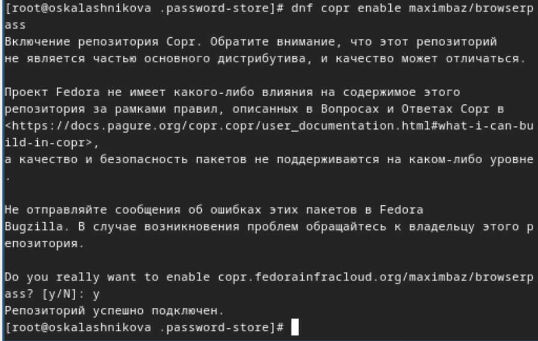{#fig:010 width=70%}

Установим browserpass (рис. [-@fig:011])
 
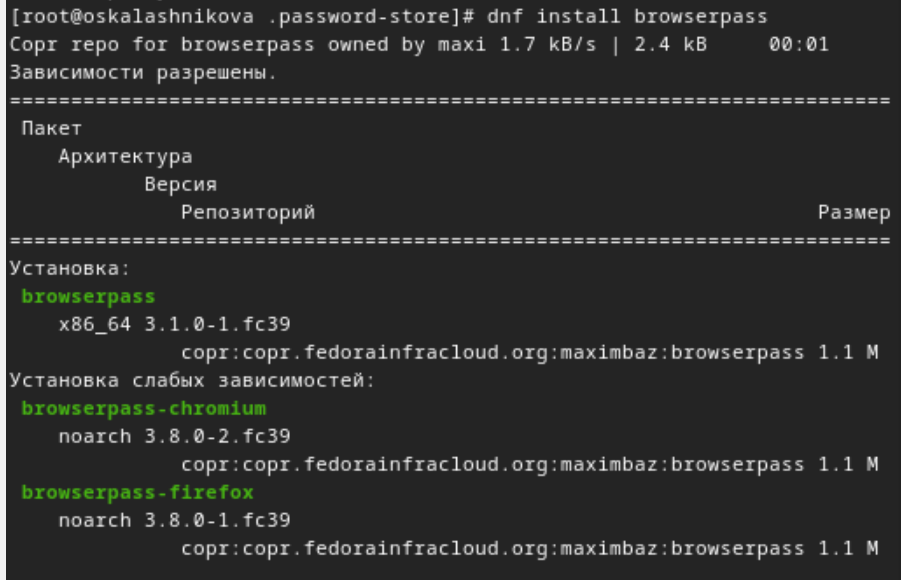{#fig:011 width=70%}

Создадим файл с паролем (рис. [-@fig:012])
 
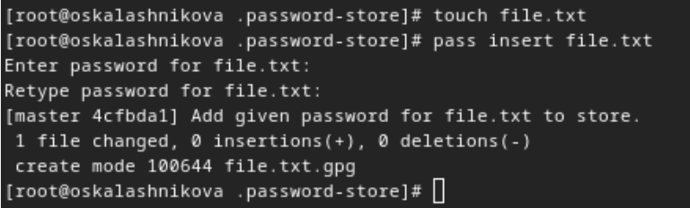{#fig:012 width=70%}

Отображаем пароль для указанного имени файла (рис. [-@fig:013])
 
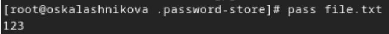{#fig:013 width=70%}

Заменяем существующий пароль (рис. [-@fig:014])
 
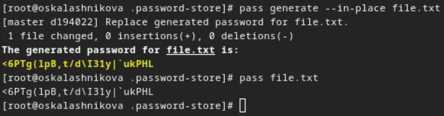{#fig:014 width=70%}

Установливаем дополнительное программное обеспечение (рис. [-@fig:015])
 
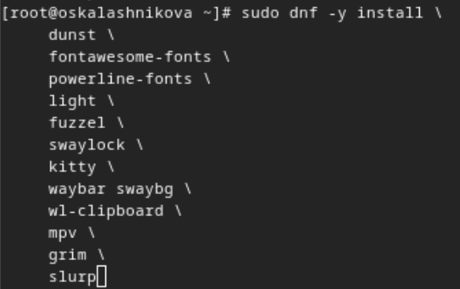{#fig:015 width=70%}

Включение стороннего репозитория (рис. [-@fig:016])
 
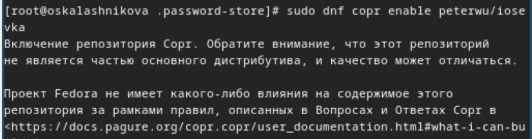{#fig:016 width=70%}

Найдём шрифты (рис. [-@fig:017])
 
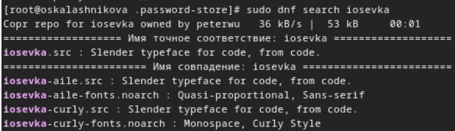{#fig:017 width=70%}

И установим (рис. [-@fig:018])
 
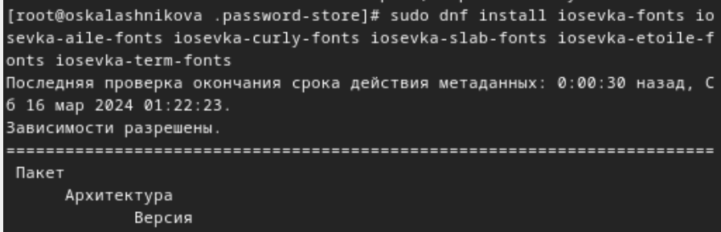{#fig:018 width=70%}

Установим бинарный файл chezmoi (рис. [-@fig:019])
 
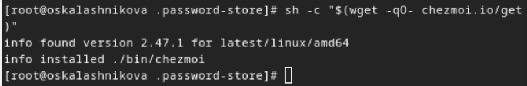{#fig:019 width=70%}

Создадим репозиторий из шаблона (рис. [-@fig:020])
 
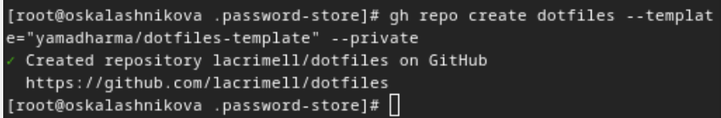{#fig:020 width=70%}

Проверяем, что он создался (рис. [-@fig:021])
 
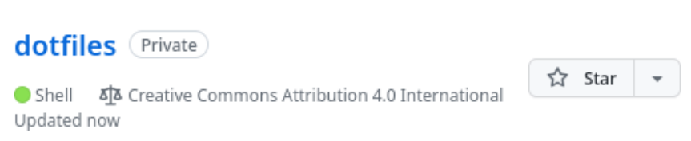{#fig:021 width=70%}

Инициализируем chezmoi, указав только что созданный репозиторий (рис. [-@fig:022])
 
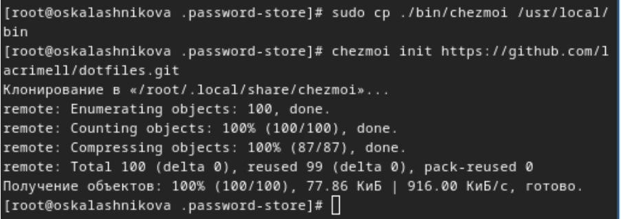{#fig:022 width=70%}

Проверяем, какие изменения внесёт chezmoi в домашний каталог, запустив chezmoi diff и запускаем chezmoi apply -v (у меня не получилось сделать хороший скрин так как слишком много изменений) (рис. [-@fig:023])
 
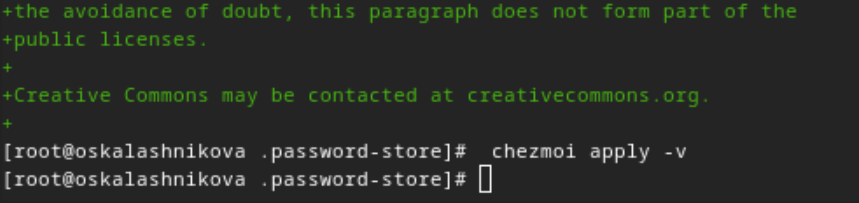{#fig:023 width=70%}

Использую свою старую виртуальную машину ubunty. Инициализируйте chezmoi с вашим репозиторием dotfiles  (рис. [-@fig:024])
 
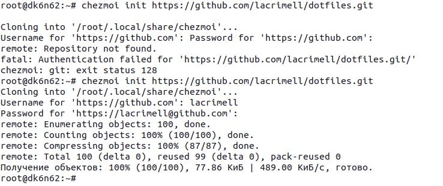{#fig:024 width=70%}

Проверяем, какие изменения внесёт chezmoi в домашний каталог, запустив chezmoi diff и запускаем chezmoi apply -v (у меня не получилось сделать хороший скрин так как слишком много изменений) (рис. [-@fig:025])
 
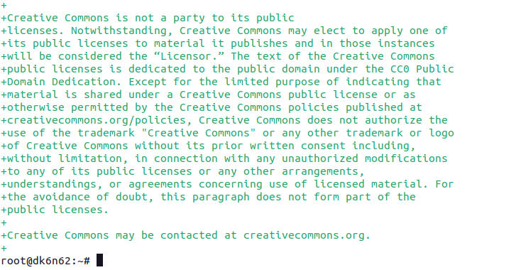{#fig:025 width=70%}

Установить свои dotfiles на новый компьютер с помощью команды (рис. [-@fig:026])
 
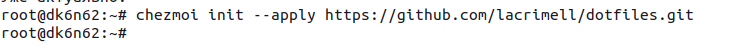{#fig:026 width=70%}

Фиксируйте и отправляйте изменения в репозиторий на основной машине (рис. [-@fig:027])
 
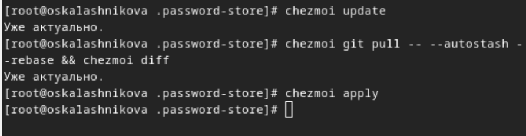{#fig:027 width=70%}

Изменение файла для автоматической фиксации (рис. [-@fig:028])
 
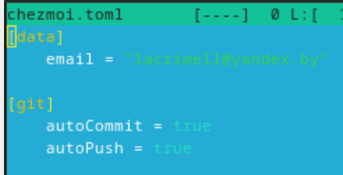{#fig:028 width=70%}

# Выводы

В результате выполнения лабораторной работы были настроены программы для управления паролями, а также появился навык синхронизации настроек ОС

