---
## Front matter
lang: ru-RU
title: Лабораторная работа №6
subtitle: Операционные системы
author:
  - Калашникова Ольга Сергеевна НПИбд-01-23
institute:
  - Российский университет дружбы народов, Москва, Россия
date: 16 марта 2024

## i18n babel
babel-lang: russian
babel-otherlangs: english

## Formatting pdf
toc: false
toc-title: Содержание
slide_level: 2
aspectratio: 169
section-titles: true
theme: metropolis
header-includes:
 - \metroset{progressbar=frametitle,sectionpage=progressbar,numbering=fraction}
 - '\makeatletter'
 - '\beamer@ignorenonframefalse'
 - '\makeatother'
 
## Fonts 
mainfont: PT Serif 
romanfont: PT Serif 
sansfont: PT Sans 
monofont: PT Mono 
mainfontoptions: Ligatures=TeX 
romanfontoptions: Ligatures=TeX 
sansfontoptions: Ligatures=TeX,Scale=MatchLowercase 
monofontoptions: Scale=MatchLowercase,Scale=0.9

---

## Цель работы

Целью данной работы является приобретение практических навыков взаимодействия пользователя с системой посредством командной строки.

## Задание 

1. Определите полное имя вашего домашнего каталога. Далее относительно этого каталога будут выполняться последующие упражнения.

2. Выполните следующие действия:

- Перейдите в каталог /tmp.

## Задание 

- Выведите на экран содержимое каталога /tmp. Для этого используйте команду ls с различными опциями. Поясните разницу в выводимой на экран информации.

-Определите, есть ли в каталоге /var/spool подкаталог с именем cron?

- Перейдите в Ваш домашний каталог и выведите на экран его содержимое. Определите, кто является владельцем файлов и подкаталогов?

## Задание 

3. Выполните следующие действия:

- В домашнем каталоге создайте новый каталог с именем newdir.

- В каталоге ~/newdir создайте новый каталог с именем morefun.

- В домашнем каталоге создайте одной командой три новых каталога с именами letters, memos, misk. Затем удалите эти каталоги одной командой.

-  Попробуйте удалить ранее созданный каталог ~/newdir командой rm. Проверьте, был ли каталог удалён.

- Удалите каталог ~/newdir/morefun из домашнего катало1га. Проверьте, был ли каталог удалён.

## Задание 

4. С помощью команды man определите, какую опцию команды ls нужно использовать для просмотра содержимое не только указанного каталога, но и подкаталогов,входящих в него.

5. С помощью команды man определите набор опций команды ls, позволяющий отсортировать по времени последнего изменения выводимый список содержимого каталога с развёрнутым описанием файлов.

## Задание 

6. Используйте команду man для просмотра описания следующих команд: cd, pwd, mkdir, rmdir, rm. Поясните основные опции этих команд.

7. Используя информацию, полученную при помощи команды history, выполните модификацию и исполнение нескольких команд из буфера команд

## Имя домашнего каталога

Полное имя домашнего каталога можно узнать с помощью утилоиты pwd (рис.1).

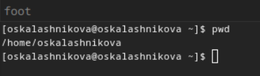{#fig:001 width=30%}

## Команда cd

С помощью утилиты cd перехожу в подкаталог tmp корневого каталога  (рис.2).

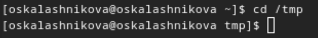{#fig:002 width=30%}

## Команда ls без ключей

С помощью утилиты ls, пока что без ключей, просматриваю содержимое каталога tmp (рис.3).

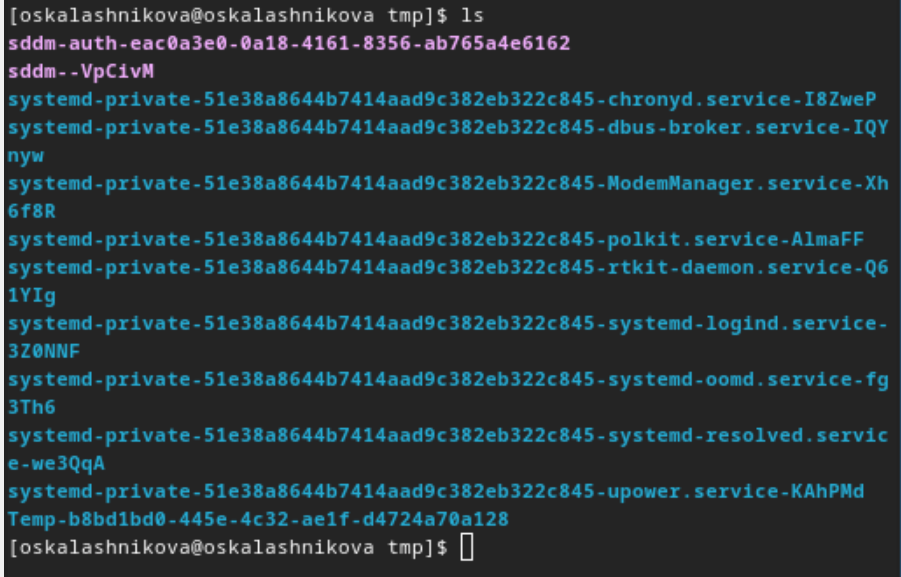{#fig:003 width=30%}

## Команда ls с разными опциями

Пробую использовать команду ls с разными опциями. Опция -m разделяет элементы списка запятой (рис.4).

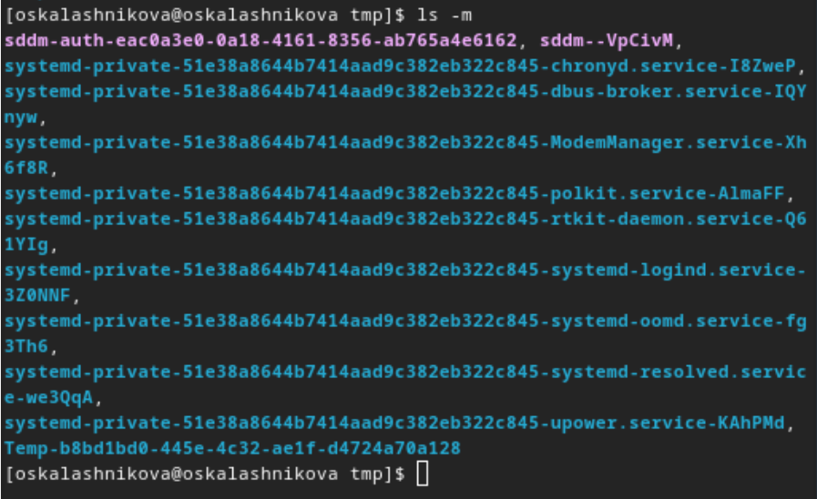{#fig:004 width=30%}

## Команда ls с разными опциями

Опция -l позволит увидеть дополнительную информацию о файлах в каталоге: время создания, владельца, права (рис.5).

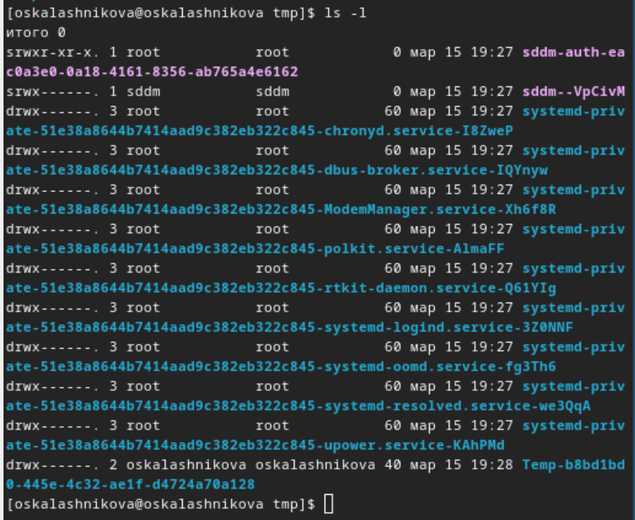{#fig:005 width=30%}

## Определение наличия файла

Используем ls /var/spool/ Чтобы определить, есть ли в каталоге подкатлог с соответствющим именем. В  директории действительно есть такой каталог (рис.6).

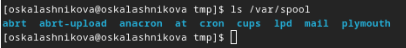{#fig:006 width=30%}

## ls -l для выяснения владельцев

Возвращаюсь в домашний каталог с помощью cd. Затем проверяю содержимое каталога с помощью утилиты ls, опция -l позволяет определить владельцев файлов(рис.7).

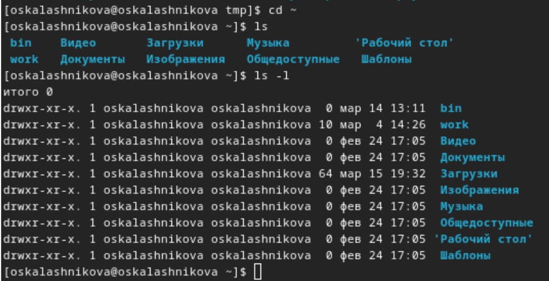{#fig:007 width=30%}

## Работа с директориями

Создаю директорию newdir с помощью утилиты mkdir, затем проверяю, что директория создалась с помощью ls. Создаю для каталога newdir подкаталог morefun, проверяю, что каталог собран (рис.8).

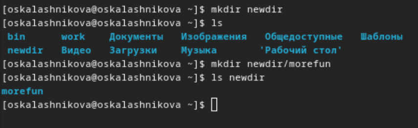{#fig:008 width=30%}

## Работа с директориями

Чтобы создать несколько директорий одной строчкой нужно перечислить названия директорий через пробел после утилиты mkdir. Чтобы удалить несколько директорий одной строчкой нужно перечислить названия директорий через пробел после утилиты rmdir (рис.9).

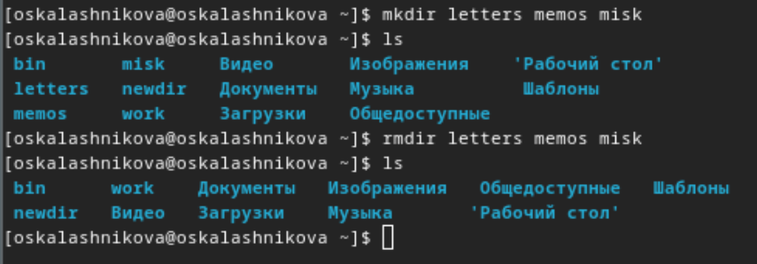{#fig:009 width=30%}

## Работа с директориями

Удаляю директорию newdir с помощью утилиты rmdir, т.к директория не пустая, я сначала удаляю morefun (рис.10).

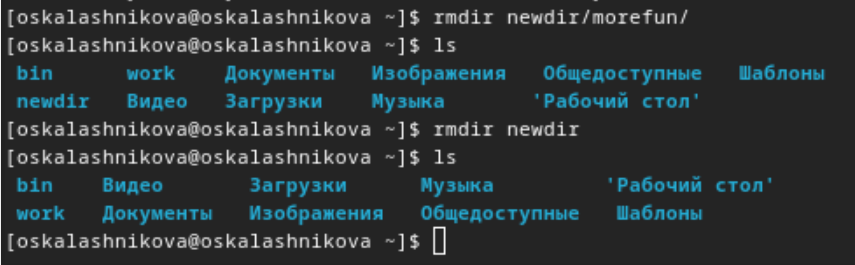{#fig:010 width=30%}

## Работа с командой man

С помощью команды man ls я могу прочесть документацию к команде ls, опция, которая позолить выводить все подкаталоги каталогов предоставлена на скриншоте, это -R (рис.11).

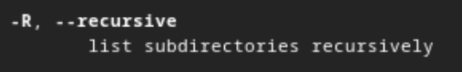{#fig:011 width=30%}

## Работа с командой man

Проверяю работу ls -R (рис.12).

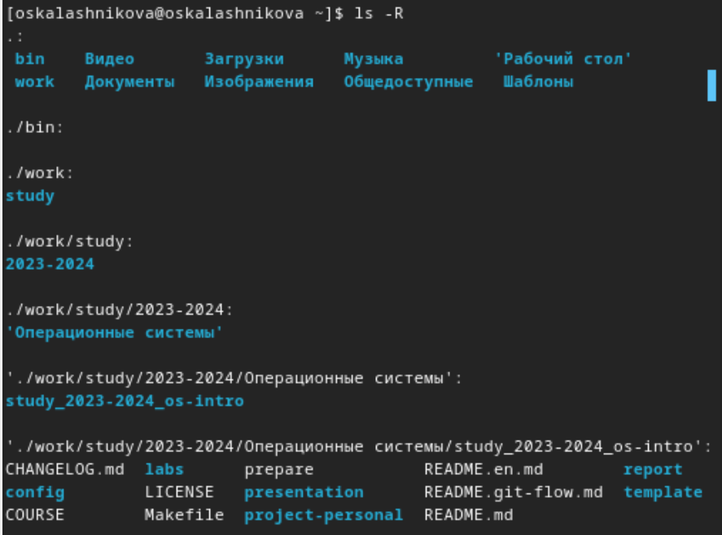{#fig:012 width=30%}

## Работа с командой man

Для сортировки и выводда информации нужна комбинация опций -tl. (рис.13).

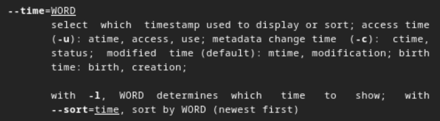{#fig:013 width=30%}

## Работа с командой man

Проверяю работу ls -tl (рис.14).

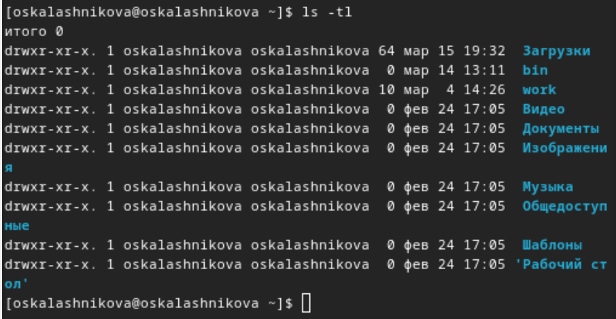{#fig:014 width=30%}

## Работа с командой man

С помощью man cd узнаю описание команды cd и ее опции. Основных опций немного:

1. -P - позволяет следовать по символическим ссылкам перед тем, как обработаны все переходы '..'

3. -L - переходит по символическим ссылкам только после того, как обработаны все переходы ".."

4. -e - позволяет выйти с ошибкой, если диреткория, в которую нужно перейти, не найдена.

## Работа с командой man

С помощью man pwd узнаю описание команды pwd и ее опции:

1. -L - брать директорию из переменной окружения, даже если она содержит символические ссылки.

2. -P - отбрасывать все символические ссылки.

## Работа с командой man

С помощью man mkdir узнаю описание команды mkdir и ее опции:

1. -m - устанавливает права доступа создаваемой директории как chmod, синтаксис тоже как у chmod.

2. -p - позволяет рекурсивно создавать директории и их подкаталоги

3. -v - выводи сообщение о созданных директориях

4. -z - установить контекст SELinux для создаваемой директории по умолчанию

5. -context - установить контекст SELinux для создаваемой директории в значении CTX

## Работа с командой man

С помощью man rmdir узнаю описание команды rmdir и ее опции:

1. --ignore-fail-on-non-empty - отменяет вывод ошибки, если каталог не пустой, просто его игнорирует

2. -p - удаляет рекурсивно каталоги, если они все содержат в себе только удаляемый каталог (можно было использовать в пункте чуть выше)

3. -v - выводит сообщение о каждом удалении  директории.

## Работа с командой man

С помощью man rm узнаю описание команды rm и ее опции:

1. -f - игнорировать несуществующие файлы или аргументы, никогда не выводить запрос на подтверждение удаления

2. -I - вывести запрос на подтверждение удаления один раз, для всех файлов, если удаляется больше 3-х файлов или идет рекурсивное удаление

3. -r, -R - удаляет директории их содержимое рекурсивно

4. -d, --dir - удаляет пустые директории

5. -v - прописывает все действия команды

## Работа с командой history

Вывела историю команд с помощью утилиты history (рис.15).

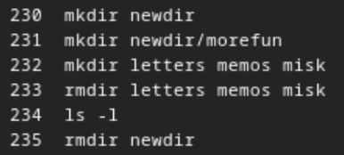{#fig:015 width=30%}

## Работа с командой history

Модифицировала команды (рис.16).

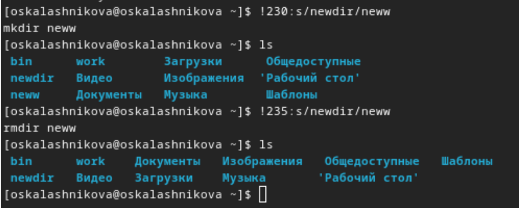{#fig:016 width=30%}

## Выводы

Я приобрела практические навыки взаимодействия пользователя с системой посредством командной строки.