---
## Front matter
title: "Отчёт по лабораторной работе №6"
subtitle: "Операционные системы"
author: "Калашникова Ольга Сергеевна"

## Generic otions
lang: ru-RU
toc-title: "Содержание"

## Bibliography
bibliography: bib/cite.bib
csl: pandoc/csl/gost-r-7-0-5-2008-numeric.csl

## Pdf output format
toc: true # Table of contents
toc-depth: 2
lof: true # List of figures
lot: true # List of tables
fontsize: 12pt
linestretch: 1.5
papersize: a4
documentclass: scrreprt
## I18n polyglossia
polyglossia-lang:
  name: russian
  options:
	- spelling=modern
	- babelshorthands=true
polyglossia-otherlangs:
  name: english
## I18n babel
babel-lang: russian
babel-otherlangs: english
## Fonts
mainfont: PT Serif
romanfont: PT Serif
sansfont: PT Sans
monofont: PT Mono
mainfontoptions: Ligatures=TeX
romanfontoptions: Ligatures=TeX
sansfontoptions: Ligatures=TeX,Scale=MatchLowercase
monofontoptions: Scale=MatchLowercase,Scale=0.9
## Biblatex
biblatex: true
biblio-style: "gost-numeric"
biblatexoptions:
  - parentracker=true
  - backend=biber
  - hyperref=auto
  - language=auto
  - autolang=other*
  - citestyle=gost-numeric
## Pandoc-crossref LaTeX customization
figureTitle: "Рис."
tableTitle: "Таблица"
listingTitle: "Листинг"
lofTitle: "Список иллюстраций"
lotTitle: "Список таблиц"
lolTitle: "Листинги"
## Misc options
indent: true
header-includes:
  - \usepackage{indentfirst}
  - \usepackage{float} # keep figures where there are in the text
  - \floatplacement{figure}{H} # keep figures where there are in the text
---

# Цель работы

Целью данной работы является приобретение практических навыков взаимодействия пользователя с системой посредством командной строки.

# Задание

1. Определите полное имя вашего домашнего каталога. Далее относительно этого каталога будут выполняться последующие упражнения.

2. Выполните следующие действия:

- Перейдите в каталог /tmp.

- Выведите на экран содержимое каталога /tmp. Для этого используйте команду ls с различными опциями. Поясните разницу в выводимой на экран информации.

-Определите, есть ли в каталоге /var/spool подкаталог с именем cron?

- Перейдите в Ваш домашний каталог и выведите на экран его содержимое. Определите, кто является владельцем файлов и подкаталогов?

3. Выполните следующие действия:

- В домашнем каталоге создайте новый каталог с именем newdir.

- В каталоге ~/newdir создайте новый каталог с именем morefun.

- В домашнем каталоге создайте одной командой три новых каталога с именами letters, memos, misk. Затем удалите эти каталоги одной командой.

-  Попробуйте удалить ранее созданный каталог ~/newdir командой rm. Проверьте, был ли каталог удалён.

- Удалите каталог ~/newdir/morefun из домашнего катало1га. Проверьте, был ли каталог удалён.

4. С помощью команды man определите, какую опцию команды ls нужно использовать для просмотра содержимое не только указанного каталога, но и подкаталогов,входящих в него.

5. С помощью команды man определите набор опций команды ls, позволяющий отсортировать по времени последнего изменения выводимый список содержимого каталога с развёрнутым описанием файлов.

6. Используйте команду man для просмотра описания следующих команд: cd, pwd, mkdir, rmdir, rm. Поясните основные опции этих команд.

7. Используя информацию, полученную при помощи команды history, выполните модификацию и исполнение нескольких команд из буфера команд

# Выполнение лабораторной работы

Полное имя домашнего каталога можно узнать с помощью утилоиты pwd (рис. @fig:001).

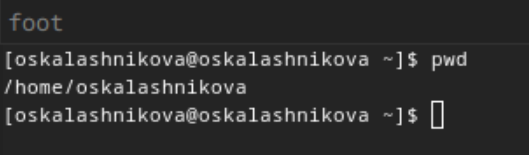{#fig:001 width=70%}

С помощью утилиты cd перехожу в подкаталог tmp корневого каталога  (рис. @fig:002).

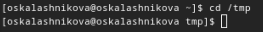{#fig:002 width=70%}

С помощью утилиты ls, пока что без ключей, просматриваю содержимое каталога tmp (рис. @fig:003).

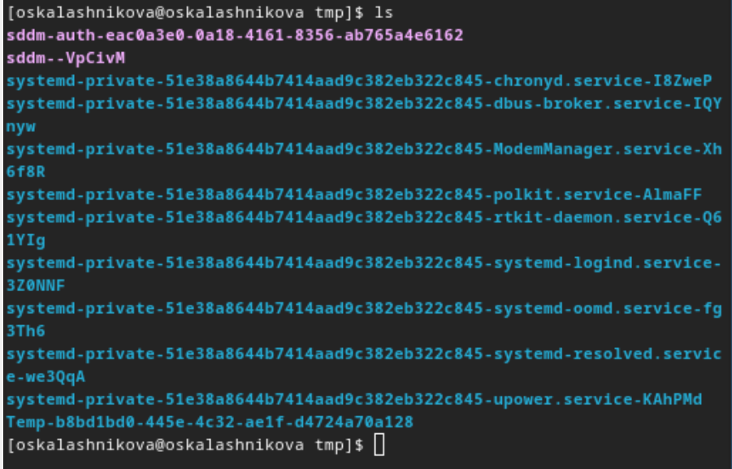{#fig:003 width=70%}

Пробую использовать команду ls с разными опциями. Опция -m разделяет элементы списка запятой (рис. @fig:004).

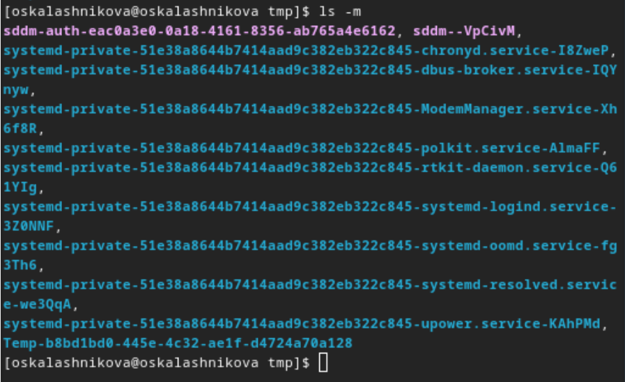{#fig:004 width=70%}

Опция -l позволит увидеть дополнительную информацию о файлах в каталоге: время создания, владельца, права (рис. @fig:005).

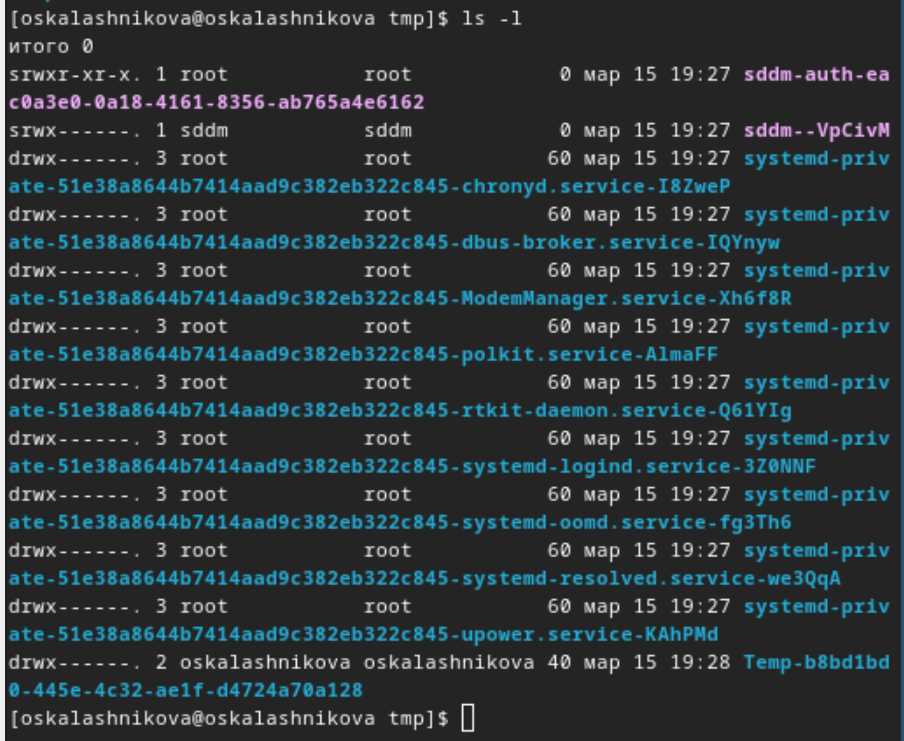{#fig:005 width=70%}

Используем ls /var/spool/ Чтобы определить, есть ли в каталоге подкатлог с соответствющим именем. В  директории действительно есть такой каталог (рис. @fig:006).

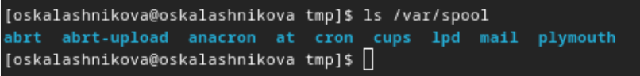{#fig:006 width=70%}

Возвращаюсь в домашний каталог с помощью cd. Затем проверяю содержимое каталога с помощью утилиты ls, опция -l позволяет определить владельцев файлов(рис. @fig:007).

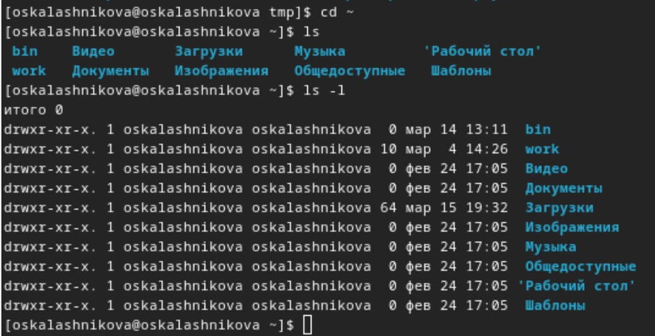{#fig:007 width=70%}

Создаю директорию newdir с помощью утилиты mkdir, затем проверяю, что директория создалась с помощью ls. Создаю для каталога newdir подкаталог morefun, проверяю, что каталог собран (рис. @fig:008).

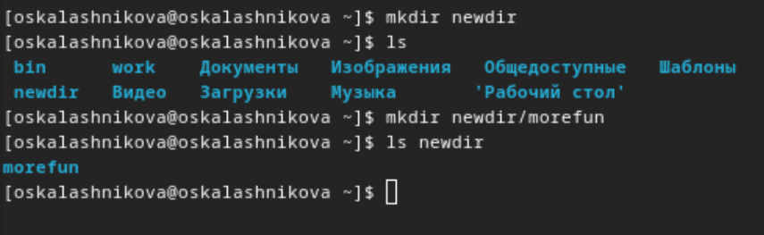{#fig:008 width=70%}

Чтобы создать несколько директорий одной строчкой нужно перечислить названия директорий через пробел после утилиты mkdir. Чтобы удалить несколько директорий одной строчкой нужно перечислить названия директорий через пробел после утилиты rmdir (рис. @fig:009).

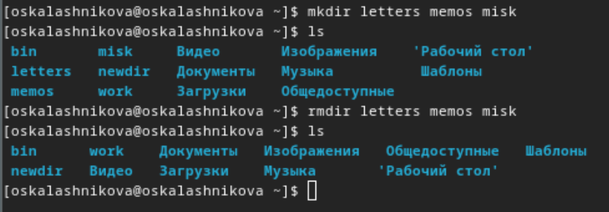{#fig:009 width=70%}

Удаляю директорию newdir с помощью утилиты rmdir, т.к директория не пустая, я сначала удаляю morefun (рис. @fig:010).

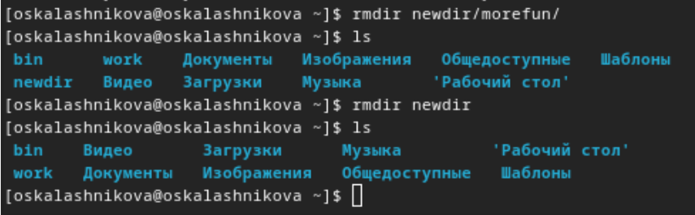{#fig:010 width=70%}

С помощью команды man ls я могу прочесть документацию к команде ls, опция, которая позолить выводить все подкаталоги каталогов предоставлена на скриншоте, это -R (рис. @fig:011).

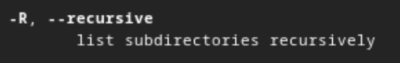{#fig:011 width=70%}

Проверяю работу ls -R (рис. @fig:012).

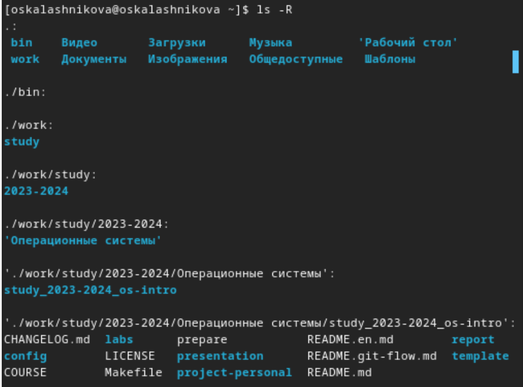{#fig:012 width=70%}

Для сортировки и выводда информации нужна комбинация опций -tl. (рис. @fig:013).

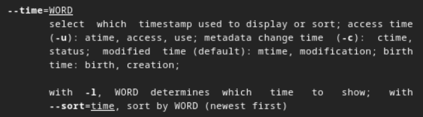{#fig:013 width=70%}

Проверяю работу ls -tl (рис. @fig:014).

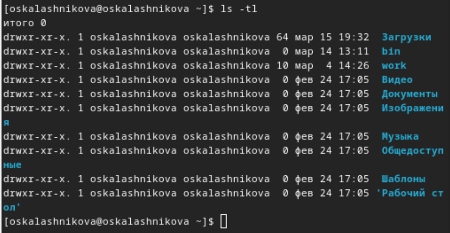{#fig:014 width=70%}

С помощью man cd узнаю описание команды cd и ее опции. Основных опций немного:

1. -P - позволяет следовать по символическим ссылкам перед тем, как обработаны все переходы '..'

3. -L - переходит по символическим ссылкам только после того, как обработаны все переходы ".."

4. -e - позволяет выйти с ошибкой, если диреткория, в которую нужно перейти, не найдена.

С помощью man pwd узнаю описание команды pwd и ее опции:

1. -L - брать директорию из переменной окружения, даже если она содержит символические ссылки.

2. -P - отбрасывать все символические ссылки.

С помощью man mkdir узнаю описание команды mkdir и ее опции:

1. -m - устанавливает права доступа создаваемой директории как chmod, синтаксис тоже как у chmod.

2. -p - позволяет рекурсивно создавать директории и их подкаталоги

3. -v - выводи сообщение о созданных директориях

4. -z - установить контекст SELinux для создаваемой директории по умолчанию

5. -context - установить контекст SELinux для создаваемой директории в значении CTX

С помощью man rmdir узнаю описание команды rmdir и ее опции:

1. --ignore-fail-on-non-empty - отменяет вывод ошибки, если каталог не пустой, просто его игнорирует

2. -p - удаляет рекурсивно каталоги, если они все содержат в себе только удаляемый каталог (можно было использовать в пункте чуть выше)

3. -v - выводит сообщение о каждом удалении  директории.

С помощью man rm узнаю описание команды rm и ее опции:

1. -f - игнорировать несуществующие файлы или аргументы, никогда не выводить запрос на подтверждение удаления

2. -I - вывести запрос на подтверждение удаления один раз, для всех файлов, если удаляется больше 3-х файлов или идет рекурсивное удаление

3. --one-file-system - во время рекурсивного удаления пропускать директории из других файловых систем

4. --no-preserve-root если в качестве директории задана корневая, то считать что это обычная директория и начать удаление.

5. -r, -R - удаляет директории их содержимое рекурсивно

6. -d, --dir - удаляет пустые директории

7. -v - прописывает все действия команды

Вывела историю команд с помощью утилиты history (рис. @fig:015).

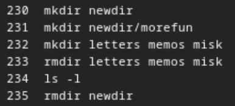{#fig:015 width=70%}

Модифицировала команды (рис. @fig:016).

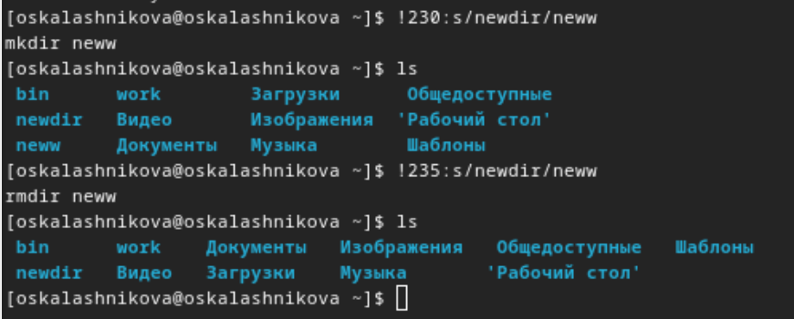{#fig:016 width=70%}

# Выводы

Я приобрела практические навыки взаимодействия пользователя с системой посредством командной строки.

# Ответы на онтрольные вопросы

1. Что такое командная строка: Командная строка, или терминал, представляет собой интерфейс для взаимодействия с операционной системой с помощью команд. Пользователь может вводить команды, чтобы выполнять различные действия, управлять файлами, запускать программы и многое другое.

2. При помощи какой команды можно определить абсолютный путь текущего каталога?Приведите пример: Для определения абсолютного пути к текущему каталогу используется команда pwd. Например: если я введу pwd в своем домашнем каталоге то получу /home/oskalashnikova

3. При помощи какой команды и каких опций можно определить только тип файлов и их имена в текущем каталоге? Приведите примеры: С помощью команды ls можно определить имена файлов, при помощи опции -F уже мы сможем определить тип файлов. Пример есть в лабораторной работе.

4. Каким образом отобразить информацию о скрытых файлах? Приведите примеры: С помощью команды ls можно определить имена файлов, если нам необходимы скрытые файлы, добавим опцию -a. (рис. @fig:017).

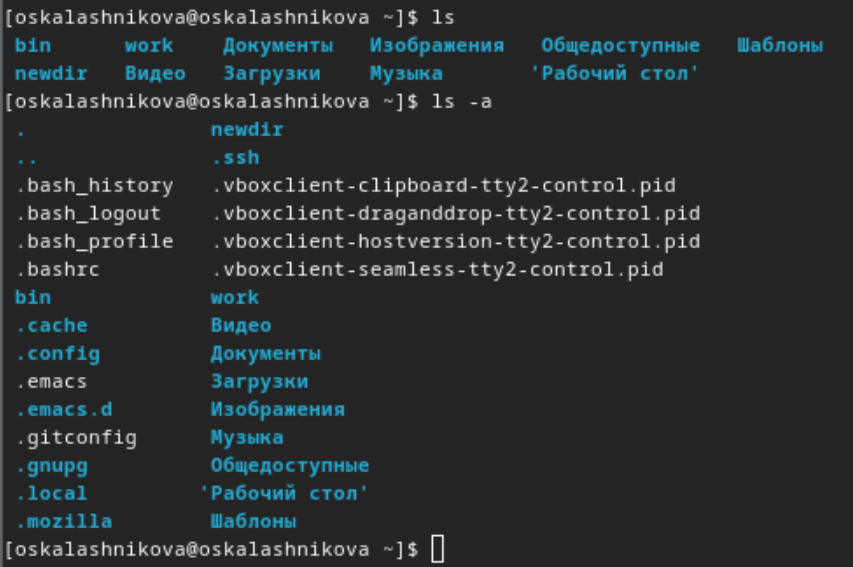{#fig:017 width=70%}

5. При помощи каких команд можно удалить файл и каталог? Можно ли это сделать одной и той же командой? Приведите примеры: rmdir удаляет пустые каталоги, не удаляет файлы. rm удаляет файлы, без дополнительных опций (-d, -r) не будет удалять каталоги. Удалить в одной строчке одной командой можно файл и каталог. Если файл находится в каталоге, используем рекурсивное удаление, если файл и каталог не связаны подобным образом, то добавим опцию -d, введя имена через пробел после утилиты.

6. Каким образом можно вывести информацию о последних выполненных пользователем командах: Вывести информацию о последних выполненных пользователем команд можно с помощью history. Пример приведет в лабораторной работе.

7. Как воспользоваться историей команд для их модифицированного выполнения? Приведите примеры: Используем синтаксис !<номер_команды>:s/<что_меняем>/<на_что_меняем>. Примеры приведены в лабораторной работе.

8. Приведите примеры запуска нескольких команд в одной строке: Для выполнения нескольких команд в одной строке используется символ ;. Предположим, я нахожусь не в домашнем каталоге. Если я введу "cd ; ls", то окажусь в домашнем каталоге и получу вывод файлов внутри него.

9. Дайте определение и приведите примера символов экранирования: Символы экранирования в командной строке используются для того, чтобы показать интерпретатору, что следующий символ нужно рассматривать буквально, а не как специальный символ. Пример: cd work/Операционные\ системы/

10. Охарактеризуйте вывод информации на экран после выполнения команды ls с опцией:  Опция -l позволит увидеть дополнительную информацию о файлах в каталоге: время создания, владельца, права доступа

11.  Что такое относительный путь к файлу? Приведите примеры использования относительного и абсолютного пути при выполнении какой-либо команды : Относительный путь указывает на расположение файла относительно текущего рабочего каталога. Например, если ваш текущий каталог /home/user, а файл находится в папке /home/user/documents/file.txt, то относительный путь к файлу будет documents/file.txt.

12. Как получить информацию об интересующей вас команде: Использовать man <имя команды> или <имя команды> --help

13. Какая клавиша или комбинация клавиш служит для автоматического дополнения вводимых команд: Для автоматического дополнения вводимых команд в большинстве оболочек используется клавиша Tab. Нажатие клавиши Tab позволяет автоматически дополнить команду или имя файла до уникального варианта.
