---
## Front matter
lang: ru-RU
title: Лабораторная работа №7
subtitle: Операционные системы
author:
  - Калашникова Ольга Сергеевна НПИбд-01-23
institute:
  - Российский университет дружбы народов, Москва, Россия
date: 16 марта 2024

## i18n babel
babel-lang: russian
babel-otherlangs: english

## Formatting pdf
toc: false
toc-title: Содержание
slide_level: 2
aspectratio: 169
section-titles: true
theme: metropolis
header-includes:
 - \metroset{progressbar=frametitle,sectionpage=progressbar,numbering=fraction}
 - '\makeatletter'
 - '\beamer@ignorenonframefalse'
 - '\makeatother'
 
## Fonts 
mainfont: PT Serif 
romanfont: PT Serif 
sansfont: PT Sans 
monofont: PT Mono 
mainfontoptions: Ligatures=TeX 
romanfontoptions: Ligatures=TeX 
sansfontoptions: Ligatures=TeX,Scale=MatchLowercase 
monofontoptions: Scale=MatchLowercase,Scale=0.9

---

## Цель работы

Ознакомление с файловой системой Linux, её структурой, именами и содержанием
каталогов. Приобретение практических навыков по применению команд для работы
с файлами и каталогами, по управлению процессами (и работами), по проверке исполь-
зования диска и обслуживанию файловой системы

## Задание

1. Выполнить все примеры из лабораторной работы

2. Выполнить команды по копированию, созданию и перемещению файлов и каталогов

3. Определить опции команды chmod

4. Изменить права доступа к файлам

5. Прочитать документацию о командах mount, fsck, mkfs, kill

## Копирование файлов и каталогов

Создаю файл и проверяю (рис.1).

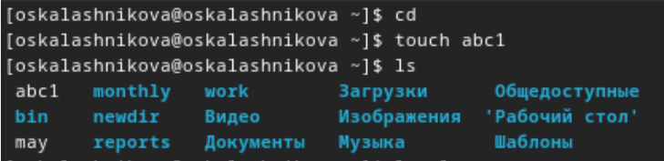{#fig:001 width=30%}

## Копирование файлов и каталогов

Дважды копирую его с новыми имнами и проверяю, что все команды были выполнены корректно(рис.2).

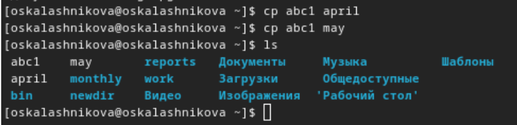{#fig:002 width=30%}

## Копирование файлов и каталогов

Создаю директорию, копирую в нее два файла, созданных на прошлом этапе, проверяю, что все скопировалось (рис.3).

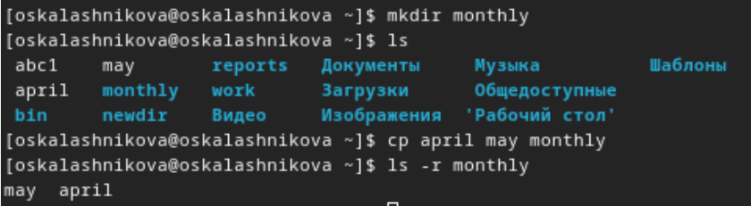{#fig:003 width=30%}

## Копирование файлов и каталогов

Копирую файл, находящийся не в текущей диреткории в файл с новым именем тоже не в текущей директории (рис.4).

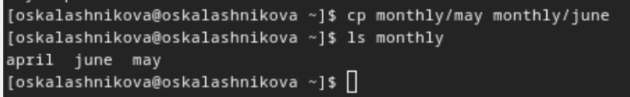{#fig:004 width=30%}

## Копирование файлов и каталогов

Создаю новую директорию (рис.5).

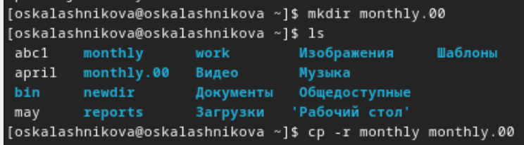{#fig:005 width=30%}

## Копирование файлов и каталогов

Затем копирую предыдущую созданную директорию в новую созданную  (рис.6).

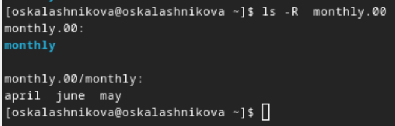{#fig:006 width=30%}

## Копирование файлов и каталогов

Копирую предыдущую созданную директорию вместе со всем содержимым в каталог /tmp  (рис.7).

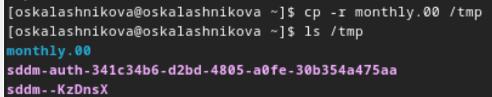{#fig:007 width=30%}

## Перемещение и переименование файлов и каталогов

Переименовываю файл (рис.8).

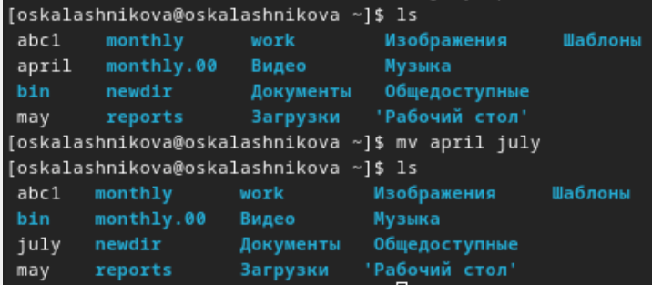{#fig:008 width=30%}

## Перемещение и переименование файлов и каталогов

Затем перемещаю его в каталог (рис.9).

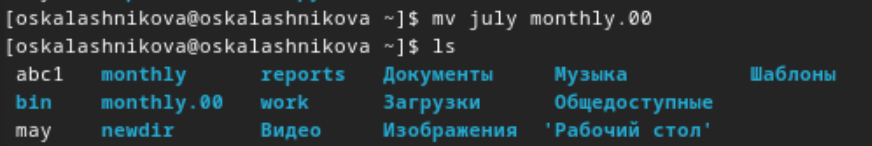{#fig:009 width=30%}

## Перемещение и переименование файлов и каталогов

Проверяю (рис.10).

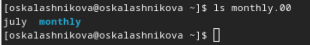{#fig:010 width=30%}

## Перемещение и переименование файлов и каталогов

Переименовываю monthly.00 в monthly.01 (рис.11).

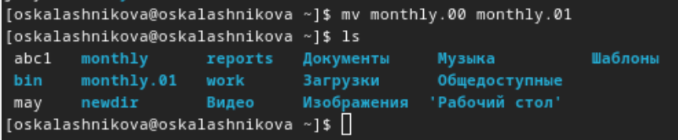{#fig:011 width=30%}

## Перемещение и переименование файлов и каталогов

Создаю новую диреткорию reports, перемещаю директорию monthly.01 в директорию reports, переименовываю эту директорию (рис.12).

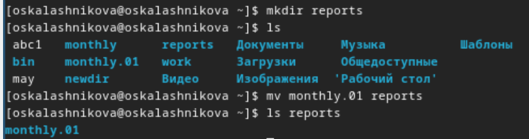{#fig:012 width=30%}

## Перемещение и переименование файлов и каталогов

Переименовываю каталог reports/monthly.01 в reports/monthly (рис.13).

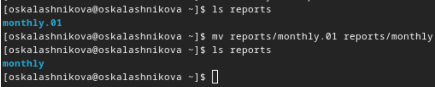{#fig:013 width=30%}

## Изменение прав доступа

Создаю пустой файл, проверяю права доступа у него, изменяю права доступа, добавляя пользователю (создателю) возможность выполнения  (рис.14).

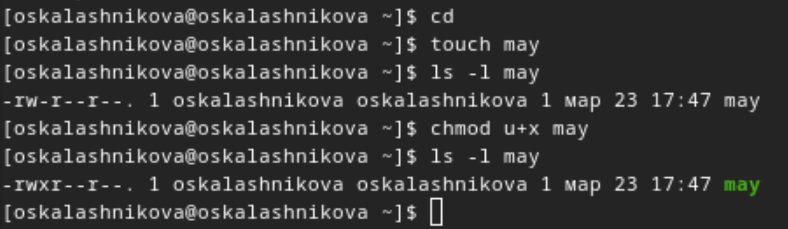{#fig:014 width=30%}

## Изменение прав доступа

Затем лишаю этой возможности (рис.15).

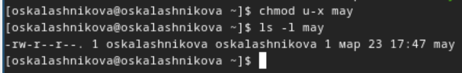{#fig:015 width=370%}

## Изменение прав доступа

Меняю права доступа у директории: группы и остальные пользователи не смогут ее прочетсь (рис.16).

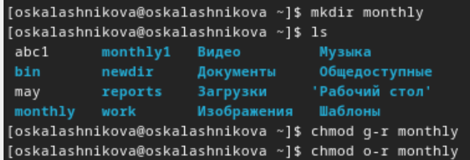{#fig:016 width=30%}

## Изменение прав доступа

Создаю новый пустой файл с правом записи для членов группы (рис.17).

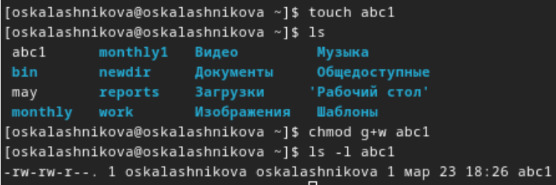{#fig:017 width=30%}

## Анализ файловой системы

С помощью команды fsck можно проверить (а в ряде случаев восстановить) целостность файловой системы (рис.18).

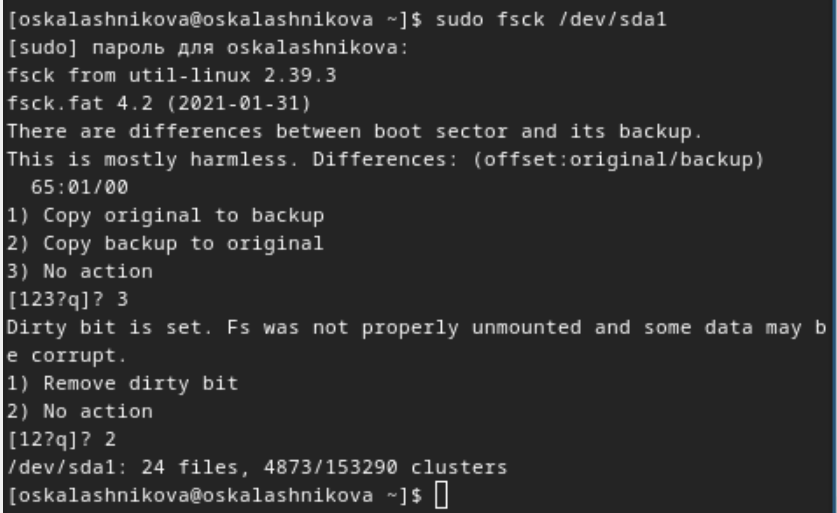{#fig:018 width=30%}

## Выполнение заданий по копированию и перемещению

Копирую файл в домашний каталог с новым именем (рис.19).

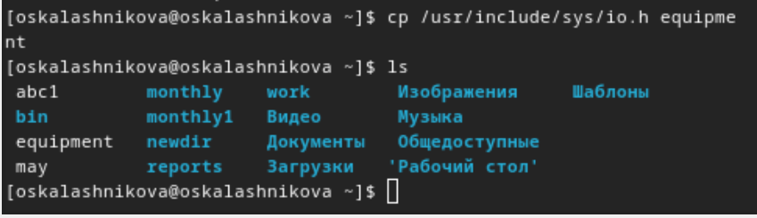{#fig:019 width=30%}

## Выполнение заданий по копированию и перемещению

Создаю новую пустую директорию (рис.20).

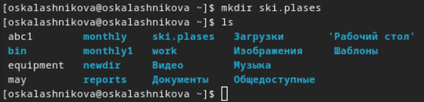{#fig:020 width=30%}

## Выполнение заданий по копированию и перемещению

Перемещаю файл в эту директорию (рис.21).

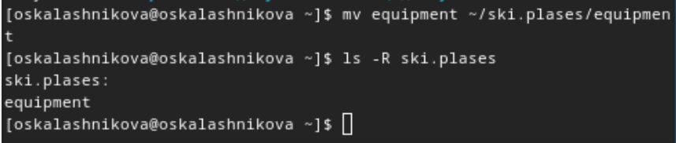{#fig:021 width=30%}

## Выполнение заданий по копированию и перемещению

Переименовываю файл (рис.22).

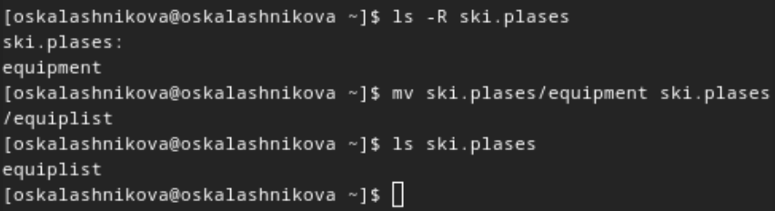{#fig:022 width=30%}

## Выполнение заданий по копированию и перемещению

Создаю новый файл, копирую его в новую директорию, но уже сразу с новым именем (рис.23).

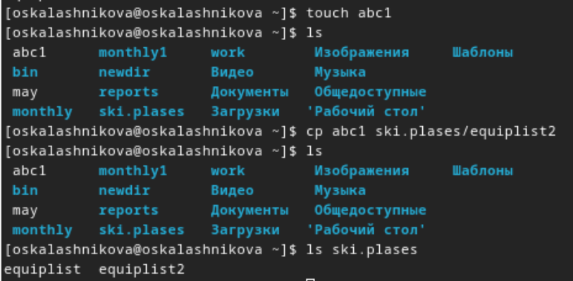{#fig:023 width=30%}

## Выполнение заданий по копированию и перемещению

Создаю внутри этого каталога подкаталог (рис.24).

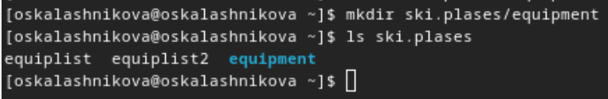{#fig:024 width=30%}

## Выполнение заданий по копированию и перемещению

Перемещаю файлы в подкаталог (рис.25).

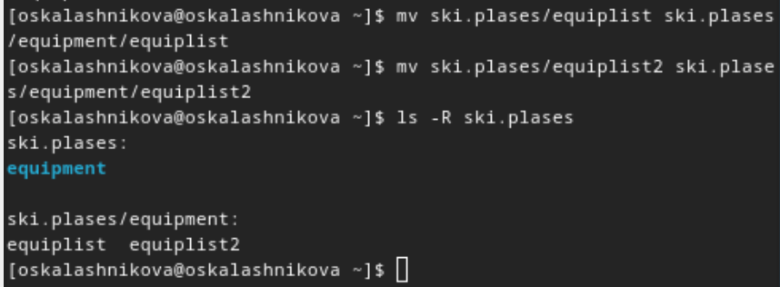{#fig:025 width=30%}

## Выполнение заданий по копированию и перемещению

Создаю новую директорию, перемещаю ее с новым именем в директорию (рис.26).

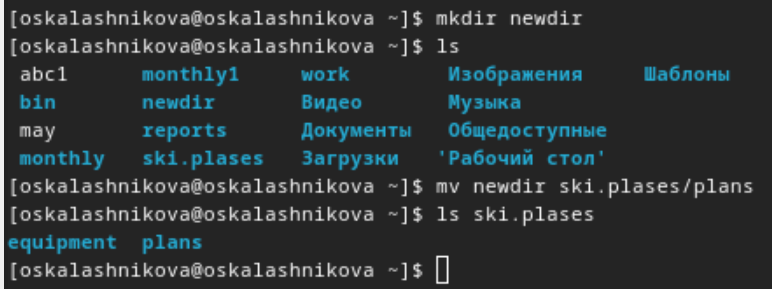{#fig:026 width=30%}

## Выполнение заданий по правам доступа

Создаю каталог и проверяю начальные права (рис.27).

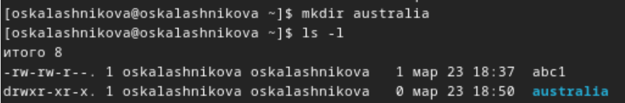{#fig:027 width=30%}

## Выполнение заданий по правам доступа

Редактирую права (рис.28).

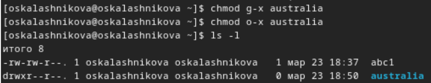{#fig:028 width=30%}

## Выполнение заданий по правам доступа

Создаю каталог и проверяю начальные права (рис.29).

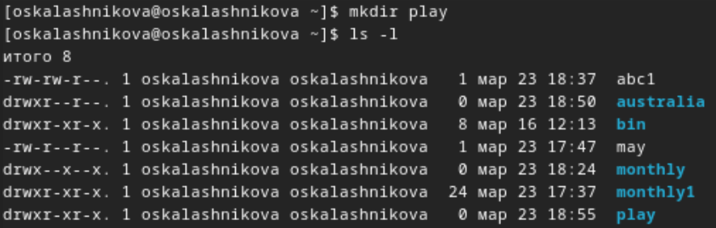{#fig:029 width=40%}

## Выполнение заданий по правам доступа

Редактирую права(рис.30).

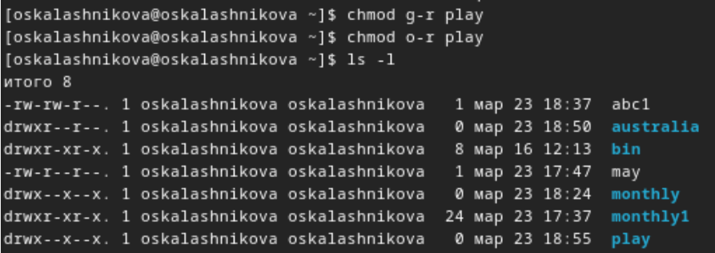{#fig:030 width=30%}

## Выполнение заданий по правам доступа

Создаю файл и проверяю начальные права (рис.31).

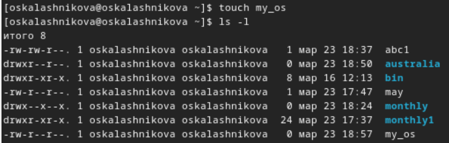{#fig:031 width=30%}

## Выполнение заданий по правам доступа

Редактирую права(рис.32).

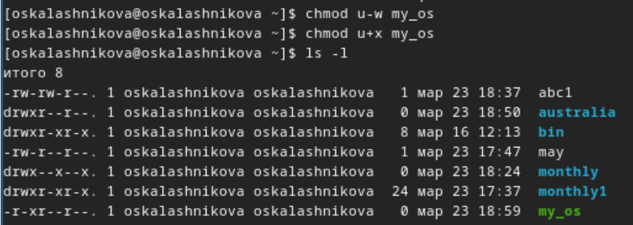{#fig:032 width=30%}

## Выполнение заданий по правам доступа

Создаю файл и проверяю начальные права. Редактирую права(рис.33).

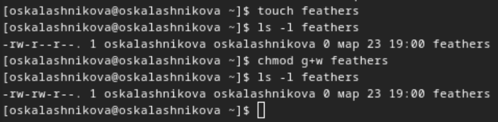{#fig:033 width=30%}

## Выполнение заданий по правам доступа

Читаю содержимое файла (рис.34).

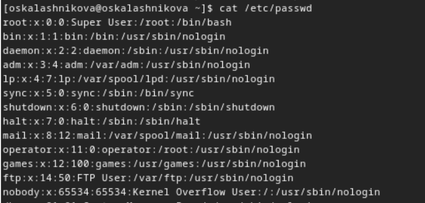{#fig:034 width=30%}

## Выполнение заданий по правам доступа

Копирую файл с новым именем (рис.35).

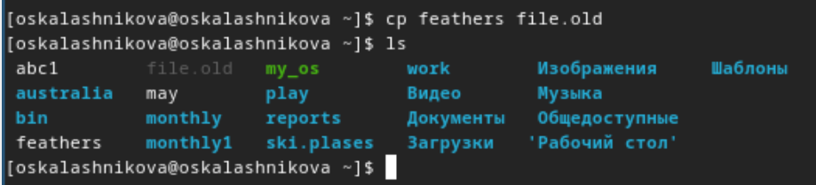{#fig:035 width=30%}

## Выполнение заданий по правам доступа

Перемещаю его в ранее созданную директорию (рис.36).

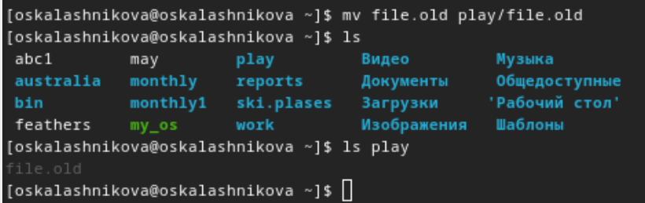{#fig:036 width=30%}

## Выполнение заданий по правам доступа

Рекурсивно копирую директорию с новым именем (рис.37).

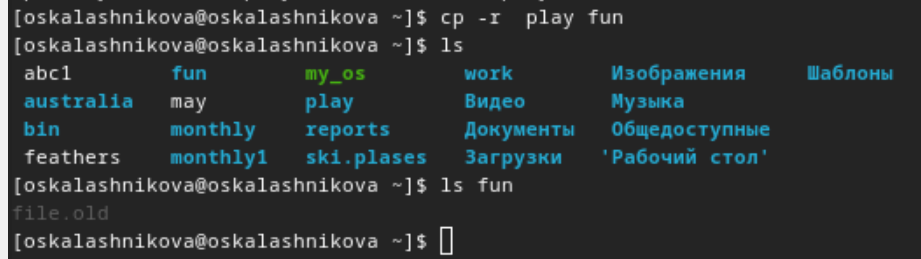{#fig:037 width=30%}

## Выполнение заданий по правам доступа

Перемещаю скопированную до этого папку (рис.38).

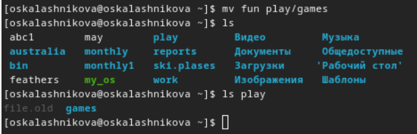{#fig:038 width=30%}

## Выполнение заданий по правам доступа

Убираю право на чтение у файла для создателя (рис.39).

{#fig:039 width=30%}

## Выполнение заданий по правам доступа

Поэтому не могу его прочесть, также не могу его скопировать, потому что отказано в доступе на чтение (рис.40).

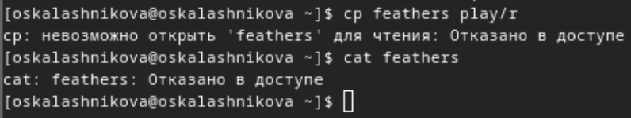{#fig:040 width=30%}

## Выполнение заданий по правам доступа

Возвращаю все права (рис.41).

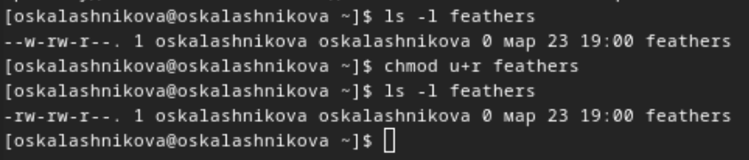{#fig:041 width=30%}

## Выполнение заданий по правам доступа

Убираю у директории право на исполнение для пользователя (рис.42).

{#fig:042 width=30%}.

## Выполнение заданий по правам доступа

пытаюсь в нее войти - отказано в доступе (рис.43).

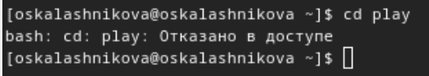{#fig:043 width=30%}

## Выполнение заданий по правам доступа

возвращаю все права (рис.44).

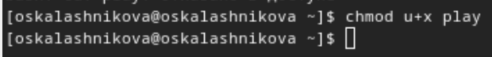{#fig:044 width=30%}

## Выводы

При выполнении данной лабораторной работы я ознакомилась с файловой системой Linux, её структурой, именами и содержанием каталогов. Приобрела практические навыки по применению команд для работы с файлами и каталогами, по управлению процессами (и работами), по проверке использования диска и обслуживанию файловой системы