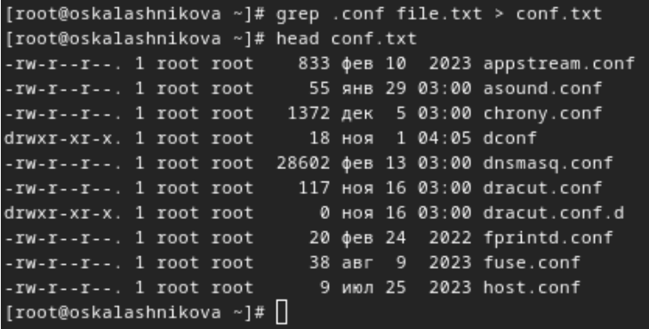

---
## Front matter
lang: ru-RU
title: Лабораторная работа №8
subtitle: Операционные системы
author:
  - Калашникова Ольга Сергеевна НПИбд-01-23
institute:
  - Российский университет дружбы народов, Москва, Россия
date: 30 марта 2024

## i18n babel
babel-lang: russian
babel-otherlangs: english

## Formatting pdf
toc: false
toc-title: Содержание
slide_level: 2
aspectratio: 169
section-titles: true
theme: metropolis
header-includes:
 - \metroset{progressbar=frametitle,sectionpage=progressbar,numbering=fraction}
 - '\makeatletter'
 - '\beamer@ignorenonframefalse'
 - '\makeatother'
 
## Fonts 
mainfont: PT Serif 
romanfont: PT Serif 
sansfont: PT Sans 
monofont: PT Mono 
mainfontoptions: Ligatures=TeX 
romanfontoptions: Ligatures=TeX 
sansfontoptions: Ligatures=TeX,Scale=MatchLowercase 
monofontoptions: Scale=MatchLowercase,Scale=0.9

---

## Цель работы

Ознакомление с инструментами поиска файлов и фильтрации текстовых данных. Приобретение практических навыков: по управлению процессами (и заданиями), по проверке использования диска и обслуживанию файловых систем.

## Конвейер

Я вошла в систему под соотвествующим именем пользователя, открыла терминал, записала в файл file.txt названия файлов из каталога /etc с помощью перенаправления ">" (и файл создала, и записала в него то, что могло быть выведено ls -lR /etc). В файл я добавила также все файлы из подкаталогов (рис.1).

{#fig:001 width=30%}

## Конвейер

Проверила, что в файл записались нужные значения с помощью утилиты head, она выводит первые 10 строк файла на экран (рис.2).

{#fig:002 width=30%}

## Конвейер

Добавила в созданный файл имена файлов из домашнего каталога, используя перенаправление ">>" в режиме добавления (рис.3).

{#fig:003 width=30%}

## Конвейер

Вывела на экран имена всех файлов, имеющих расширение ".conf" с помощью утилиты grep (рис.4).

{#fig:004 width=30%}

## Конвейер

Добавила вывод прошлой команды в новый файл conf.txt с помощью перенаправления ">" (файл создается при выполнении этой команды) (рис.5).

{#fig:005 width=30%}

## Поиск файла

Определяю,какие файлы в домашнем каталоге начинаютя с символа "c" с помощью утилиты find, прописываю ей в аргументах домашнюю директорию, выбираю опцию -name (ищем по имени), и пишу маску, по которой будем искать имя, где * - любое кол-во любых символов, добавляю опцию -print, чтобы мне вывелся результат. Я получаю информацию даже о файлах из подкаталогов домашнего каталога. (рис.6).

{#fig:006 width=30%}

## Поиск файла

Второй способ использовать утилиту ls -lR и использовать grep, чтобы найти элементы с первым символом c. Однако этот способ не работает для поиска файлов из подкаталогов каталога (рис.7).

{#fig:007 width=30%}

## Поиск файла

С помощью метода find, чьи опции я расписала ранее, ищу все файлы, начинающиеся с буквы "h" из каталога /etc (рис.8).

{#fig:008 width=30%}

## Управление процессами и задачами

Запускаю в фоновом режиме (на это указывает символ &) процесс, который будет записывать в файл logfile (с помощью перенаправления >) файлы, имена которых начинаются с log (рис.9).

{#fig:009 width=30%}

## Управление процессами и задачами

Проверяю, что файл создан (рис.10).

{#fig:010 width=30%}

## Управление процессами и задачами

Удаляю файл, проверяю, что файл удален (рис.11).

{#fig:011 width=30%}

## Управление процессами и задачами

Запускаю в консоли в фоновом режиме (с помощью символа &) редактор nano (рис.12).

{#fig:012 width=30%}

## Управление процессами и задачами

С помощью утилиты ps определяю идентификатор процесса mousepad(3497) (рис.13).

{#fig:013 width=30%}

## Управление процессами и задачами

Второй способ (рис.14).

{#fig:014 width=30%}

## Управление процессами и задачами

Прочитала справку команды kill (рис.15).

{#fig:015 width=30%}

## Управление процессами и задачами

Использую команду kill и идентификатор процесса, чтобы его удалить (рис.16)

{#fig:016 width=30%}

## Проверка использования диска

Прочитала документацию про функции df (рис.17).

{#fig:017 width=30%}

## Проверка использования диска

Прочитала документацию про функции du (рис. @fig:018).

{#fig:018 width=30%}

## Проверка использования диска

Использую утилиту df опции -iv позволяют увидеть информацию об инодах и сделать вывод читаемым, игнорируя сообщения системы о нем. Эта утилита нам нужна, чтобы выяснить, сколько свободного места есть у нашей системы (рис.19). 

{#fig:019 width=30%}

## Проверка использования диска

Использую утилиту du. Она нужна чтобы просмотреть, сколько места занимают файлы в определенной директории и найти самые большие из них (рис.20).

{#fig:020 width=30%}

## Проверка использования диска

Прочитала документацию о команде find (рис.21).

{#fig:021 width=30%}

## Проверка использования диска

Вывела имена всех директорий, имеющихся в моем домашнем каталоге, используя аргумент d у утилиты find опции -type, то есть указываю тип файлов, который мне нужен и этот тип Директория (рис.22). 

{#fig:022 width=30%}

## Выводы

В результате данной лабораторной работы я ознакомилась с инструментами поиска файлов и фильтрации текстовых данных, а также приобрела практические навыки по управлению процессами (и заданиями), по проверке использования диска и по обслуживанию файловых систем.
