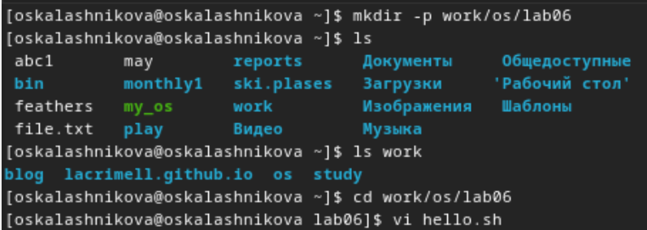
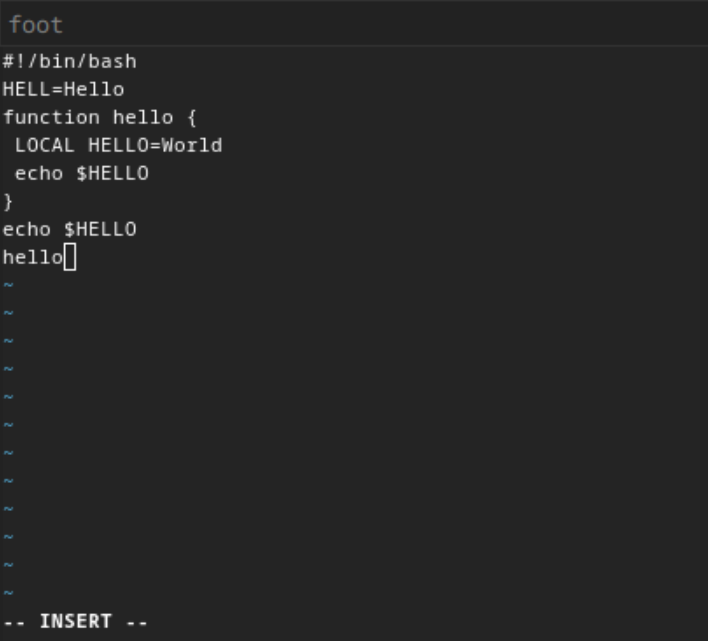
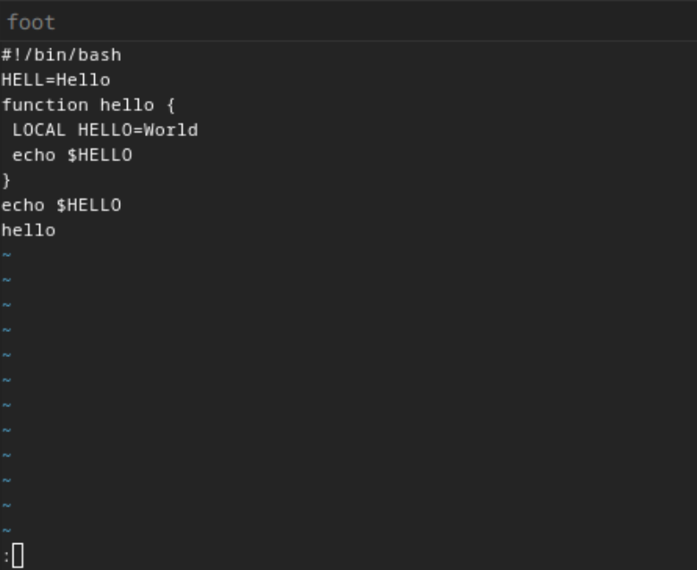
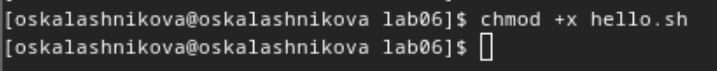
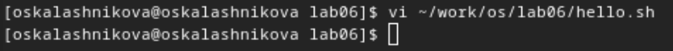
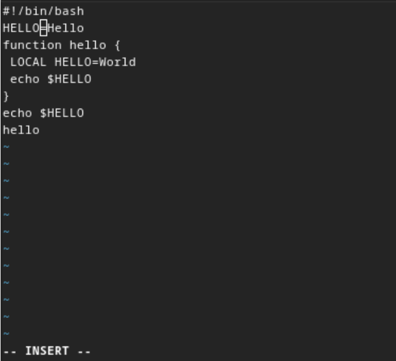
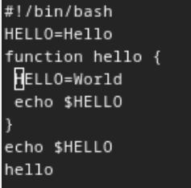
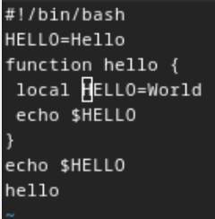
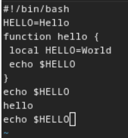
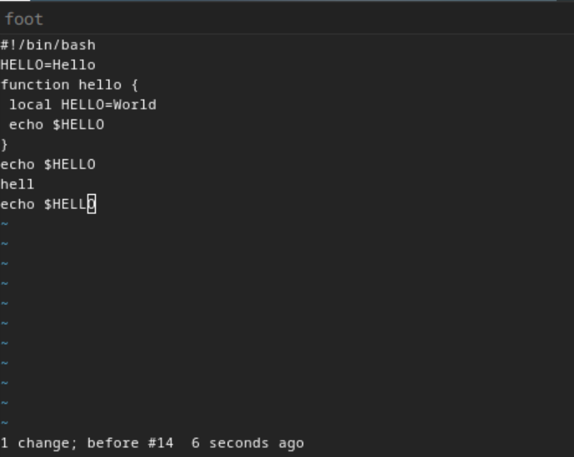

---
## Front matter
lang: ru-RU
title: Лабораторная работа №10
subtitle: Операционные системы
author:
  - Калашникова Ольга Сергеевна НПИбд-01-23
institute:
  - Российский университет дружбы народов, Москва, Россия
date: 13 апреля 2024

## i18n babel
babel-lang: russian
babel-otherlangs: english

## Formatting pdf
toc: false
toc-title: Содержание
slide_level: 2
aspectratio: 169
section-titles: true
theme: metropolis
header-includes:
 - \metroset{progressbar=frametitle,sectionpage=progressbar,numbering=fraction}
 - '\makeatletter'
 - '\beamer@ignorenonframefalse'
 - '\makeatother'
 
## Fonts 
mainfont: PT Serif 
romanfont: PT Serif 
sansfont: PT Sans 
monofont: PT Mono 
mainfontoptions: Ligatures=TeX 
romanfontoptions: Ligatures=TeX 
sansfontoptions: Ligatures=TeX,Scale=MatchLowercase 
monofontoptions: Scale=MatchLowercase,Scale=0.9

---

## Цель работы

Цель данной лабораторной работы - познакомиться с операционной системой Linux, получить практические навыки работы с редактором vi, установленным по умолчанию практически во всех дистрибутивах.

## Задание

1. Ознакомиться с теоретическим материалом.

2. Ознакомиться с редактором vi.

3. Выполнить упражнения, используя команды vi.

## Создание нового файла с использованием vi

Создаю директорию, в которой буду работать, с помощью команды mkdir, перехожу в нее с помощью команды cd, создаю и открываю для редактирования файл с помощью встроенного текстового редактора vi (рис.1).

{#fig:001 width=30%}

## Создание нового файла с использованием vi

Нажимаю i, чтобы начать редактирование и добавляться текст (режим добавления), далее добавляю текст (рис.2).

{#fig:002 width=40%}

## Создание нового файла с использованием vi

Нажимаю esc, чтобы выйти из режима добавления и перейти в командный режим. Перехожу в режим последней строки (рис.3).

{#fig:003 width=30%}

## Создание нового файла с использованием vi

Ввожу w для сохранения и q для выхода и нажимаю enter, после чего файл сохраняется с изменениями и я возвращаюсь в терминал (рис.4).

{#fig:004 width=40%}

## Создание нового файла с использованием vi

С помощью chmod добавляю права на исполнение файла, делая его исполняемым (рис.5).

{#fig:005 width=30%}

## Редактирование существующего файла

Снова открываю этот файл с помощью текстового редактора vi (рис.6).

{#fig:006 width=40%}

## Редактирование существующего файла

Изменяю местоположение курсора (рис.7).

{#fig:007 width=30%}

## Редактирование существующего файла

В режиме добавления (клавиша i) удаляю слово LOCAL, снова перехожу в командный режим с помощью esc (рис.8).

{#fig:008 width=40%}

## Редактирование существующего файла

В режиме добавления (клавиша i) добавляю слово local, снова перехожу в командный режим с помощью esc (рис.9).

{#fig:009 width=30%}

## Редактирование существующего файла

В режиме добавления (клавиша i) перехожу в конец последней строки и добавляю новую строку, снова перехожу в командный режим с помощью esc. (рис.10). После этого я вернулась в режим добавления, удалила строку и вернулась в командный режим.

{#fig:010 width=40%}

## Редактирование существующего файла

В командном режиме я нажала "u" и отменила последнее действие, удаление строки (рис.11).

{#fig:011 width=30%}

## Редактирование существующего файла

Перешла в режим последней строки и ввела w для сохранения файла и q для выхода, нажала enter и файл закрылся (рис.12).

{#fig:012 width=40%}

## Выводы

При выполнении данной лабораторной работы я познакомилась с операционной системой Linux, получила практические навыки работы с редактором vi, установленным по умолчанию практически во всех дистрибутивах.

