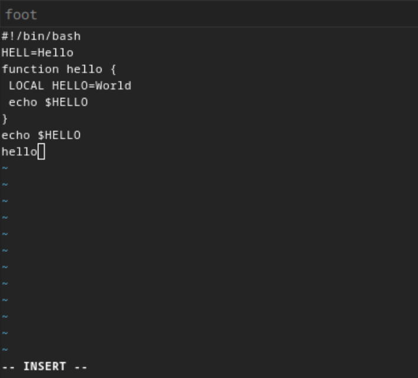
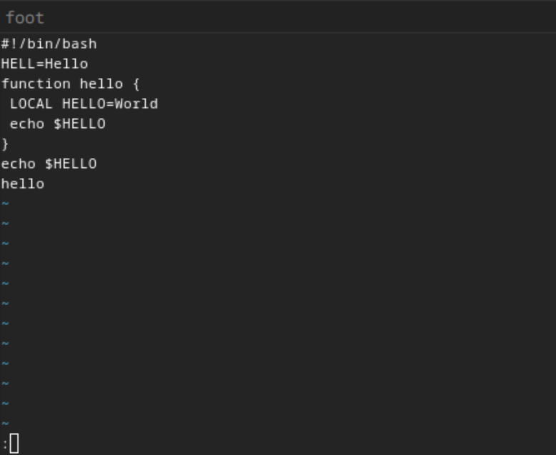
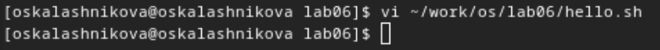
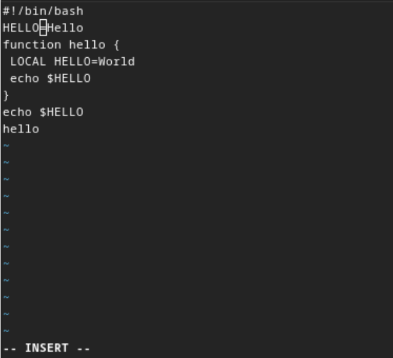
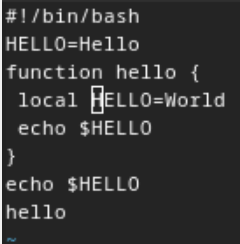
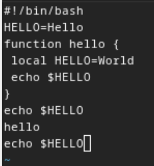
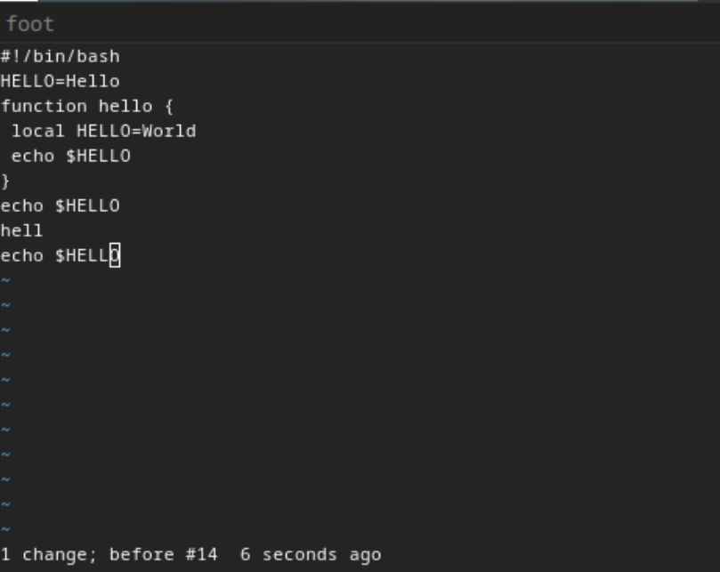
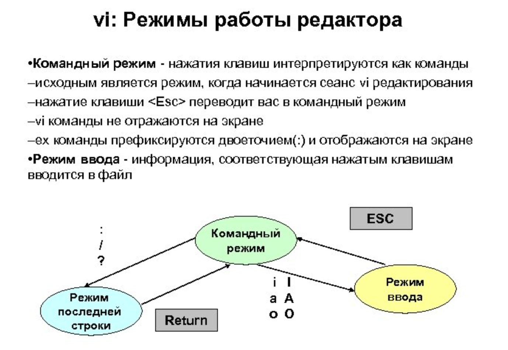

---
## Front matter
title: "Отчёт по лабораторной работе №10"
subtitle: "Операционные системы"
author: "Калашникова Ольга Сергеевна"

## Generic otions
lang: ru-RU
toc-title: "Содержание"

## Bibliography
bibliography: bib/cite.bib
csl: pandoc/csl/gost-r-7-0-5-2008-numeric.csl

## Pdf output format
toc: true # Table of contents
toc-depth: 2
lof: true # List of figures
lot: true # List of tables
fontsize: 12pt
linestretch: 1.5
papersize: a4
documentclass: scrreprt
## I18n polyglossia
polyglossia-lang:
  name: russian
  options:
	- spelling=modern
	- babelshorthands=true
polyglossia-otherlangs:
  name: english
## I18n babel
babel-lang: russian
babel-otherlangs: english
## Fonts
mainfont: PT Serif
romanfont: PT Serif
sansfont: PT Sans
monofont: PT Mono
mainfontoptions: Ligatures=TeX
romanfontoptions: Ligatures=TeX
sansfontoptions: Ligatures=TeX,Scale=MatchLowercase
monofontoptions: Scale=MatchLowercase,Scale=0.9
## Biblatex
biblatex: true
biblio-style: "gost-numeric"
biblatexoptions:
  - parentracker=true
  - backend=biber
  - hyperref=auto
  - language=auto
  - autolang=other*
  - citestyle=gost-numeric
## Pandoc-crossref LaTeX customization
figureTitle: "Рис."
tableTitle: "Таблица"
listingTitle: "Листинг"
lofTitle: "Список иллюстраций"
lotTitle: "Список таблиц"
lolTitle: "Листинги"
## Misc options
indent: true
header-includes:
  - \usepackage{indentfirst}
  - \usepackage{float} # keep figures where there are in the text
  - \floatplacement{figure}{H} # keep figures where there are in the text
---

# Цель работы

Цель данной лабораторной работы - познакомиться с операционной системой Linux, получить практические навыки работы с редактором vi, установленным по умолчанию практически во всех дистрибутивах.

# Задание

1. Ознакомиться с теоретическим материалом.

2. Ознакомиться с редактором vi.

3. Выполнить упражнения, используя команды vi.

# Выполнение лабораторной работы

Создаю директорию, в которой буду работать, с помощью команды mkdir, перехожу в нее с помощью команды cd, создаю и открываю для редактирования файл с помощью встроенного текстового редактора vi (рис. @fig:001).

{#fig:001 width=70%}

Нажимаю i, чтобы начать редактирование и добавляться текст (режим добавления), далее добавляю текст (рис. @fig:002).

{#fig:002 width=70%}

Нажимаю esc, чтобы выйти из режима добавления и перейти в командный режим. Перехожу в режим последней строки (рис. @fig:003).

{#fig:003 width=70%}

Ввожу w для сохранения и q для выхода и нажимаю enter, после чего файл сохраняется с изменениями и я возвращаюсь в терминал (рис. @fig:004).

{#fig:004 width=70%}

С помощью chmod добавляю права на исполнение файла, делая его исполняемым (рис. @fig:005).

{#fig:005 width=70%}

Снова открываю этот файл с помощью текстового редактора vi (рис. @fig:006).

{#fig:006 width=70%}

Изменяю местоположение курсора (рис. @fig:007).

{#fig:007 width=70%}

В режиме добавления (клавиша i) удаляю слово LOCAL, снова перехожу в командный режим с помощью esc (рис. @fig:008).

{#fig:008 width=70%}

В режиме добавления (клавиша i) добавляю слово local, снова перехожу в командный режим с помощью esc (рис. @fig:009).

{#fig:009 width=70%}

В режиме добавления (клавиша i) перехожу в конец последней строки и добавляю новую строку, снова перехожу в командный режим с помощью esc. (рис. @fig:010). После этого я вернулась в режим добавления, удалила строку и вернулась в командный режим.

{#fig:010 width=70%}

В командном режиме я нажала "u" и отменила последнее действие, удаление строки (рис. @fig:011).

{#fig:011 width=70%}

Перешла в режим последней строки и ввела w для сохранения файла и q для выхода, нажала enter и файл закрылся (рис. @fig:012).

{#fig:012 width=70%}

# Выводы

При выполнении данной лабораторной работы я познакомилась с операционной системой Linux, получила практические навыки работы с редактором vi, установленным по умолчанию практически во всех дистрибутивах.

# Ответы на контрольные вопросы

1. Дайте краткую характеристику режимам работы редактора vi.

- Командный режим (Command mode): В этом режиме редактора vi, мы можем выполнять команды, перемещаться по тексту и изменять его содержимое.

- Режим ввода (Insert mode): В этом режиме мы можем вводить и редактировать текст.

- Режим последней строки (Last line mode): Позволяет вводить команды, сохранять файл, выходить из vi и т. д.

2. Как выйти из редактора, не сохраняя произведённые изменения?

Для выхода из редактора vi без сохранения изменений, в командном режиме введите команду :q! (или q) и нажмите Enter.

3. Назовите и дайте краткую характеристику командам позиционирования.

– 0 (ноль) — переход в начало строки;

– $ — переход в конец строки;

– G — переход в конец файла;

– n G — переход на строку с номером n.

4. Что для редактора vi является словом?

В редакторе vi, слово - это последовательность букв, цифр и символов, разделенных пробелами или другими символами пунктуации. Движение по словам часто используется в командном режиме для быстрого позиционирования.

5. Каким образом из любого места редактируемого файла перейти в начало (конец) файла?

- Для перехода в начало файла в командном режиме введите gg.

- Для перехода в конец файла в командном режиме введите G.

6. Назовите и дайте краткую характеристику основным группам команд редактирования.

Вставка текста: 

– а — вставить текст после курсора; 

– А — вставить текст в конец строки; 

– i — вставить текст перед курсором; 

– n i — вставить текст n раз; 

– I — вставить текст в начало строки.

Вставка строки:

– о — вставить строку под курсором; 

– О — вставить строку над курсором.

Удаление текста:

– x — удалить один символ в буфер; 

– d w — удалить одно слово в буфер; 

– d $ — удалить в буфер текст от курсора до конца строки; 

– d 0 — удалить в буфер текст от начала строки до позиции курсора; 

– d d — удалить в буфер одну строку; 

– n d d — удалить в буфер n строк.

Отмена и повтор произведённых изменений: 

– u — отменить последнее изменение; 

– . — повторить последнее изменение.

Копирование текста в буфер:

– Y — скопировать строку в буфер; 

– n Y — скопировать n строк в буфер; 

– y w — скопировать слово в буфер.

Вставка текста из буфера:

– p — вставить текст из буфера после курсора; 

– P — вставить текст из буфера перед курсором.

Замена текста:

– c w — заменить слово; 

– n c w — заменить n слов; 

– c $ — заменить текст от курсора до конца строки; 

– r — заменить слово; 

– R — заменить текст.

Поиск текста:

– / текст — произвести поиск вперёд по тексту указанной строки символов текст; 

– ? текст — произвести поиск назад по тексту указанной строки символов текст.

7. Необходимо заполнить строку символами $. Каковы ваши действия?

Перейти в режим вставки.

8. Как отменить некорректное действие, связанное с процессом редактирования?

В командном режиме введите u, чтобы отменить последнее действие. Это отменит последнее изменение в тексте.

9. Назовите и дайте характеристику основным группам команд режима последней строки.

- Сохранение и выход: Команды для сохранения изменений и выхода из vi.

- Переходы и поиск: Команды для перемещения по файлу и поиска текста.

- Команды настройки: Команды для настройки редактора и его параметров.

10. Как определить, не перемещая курсора, позицию, в которой заканчивается строка?

$ — переход в конец строки

11. Выполните анализ опций редактора vi (сколько их, как узнать их назначение и т.д.)

Опции редактора vi позволяют настроить рабочую среду. 

Для задания опций используется команда set (в режиме последней строки): 

– : set all — вывести полный список опций; 

– : set nu — вывести номера строк; 

– : set list — вывести невидимые символы; 

– : set ic — не учитывать при поиске, является ли символ прописным или строчным.

12. Как определить режим работы редактора vi?

В редакторе vi режим работы обычно отображается в нижнем левом углу окна редактора. Например <Insert> для режима вставки.

13. Постройте граф взаимосвязи режимов работы редактора vi.(рис. @fig:013).

{#fig:013 width=70%}
