---
## Front matter
lang: ru-RU
title: Лабораторная работа №13
subtitle: Операционные системы
author:
  - Калашникова Ольга Сергеевна НПИбд-01-23
institute:
  - Российский университет дружбы народов, Москва, Россия
date: 4 мая 2024

## i18n babel
babel-lang: russian
babel-otherlangs: english

## Formatting pdf
toc: false
toc-title: Содержание
slide_level: 2
aspectratio: 169
section-titles: true
theme: metropolis
header-includes:
 - \metroset{progressbar=frametitle,sectionpage=progressbar,numbering=fraction}
 - '\makeatletter'
 - '\beamer@ignorenonframefalse'
 - '\makeatother'

## Fonts 
mainfont: PT Serif 
romanfont: PT Serif 
sansfont: PT Sans 
monofont: PT Mono 
mainfontoptions: Ligatures=TeX 
romanfontoptions: Ligatures=TeX 
sansfontoptions: Ligatures=TeX,Scale=MatchLowercase 
monofontoptions: Scale=MatchLowercase,Scale=0.9

---

## Цель работы

Цель данной лабораторной работы - изучить основы программирования в оболочке ОС UNIX, научится писать более сложные командные файлы с использованием логических управляющих конструкций и циклов.

## Выполнение лабораторной работы

Создаю файл с разрешением на исполнение (рис.1).

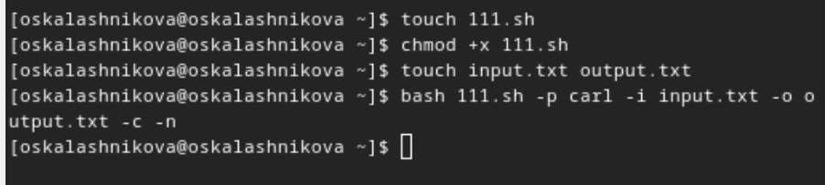{#fig:001 width=30%}

## Выполнение лабораторной работы

Командный файл, c командами getopts и grep, который анализирует командную строку, а затем ищет в указанном файле нужные строки (рис.2).

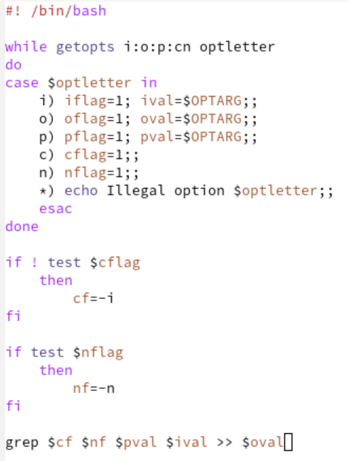{#fig:002 width=30%}

## Выполнение лабораторной работы

Результат работы программы в файле output.txt (рис.3).

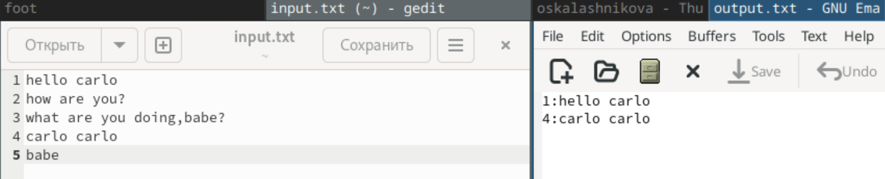{#fig:003 width=30%}

## Выполнение лабораторной работы

Создаю исполняемый файл для второй программы, также создаю файл 12.с для программы на Си (рис.4).

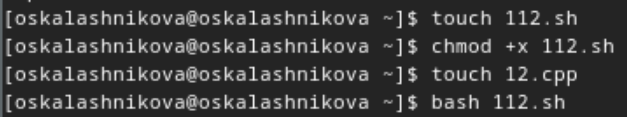{#fig:004 width=30%}

## Выполнение лабораторной работы

Пишу программу на языке Си, которая вводит число и определяет, является ли оно больше нуля, меньше нуля или равно нулю. Затем программа завершается с помощью функции exit(n), передавая информацию в о коде завершения в оболочку (рис.5).

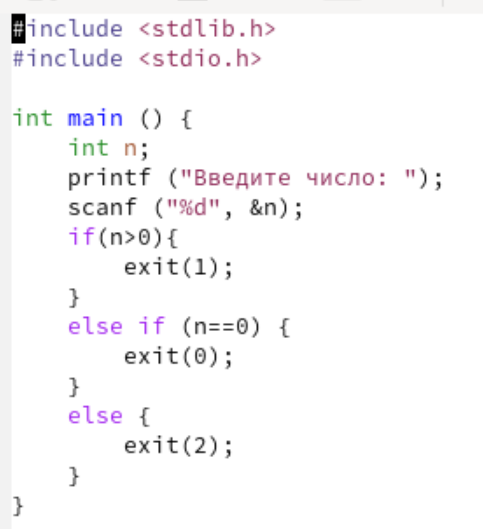{#fig:005 width=30%}

## Выполнение лабораторной работы

Командный файл должен вызывать эту программу и, проанализировав с помощью команды $?, выдать сообщение о том, какое число было введено (рис.6).

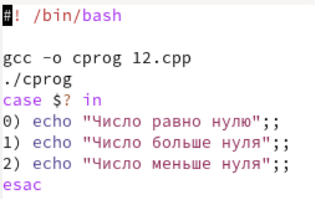{#fig:006 width=30%}

## Выполнение лабораторной работы

Программа работает корректно (рис.7).

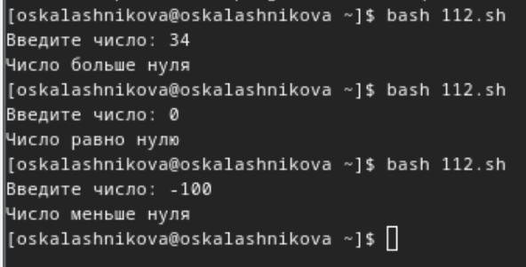{#fig:007 width=30%}

## Выполнение лабораторной работы

Создаю исполняемый файл для третьей программы (рис.8).

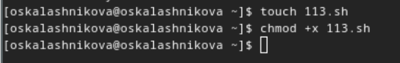{#fig:008 width=30%}

## Выполнение лабораторной работы

Командный файл, создающий указанное число файлов, пронумерованных последовательно от 1 до N (например 1.tmp, 2.tmp, 3.tmp,4.tmp и т.д.). Число файлов, которые необходимо создать, передаётся в аргументы командной строки. Этот же командный файл должен уметь удалять все созданные им файлы (если они существуют) (рис.9).

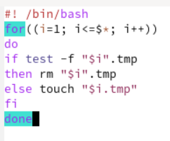{#fig:009 width=30%}

## Выполнение лабораторной работы

Проверяю, что программа создала файлы и удалила их при соответствующих запросах (рис.10).

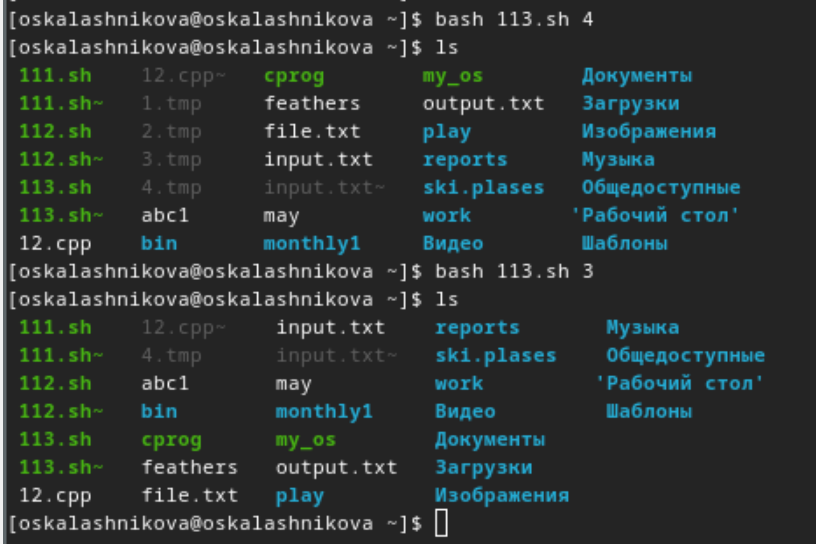{#fig:010 width=30%}

## Выполнение лабораторной работы

Создаю исполняемый файл для четвертой программы. Это командный файл, который с помощью команды tar запаковывает в архив все файлы в указанной директории. Модифицировать его так, чтобы запаковывались только те файлы, которые были изменены менее недели тому назад (использовать команду find) (рис.11).

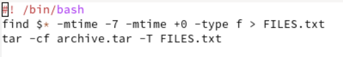{#fig:011 width=30%}

## Выполнение лабораторной работы
Проверяю работу программы (рис.12).

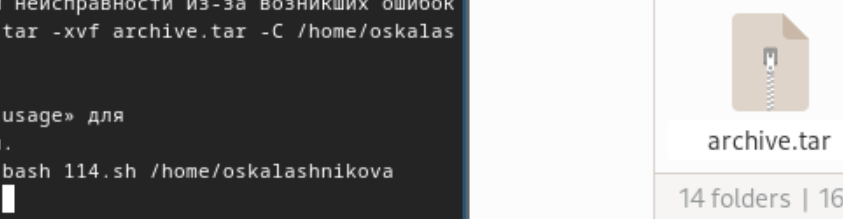{#fig:012 width=30%}

## Выводы

При выполнении данной лабораторной работы я изучила основы программирования в оболочке ОС UNIX, научилась писать более сложные командные файлы с использованием логических управляющих конструкций и циклов.

