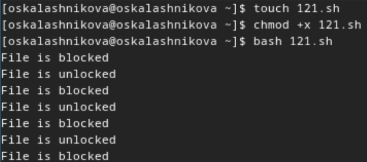
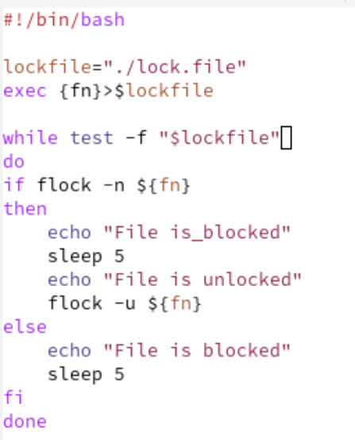
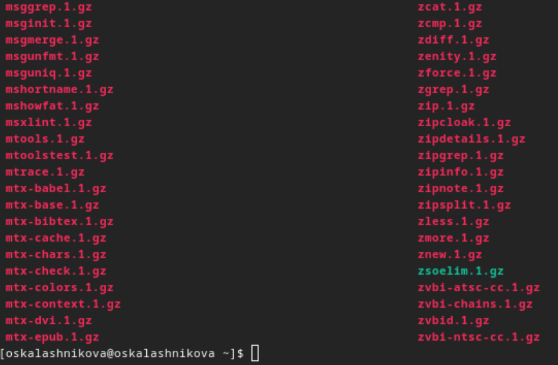
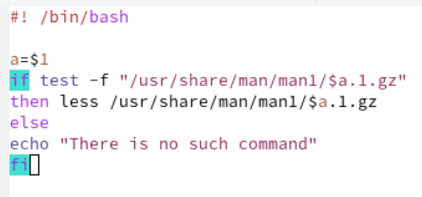
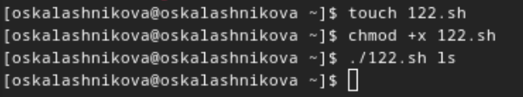
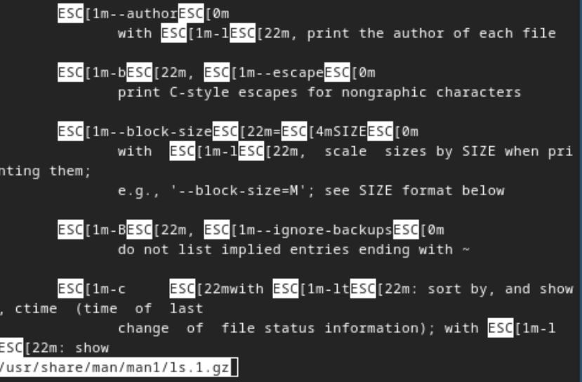
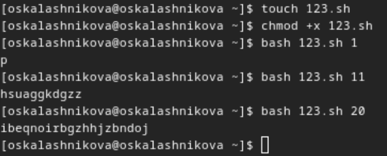
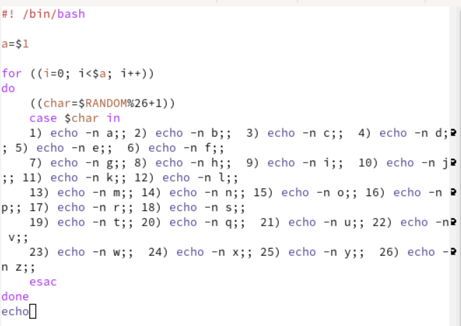

---
## Front matter
lang: ru-RU
title: Лабораторная работа №14
subtitle: Операционные системы
author:
  - Калашникова Ольга Сергеевна НПИбд-01-23
institute:
  - Российский университет дружбы народов, Москва, Россия
date: 11 мая 2024

## i18n babel
babel-lang: russian
babel-otherlangs: english

## Formatting pdf
toc: false
toc-title: Содержание
slide_level: 2
aspectratio: 169
section-titles: true
theme: metropolis
header-includes:
 - \metroset{progressbar=frametitle,sectionpage=progressbar,numbering=fraction}
 - '\makeatletter'
 - '\beamer@ignorenonframefalse'
 - '\makeatother'

## Fonts 
mainfont: PT Serif 
romanfont: PT Serif 
sansfont: PT Sans 
monofont: PT Mono 
mainfontoptions: Ligatures=TeX 
romanfontoptions: Ligatures=TeX 
sansfontoptions: Ligatures=TeX,Scale=MatchLowercase 
monofontoptions: Scale=MatchLowercase,Scale=0.9

---

## Цель работы

Цель данной лабораторной работы - изучить основы программирования в оболочке ОС UNIX, научиться писать более сложные командные файлы с использованием логических управляющих конструкций и циклов.

## Выполнение лабораторной работы

Создаю командный файл для первой программы, пишу ее, проверяю ее работу (рис.1).

{#fig:001 width=40%}

## Выполнение лабораторной работы

Командный файл, реализующий упрощённый механизм семафоров. (рис.2).

{#fig:002 width=40%}

## Выполнение лабораторной работы

Чтобы реализовать команду man с помощью командного файла, изучаю содержимое каталога /usr/share/man/man1. В нем находятся архивы текстовых файлов, содержащих справку по большинству установленных в системе программ и команд (рис.3).

{#fig:003 width=40%}

## Выполнение лабораторной работы

Командный файл должен получать в виде аргумента командной строки название команды и в виде
результата выдавать справку об этой команде или сообщение об отсутствии справки, если соответствующего файла нет в каталоге man1 (рис.4).

{#fig:004 width=70%}

## Выполнение лабораторной работы
Проверяю работу командного файла (рис.5).

{#fig:005 width=40%}

## Выполнение лабораторной работы

Командный файл работает так же, как и команда man, открывает справку по указанной утилите (рис.6).

{#fig:006 width=40%}

## Выполнение лабораторной работы

Создаю файл для кода третьей программы, пишу программу и проверяю ее работу (рис.7).

{#fig:007 width=40%}

## Выполнение лабораторной работы

Используя встроенную переменную $RANDOM, пишу командный файл, генерирующий случайную последовательность букв латинского алфавита. Т.к. $RANDOM выдаёт псевдослучайные числа в диапазоне от 0 до 32767, ввожу ограничения так, чтобы была генерация чисел от 1 до 26 (рис.8).

{#fig:008 width=40%}

## Выводы

При выполнении данной лабораторной работы я изучила основы программирования в оболочке ОС UNIX, научилась писать более сложные командные файлы с использованием логических управляющих конструкций и циклов.
