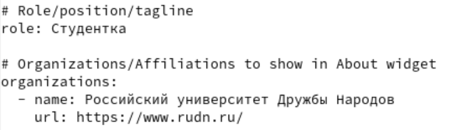

---
## Front matter
lang: ru-RU
title: Отчет по выполнению индивидуального проекта №2
subtitle: Операционные системы
author:
  - Калашникова Ольга Сергеевна НПИбд-01-23
institute:
  - Российский университет дружбы народов, Москва, Россия
date: 16 марта 2024

## i18n babel
babel-lang: russian
babel-otherlangs: english

## Formatting pdf
toc: false
toc-title: Содержание
slide_level: 2
aspectratio: 169
section-titles: true
theme: metropolis
header-includes:
 - \metroset{progressbar=frametitle,sectionpage=progressbar,numbering=fraction}
 - '\makeatletter'
 - '\beamer@ignorenonframefalse'
 - '\makeatother'

## Fonts 
mainfont: PT Serif 
romanfont: PT Serif 
sansfont: PT Sans 
monofont: PT Mono 
mainfontoptions: Ligatures=TeX 
romanfontoptions: Ligatures=TeX 
sansfontoptions: Ligatures=TeX,Scale=MatchLowercase 
monofontoptions: Scale=MatchLowercase,Scale=0.9

---

## Цель работы

Продолжить работы со своим сайтом. Редактировать его в соответствии с требованиями. Добавить данные о себе.

## Задание

1. Разместить фотографию владельца сайта.

2. Разместить краткое описание владельца сайта (Biography).

3. Добавить информацию об интересах (Interests).

4. Добавить информацию от образовании (Education).

5. Сделать пост по прошедшей неделе.

6. Добавить пост на тему управление версиями. Git.

## О владельце

Добавила свою фотографию в папку вместо шаблона (рис.1).

{#fig:001 width=30%}

## О владельце

В файле index.md в той же папке изменяю поля. Начинаю с имени (рис.2).

{#fig:002 width=30%}

## О владельце

Добавила то, где я обучаюсь сейчас (рис.3).

{#fig:003 width=30%}

## О владельце

Добавила короткую биографию и расписала свои интересы (рис.4).

{#fig:004 width=30%}

## О владельце

Добавила свое образование (рис.5).

{#fig:005 width=30%}

## О владельце

Изменила биографию (рис.6).

{#fig:006 width=30%}

## О владельце

Как это должно выглядеть на сайте (при выполнение этого не видно) (рис.7).

{#fig:007 width=30%}

## Статьи

Создаю папки в директории post, которые обозначают посты и в которых будут тексты постов, картинки и доп. файлы (рис.8).

{#fig:008 width=30%}

## О владельце

Добавила фото моей кошки в папку для статьи о том, как прошла неделя (рис.9).

{#fig:009 width=30%}

## О владельце

Заполнила файл index.md в папке для поста про прошедшую неделю (рис.10).

{#fig:010 width=30%}

## О владельце

Заполнила файл index.md в папке для поста про управление версиями Git (рис.11).

{#fig:011 width=30%}

## О владельце

Как это должно выглядеть на сайте (при выполнение не всё видно) (рис.12).

{#fig:012 width=30%}

## Генерация сайта

Генерирую сайт с изменениями (рис.13).

{#fig:013 width=30%}

## Генерация сайта

Сохраняю изменения на гите  (рис.14).

{#fig:014 width=30%}

## Генерация сайта

Выполняю git push (рис.15).

{#fig:015 width=30%}

## Генерация сайта

Сохраняю изменения в папке, изменения в которйо отправятся на репозиторий, где лежит сайт (рис.16).

{#fig:016 width=30%}

## Генерация сайта

Выполняю git push (рис.17).

{#fig:017 width=30%}

## Генерация сайта

Проверяю, как выглядит сайт в браузере (рис.18).

{#fig:018 width=30%}

## Выводы

В процессе выполнения второго этапа индивидуального проекта я научилась редактировать данные о себе, а также писать посты и добавлять их на сайт.