---
## Front matter
title: "Отчет по второму этапу индивидуального проекта"
subtitle: "Операционные системы"
author: "Калашникова Ольга Сергеевна"

## Generic otions
lang: ru-RU
toc-title: "Содержание"

## Bibliography
bibliography: bib/cite.bib
csl: pandoc/csl/gost-r-7-0-5-2008-numeric.csl

## Pdf output format
toc: true # Table of contents
toc-depth: 2
lof: true # List of figures
lot: true # List of tables
fontsize: 12pt
linestretch: 1.5
papersize: a4
documentclass: scrreprt
## I18n polyglossia
polyglossia-lang:
  name: russian
  options:
	- spelling=modern
	- babelshorthands=true
polyglossia-otherlangs:
  name: english
## I18n babel
babel-lang: russian
babel-otherlangs: english
## Fonts
mainfont: PT Serif
romanfont: PT Serif
sansfont: PT Sans
monofont: PT Mono
mainfontoptions: Ligatures=TeX
romanfontoptions: Ligatures=TeX
sansfontoptions: Ligatures=TeX,Scale=MatchLowercase
monofontoptions: Scale=MatchLowercase,Scale=0.9
## Biblatex
biblatex: true
biblio-style: "gost-numeric"
biblatexoptions:
  - parentracker=true
  - backend=biber
  - hyperref=auto
  - language=auto
  - autolang=other*
  - citestyle=gost-numeric
## Pandoc-crossref LaTeX customization
figureTitle: "Рис."
tableTitle: "Таблица"
listingTitle: "Листинг"
lofTitle: "Список иллюстраций"
lotTitle: "Список таблиц"
lolTitle: "Листинги"
## Misc options
indent: true
header-includes:
  - \usepackage{indentfirst}
  - \usepackage{float} # keep figures where there are in the text
  - \floatplacement{figure}{H} # keep figures where there are in the text
---

# Цель работы

Продолжить работы со своим сайтом. Редактировать его в соответствии с требованиями. Добавить данные о себе.

# Задание

1. Разместить фотографию владельца сайта.

2. Разместить краткое описание владельца сайта (Biography).

3. Добавить информацию об интересах (Interests).

4. Добавить информацию от образовании (Education).

5. Сделать пост по прошедшей неделе.

6. Добавить пост на тему управление версиями. Git.

# Выполнение лабораторной работы

## О владельце

Добавила свою фотографию в папку вместо шаблона (рис. @fig:001).

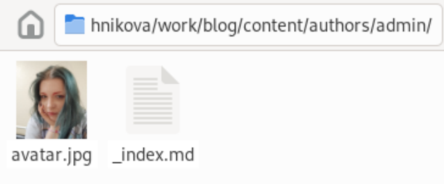{#fig:001 width=70%}

В файле index.md в той же папке изменяю поля. Начинаю с имени (рис. @fig:002).

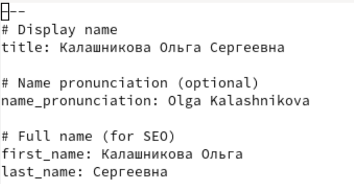{#fig:002 width=70%}

Добавила то, где я обучаюсь сейчас (рис. @fig:003).

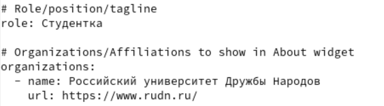{#fig:003 width=70%}

Добавила короткую биографию и расписала свои интересы (рис. @fig:004).

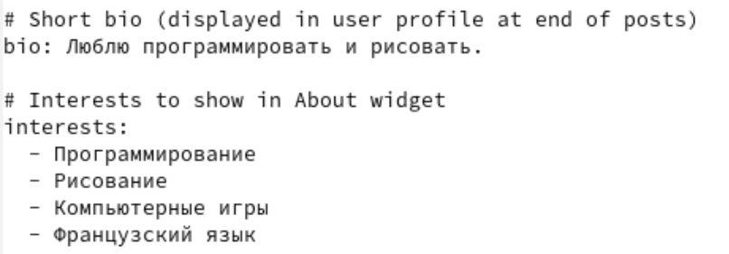{#fig:004 width=70%}

Добавила свое образование (рис. @fig:005).

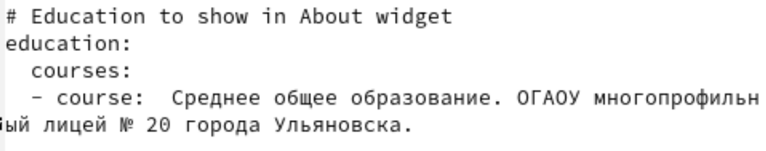{#fig:005 width=70%}

Изменила биографию (рис. @fig:006).

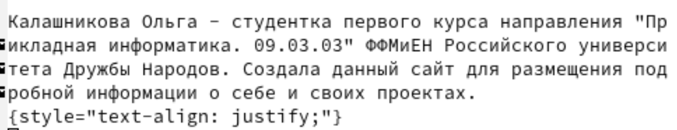{#fig:006 width=70%}

Как это должно выглядеть на сайте (при выполнение этого не видно) (рис. @fig:007).

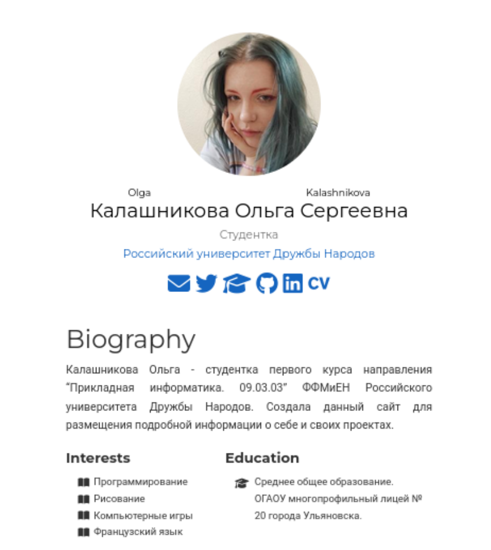{#fig:007 width=70%}

## Статьи

Создаю папки в директории post, которые обозначают посты и в которых будут тексты постов, картинки и доп. файлы (рис. @fig:008).

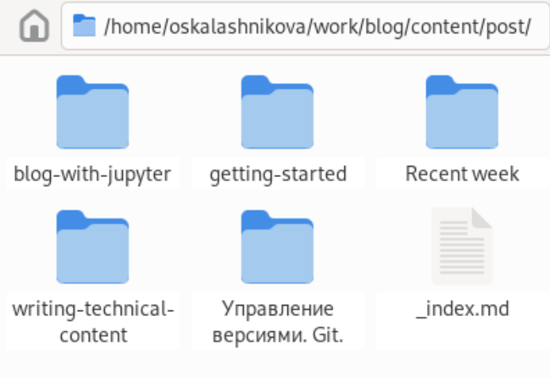{#fig:008 width=70%}

Добавила фото моей кошки в папку для статьи о том, как прошла неделя (рис. @fig:009).

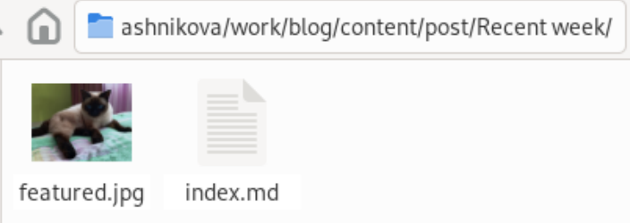{#fig:009 width=70%}

Заполнила файл index.md в папке для поста про прошедшую неделю (рис. @fig:010).

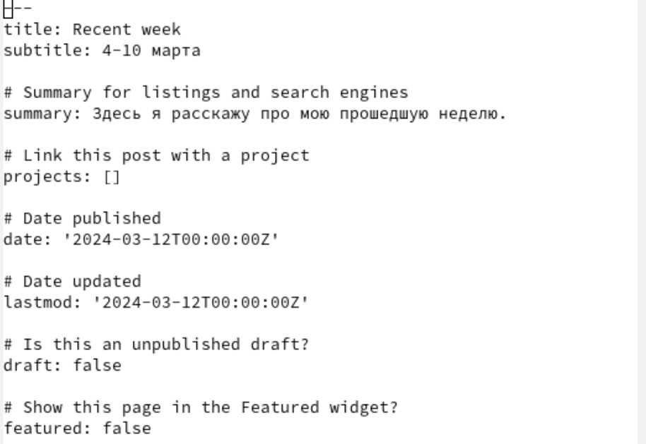{#fig:010 width=70%}

Заполнила файл index.md в папке для поста про управление версиями Git (рис. @fig:011).

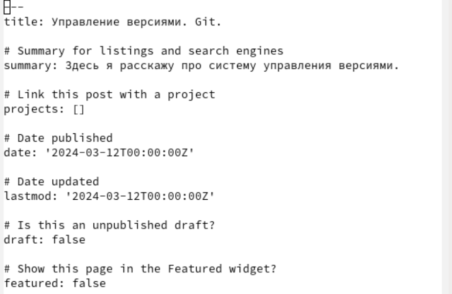{#fig:011 width=70%}

Как это должно выглядеть на сайте (при выполнение не всё видно) (рис. @fig:012).

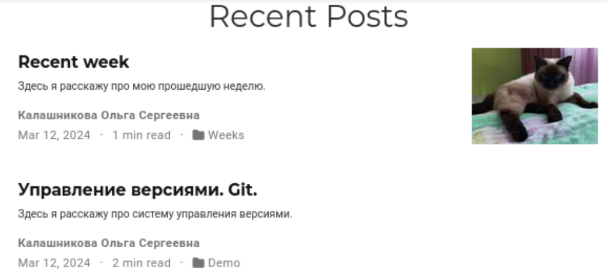{#fig:012 width=70%}

## Генерация сайта

Генерирую сайт с изменениями (рис. @fig:013).

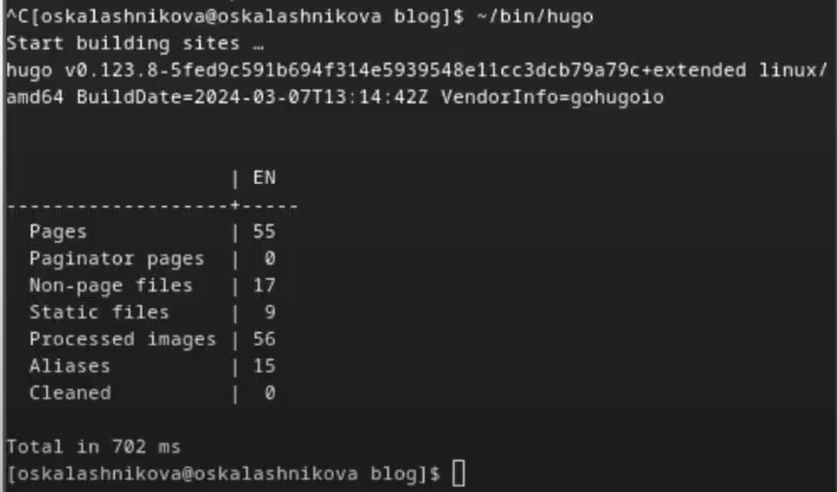{#fig:013 width=70%}

Сохраняю изменения на гите  (рис. @fig:014).

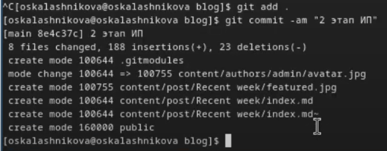{#fig:014 width=70%}

Выполняю git push (рис. @fig:015).

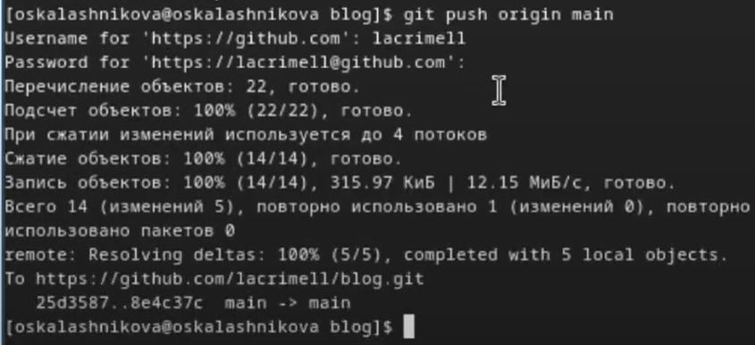{#fig:015 width=70%}

Сохраняю изменения в папке, изменения в которйо отправятся на репозиторий, где лежит сайт (рис. @fig:016).

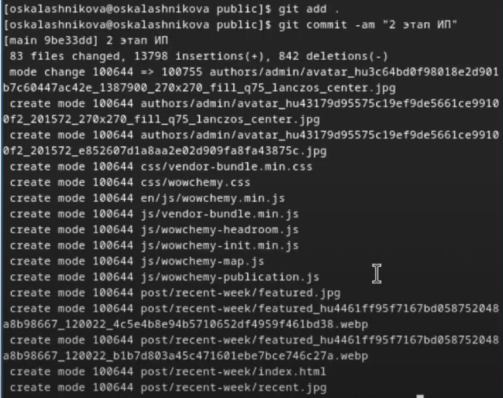{#fig:016 width=70%}

Выполняю git push (рис. @fig:017).

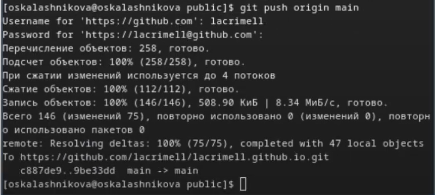{#fig:017 width=70%}

Проверяю, как выглядит сайт в браузере (рис. @fig:018).

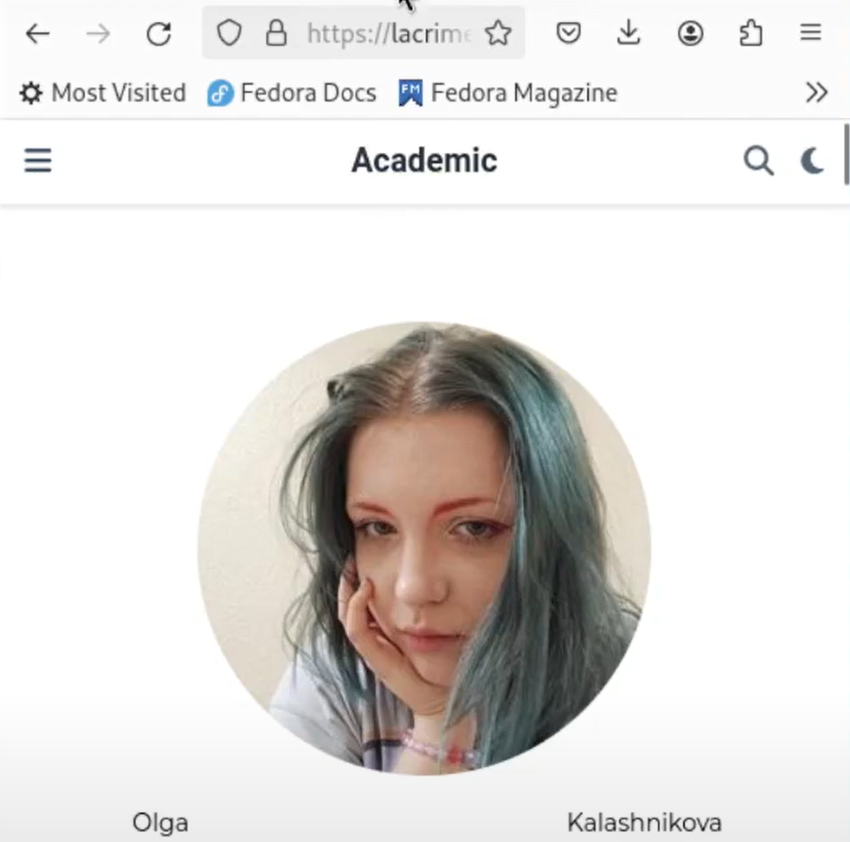{#fig:018 width=70%}

# Выводы

В процессе выполнения второго этапа индивидуального проекта я научилась редактировать данные о себе, а также писать посты и добавлять их на сайт.