---
## Front matter
lang: ru-RU
title: Отчет по выполнению индивидуального проекта №3
subtitle: Операционные системы
author:
  - Калашникова Ольга Сергеевна НПИбд-01-23
institute:
  - Российский университет дружбы народов, Москва, Россия
date: 6 апреля 2024

## i18n babel
babel-lang: russian
babel-otherlangs: english

## Formatting pdf
toc: false
toc-title: Содержание
slide_level: 2
aspectratio: 169
section-titles: true
theme: metropolis
header-includes:
 - \metroset{progressbar=frametitle,sectionpage=progressbar,numbering=fraction}
 - '\makeatletter'
 - '\beamer@ignorenonframefalse'
 - '\makeatother'

## Fonts 
mainfont: PT Serif 
romanfont: PT Serif 
sansfont: PT Sans 
monofont: PT Mono 
mainfontoptions: Ligatures=TeX 
romanfontoptions: Ligatures=TeX 
sansfontoptions: Ligatures=TeX,Scale=MatchLowercase 
monofontoptions: Scale=MatchLowercase,Scale=0.9

---

## Цель работы

Продолжить работы со своим сайтом. Редактировать его в соответствии с требованиями. Добавить статьи.

## Задание

1. Добавить информацию о навыках (Skills).

2. Добавить информацию об опыте (Experience).

3. Добавить информацию о достижениях (Accomplishments).

4. Сделать пост по прошедшей неделе.

5. Добавить пост на тему по выбору (Язык разметки Markdown)

## Skills

Захожу в терминал, перехожу в директорию ~/work/blog, ввожу команду ~/bin/hugo server для запуска локального сервера (рис.1)

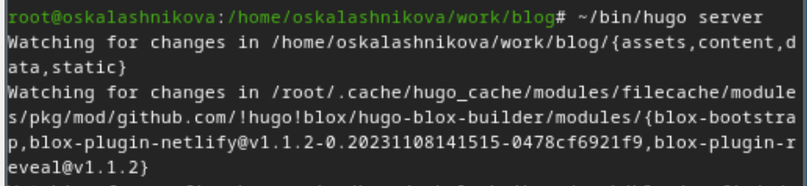{#fig:001 width=30%}

## Skills

Перехожу в директорию ~/work/blog/content/authors/admin/ , открываю файл _index.md, в нем будет осуществляться дальшейшая работа (рис.2)

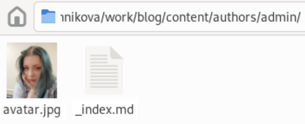{#fig:002 width=30%}

## Skills

В блоке features, там, где заголовок Skills прописала навыки. Иконки для навыков искала, найдя в интернете официальную библиотеку иконок fas, так можно найти и иконки из библиотеки fab (рис.3)

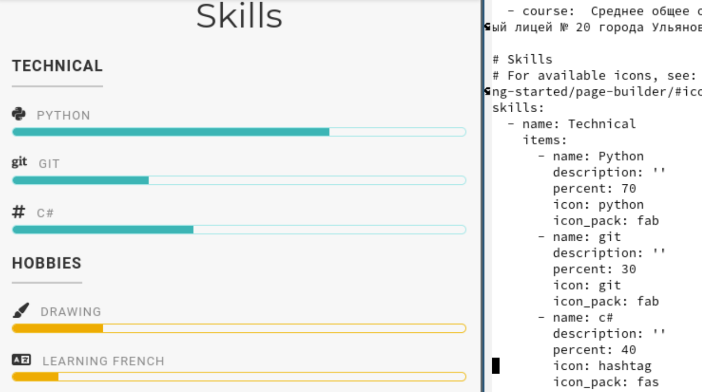{#fig:003 width=30%}

## Skills

Делаю тоже самое для графы Hobbies (рис.4)

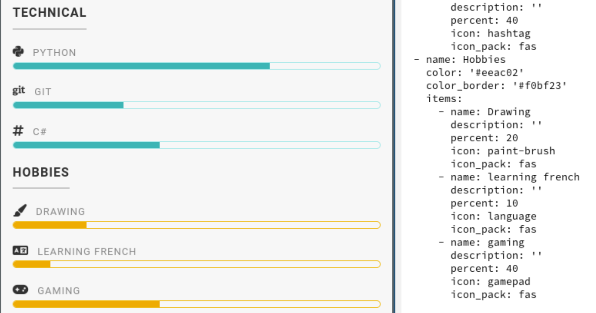{#fig:004 width=30%}

## Experience

Перехожу в директорию ~/work/blog/content, открываю файл _index.md, в нем будет осуществляться дальшейшая работа (рис.5)

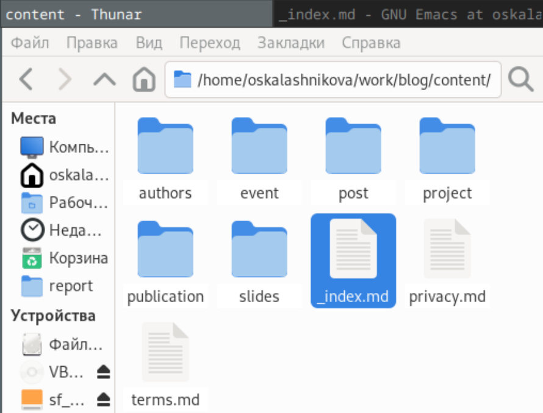{#fig:005 width=30%}

## Experience

Далее добавила свой опыт в блоке Experience, добавила даты, поменяла иконки (В итоговой версии иконки не сохранились) (рис.6)

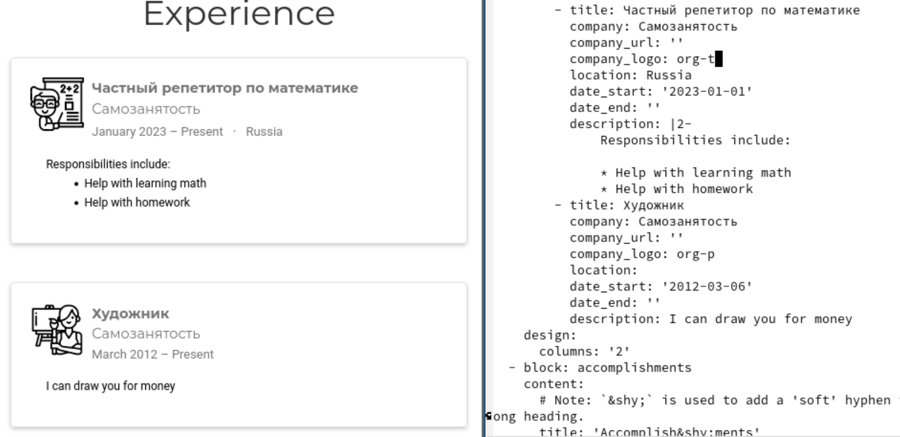{#fig:006 width=30%}

## Accomplishments

Далее в Accomplishments добавила достижения (рис.7)

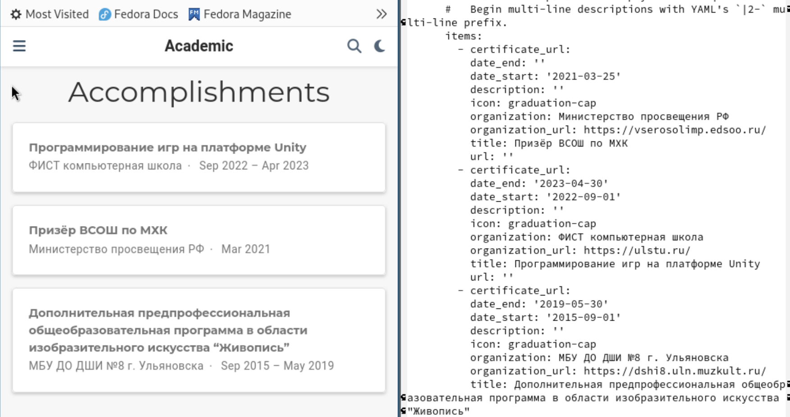{#fig:007 width=30%}

## Posts

Создаю папку для поста по прошедшей неделе (рис.8)

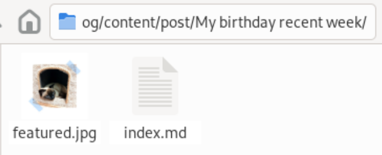{#fig:008 width=30%}

## Posts

Добавила пост по прошедшей неделе в папке posts (рис.9)

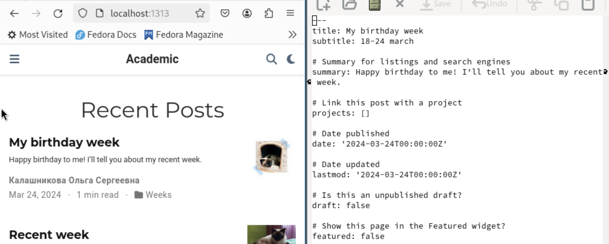{#fig:009 width=30%} 

## Posts

Добавила пост на тему по выбору (язык разметки Markdown) в папке posts (рис.10)

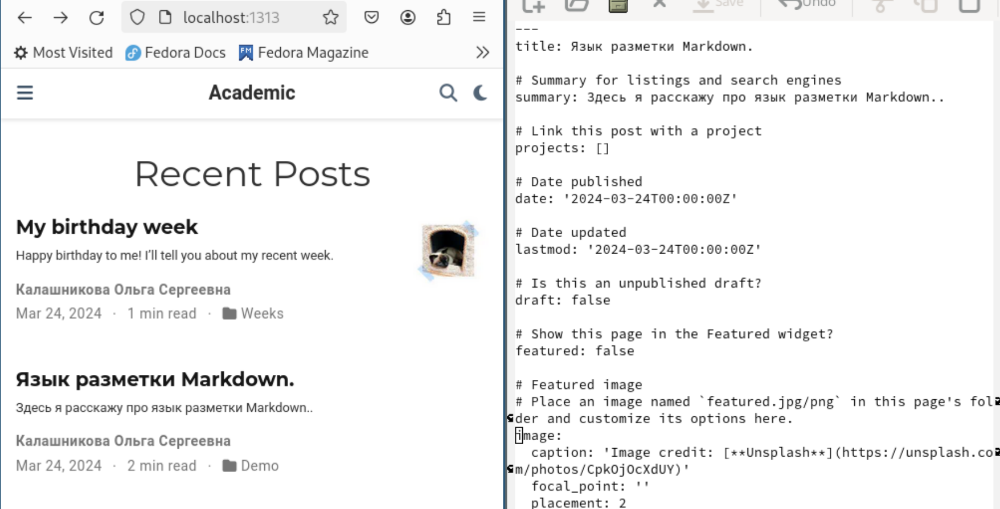{#fig:010 width=30%}

## Завершение работы

Закрываю локальный сервер с помощью клавиш Ctrl+C и собираю сайт с изменениями, введя команду ~/bin/hugo без аргументов (рис.11)

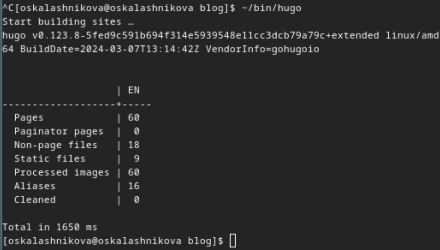{#fig:011 width=30%}

## Завершение работы

Отправляю изменения на GitHub (рис.12)

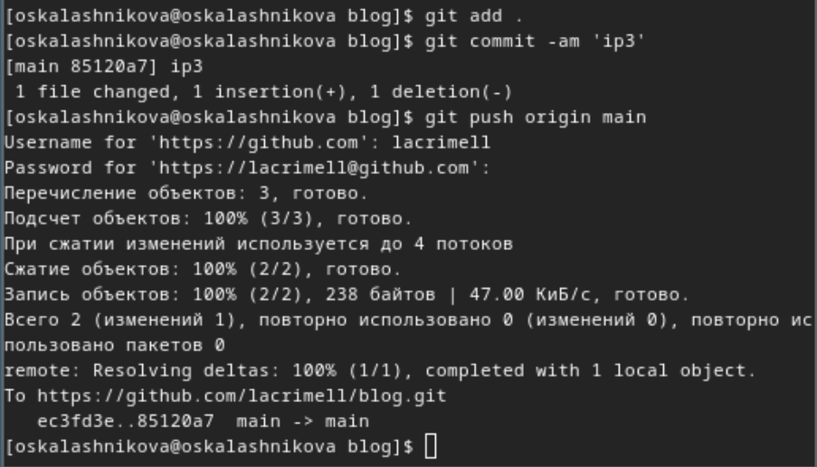{#fig:012 width=30%}

## Завершение работы

Теперь перехожу в директорию blog/public и отправляю изменения на GitHub, чтобы глобальный сайт тоже был обновлен (рис.13)

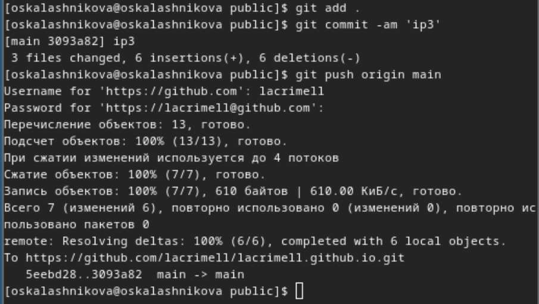{#fig:013 width=30%}

## Завершение работы

Проверяю, что все сделано корректно (рис.14)

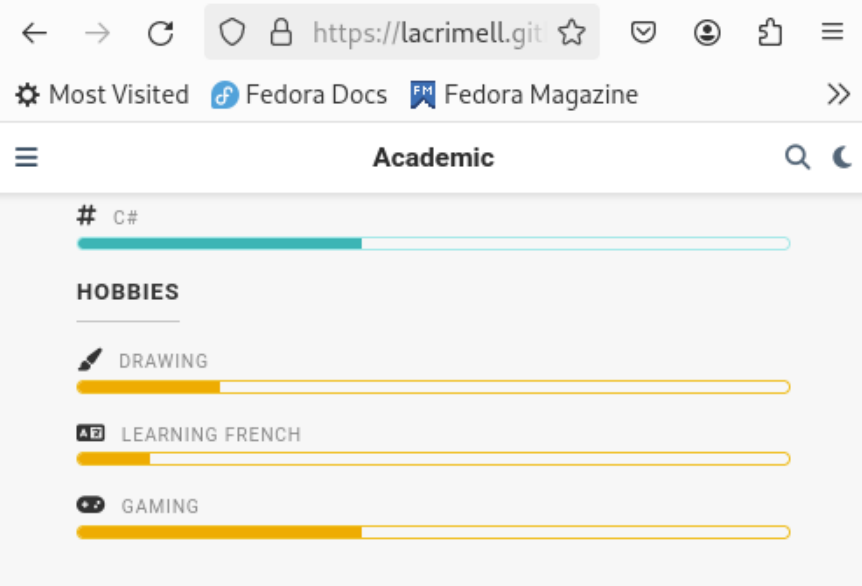{#fig:014 width=30%}

## Выводы

В процессе выполнения второго этапа индивидуального проекта я научилась редактировать данные о себе, а также писать посты и добавлять их на сайт.