---
## Front matter
title: "Отчет по второму этапу индивидуального проекта"
subtitle: "Операционные системы"
author: "Калашникова Ольга Сергеевна"

## Generic otions
lang: ru-RU
toc-title: "Содержание"

## Bibliography
bibliography: bib/cite.bib
csl: pandoc/csl/gost-r-7-0-5-2008-numeric.csl

## Pdf output format
toc: true # Table of contents
toc-depth: 2
lof: true # List of figures
lot: true # List of tables
fontsize: 12pt
linestretch: 1.5
papersize: a4
documentclass: scrreprt
## I18n polyglossia
polyglossia-lang:
  name: russian
  options:
	- spelling=modern
	- babelshorthands=true
polyglossia-otherlangs:
  name: english
## I18n babel
babel-lang: russian
babel-otherlangs: english
## Fonts
mainfont: PT Serif
romanfont: PT Serif
sansfont: PT Sans
monofont: PT Mono
mainfontoptions: Ligatures=TeX
romanfontoptions: Ligatures=TeX
sansfontoptions: Ligatures=TeX,Scale=MatchLowercase
monofontoptions: Scale=MatchLowercase,Scale=0.9
## Biblatex
biblatex: true
biblio-style: "gost-numeric"
biblatexoptions:
  - parentracker=true
  - backend=biber
  - hyperref=auto
  - language=auto
  - autolang=other*
  - citestyle=gost-numeric
## Pandoc-crossref LaTeX customization
figureTitle: "Рис."
tableTitle: "Таблица"
listingTitle: "Листинг"
lofTitle: "Список иллюстраций"
lotTitle: "Список таблиц"
lolTitle: "Листинги"
## Misc options
indent: true
header-includes:
  - \usepackage{indentfirst}
  - \usepackage{float} # keep figures where there are in the text
  - \floatplacement{figure}{H} # keep figures where there are in the text
---

# Цель работы

Продолжить работы со своим сайтом. Редактировать его в соответствии с требованиями. Добавить статьи.

# Задание

1. Добавить информацию о навыках (Skills).

2. Добавить информацию об опыте (Experience).

3. Добавить информацию о достижениях (Accomplishments).

4. Сделать пост по прошедшей неделе.

5. Добавить пост на тему по выбору (Язык разметки Markdown)

# Выполнение

## Skills

Захожу в терминал, перехожу в директорию ~/work/blog, ввожу команду ~/bin/hugo server для запуска локального сервера (рис. @fig:001)

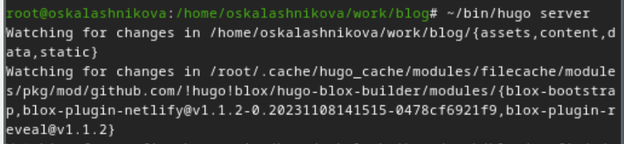{#fig:001 width=70%}

Перехожу в директорию ~/work/blog/content/authors/admin/ , открываю файл _index.md, в нем будет осуществляться дальшейшая работа (рис. @fig:002)

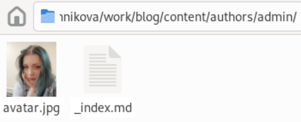{#fig:002 width=70%}

В блоке features, там, где заголовок Skills прописала навыки. Иконки для навыков искала, найдя в интернете официальную библиотеку иконок fas, так можно найти и иконки из библиотеки fab (рис. @fig:003)

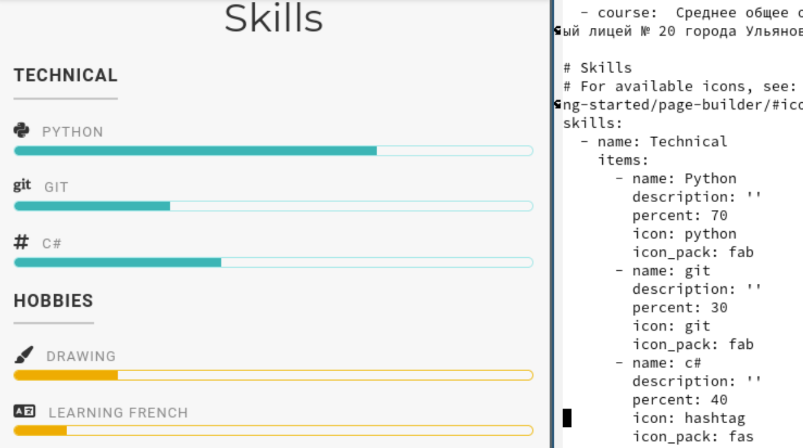{#fig:003 width=70%}

Делаю тоже самое для графы Hobbies (рис. @fig:004)

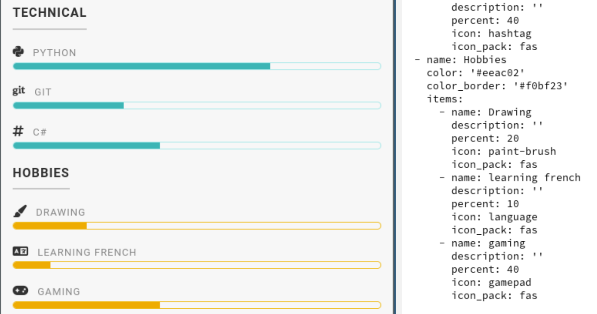{#fig:004 width=70%}

## Experience

Перехожу в директорию ~/work/blog/content, открываю файл _index.md, в нем будет осуществляться дальшейшая работа (рис. @fig:005)

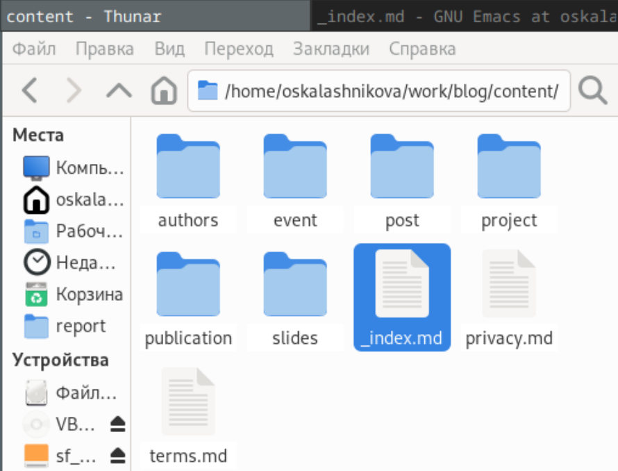{#fig:005 width=70%}

Далее добавила свой опыт в блоке Experience, добавила даты, поменяла иконки (В итоговой версии иконки не сохранились) (рис. @fig:006)

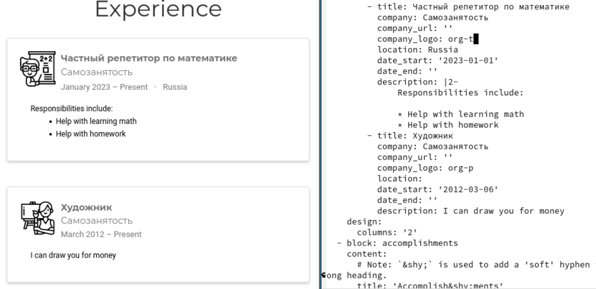{#fig:006 width=70%}

## Accomplishments

Далее в Accomplishments добавила достижения (рис. @fig:007)

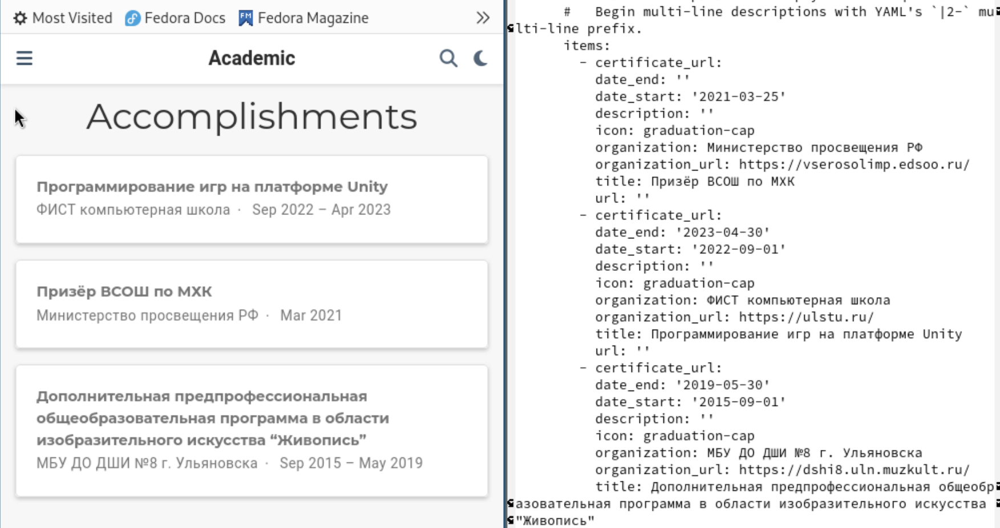{#fig:007 width=70%}

## Posts

Создаю папку для поста по прошедшей неделе (рис. @fig:008)

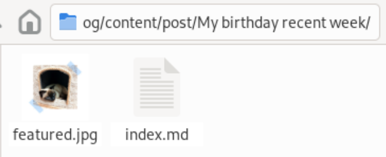{#fig:008 width=70%}

Добавила пост по прошедшей неделе в папке posts (рис. @fig:009)

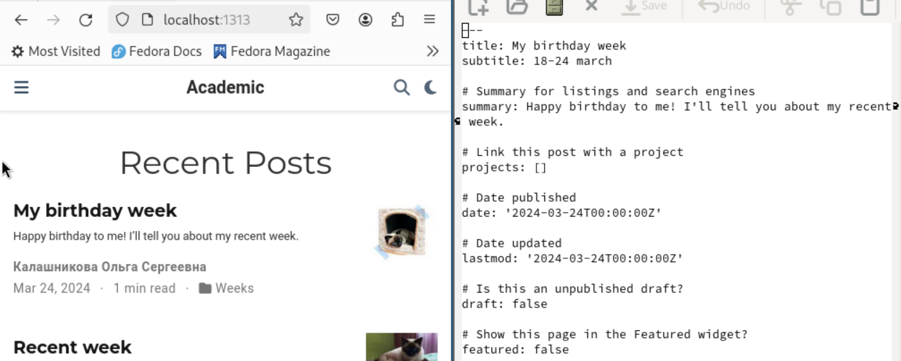{#fig:009 width=70%} 

Добавила пост на тему по выбору (язык разметки Markdown) в папке posts (рис. @fig:010)

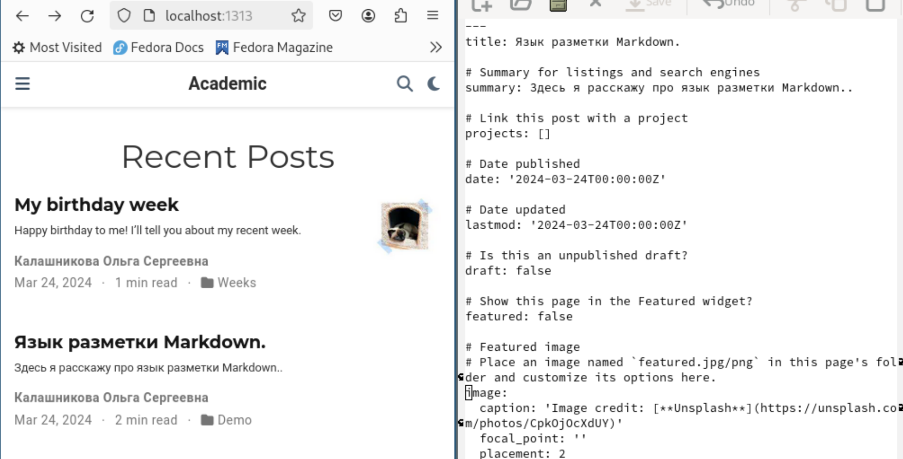{#fig:010 width=70%}

## Завершение работы

Закрываю локальный сервер с помощью клавиш Ctrl+C и собираю сайт с изменениями, введя команду ~/bin/hugo без аргументов (рис. @fig:011)

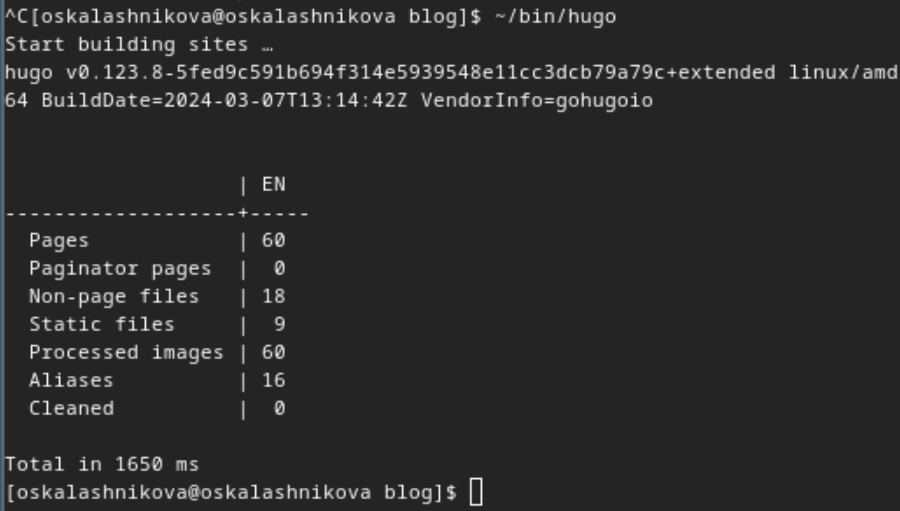{#fig:011 width=70%}

Отправляю изменения на GitHub (рис. @fig:012)

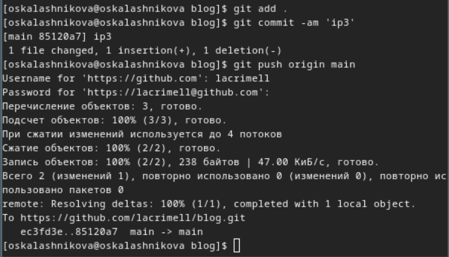{#fig:012 width=70%}

Теперь перехожу в директорию blog/public и отправляю изменения на GitHub, чтобы глобальный сайт тоже был обновлен (рис. @fig:013)

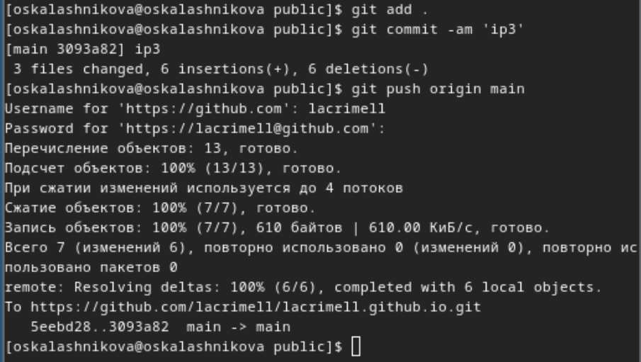{#fig:013 width=70%}

Проверяю, что все сделано корректно (рис. @fig:014)

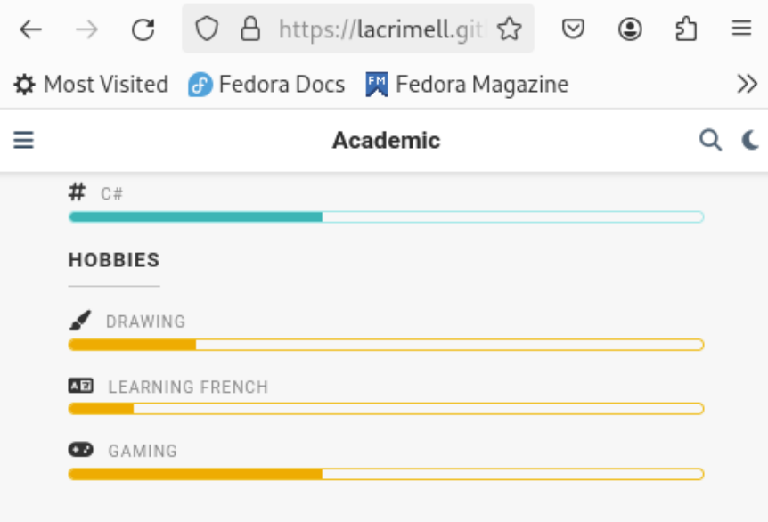{#fig:014 width=70%}

# Выводы

В процессе выполнения второго этапа индивидуального проекта я научилась редактировать данные о себе, а также писать посты и добавлять их на сайт.