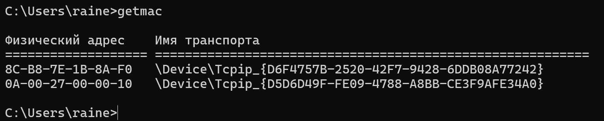
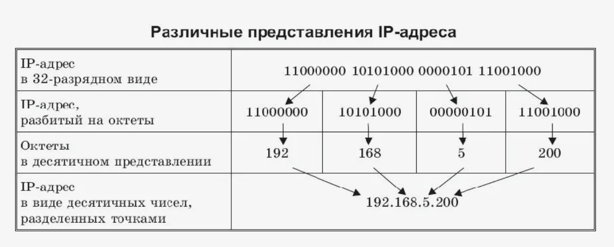
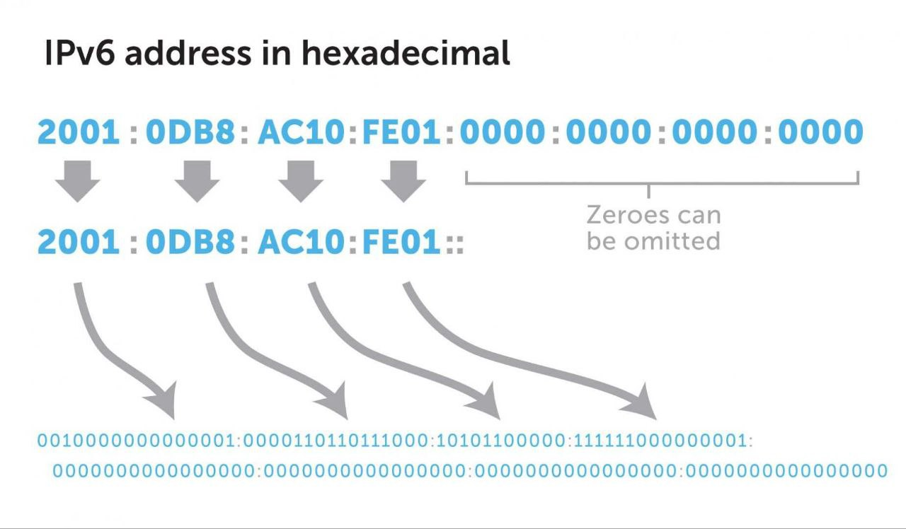
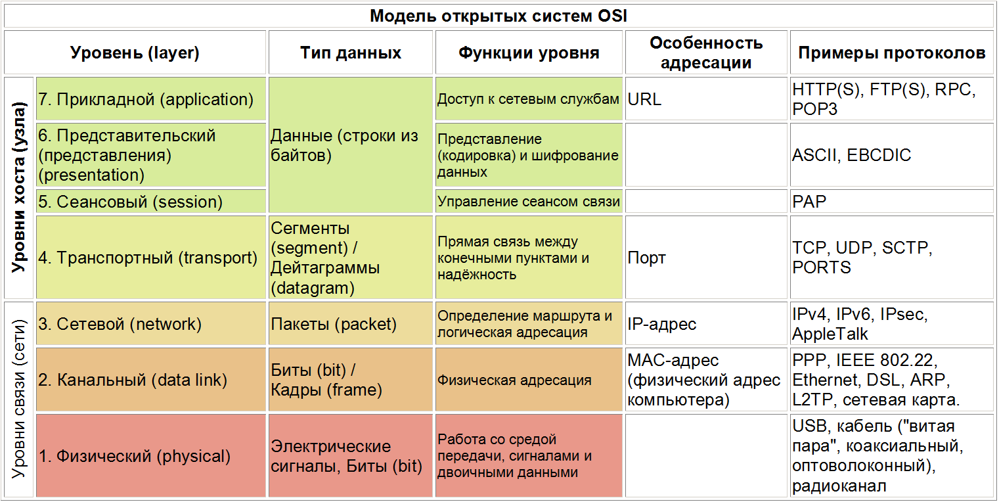
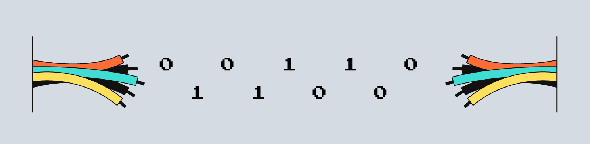
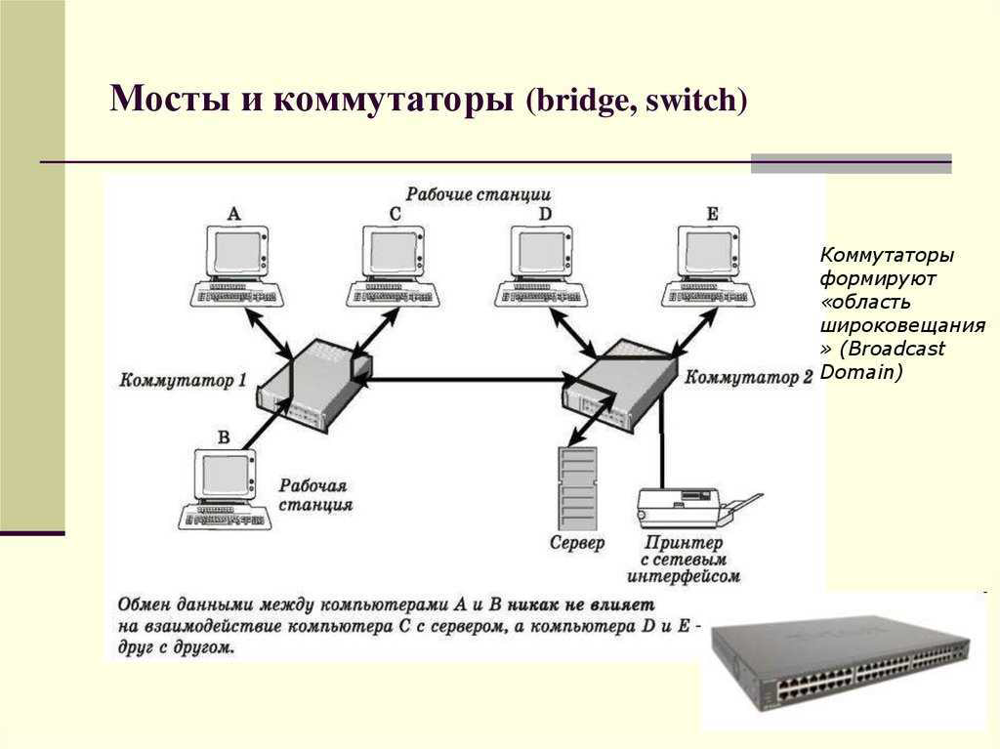

---
## Front matter
title: "Доклад"
subtitle: "Физическая и логическая адресация в компьютерных системах"
author: "Калашникова Ольга Сергеевна"

## Generic otions
lang: ru-RU
toc-title: "Содержание"

## Bibliography
bibliography: bib/cite.bib
csl: pandoc/csl/gost-r-7-0-5-2008-numeric.csl

## Pdf output format
toc: true # Table of contents
toc-depth: 2
lof: true # List of figures
lot: true # List of tables
fontsize: 12pt
linestretch: 1.5
papersize: a4
documentclass: scrreprt
## I18n polyglossia
polyglossia-lang:
  name: russian
  options:
	- spelling=modern
	- babelshorthands=true
polyglossia-otherlangs:
  name: english
## I18n babel
babel-lang: russian
babel-otherlangs: english
## Fonts
mainfont: PT Serif
romanfont: PT Serif
sansfont: PT Sans
monofont: PT Mono
mainfontoptions: Ligatures=TeX
romanfontoptions: Ligatures=TeX
sansfontoptions: Ligatures=TeX,Scale=MatchLowercase
monofontoptions: Scale=MatchLowercase,Scale=0.9
## Biblatex
biblatex: true
biblio-style: "gost-numeric"
biblatexoptions:
  - parentracker=true
  - backend=biber
  - hyperref=auto
  - language=auto
  - autolang=other*
  - citestyle=gost-numeric
## Pandoc-crossref LaTeX customization
figureTitle: "Рис."
tableTitle: "Таблица"
listingTitle: "Листинг"
lofTitle: "Список иллюстраций"
lotTitle: "Список таблиц"
lolTitle: "Листинги"
## Misc options
indent: true
header-includes:
  - \usepackage{indentfirst}
  - \usepackage{float} # keep figures where there are in the text
  - \floatplacement{figure}{H} # keep figures where there are in the text
---

# Вводная часть 

**Актуальность темы и проблема:** 
Многие пользователи компьютера сталкиваются с недостаточным пониманием различия между физической и логической адресацией в компьютерных системах.

**Объект и предмет исследования:**
Физическая и логическая адресация в компьютерных системах, их  различия, применение и взаимодействие.

**Цель:**
Изучение и анализ особенностей физической и логической адресации в компьютерных системах с целью повышения понимания их важности и применения.

**задачи исследования:**

1. Объяснить что такое физическая и логическая адресация.

2. Проанализировать сферы применения и значимость каждого типа адресации.

3. Изучить и сравнить основные различия между физической и логической адресацией.

**Материалы и методы и инструменты исследования:**  
Интернет-ресурсы, учебная литература, аналитика.

# Введение

В сетевых технологиях широко используются MAC-адреса и IP-адреса, играя важную роль в обеспечении связи и идентификации устройств в компьютерных сетях. Эти адреса служат различным целям и выполняют ключевые функции в сетевых протоколах.

Сущность различий между MAC-адресами и IP-адресами представляет собой значимое поле исследования в области компьютерных сетей. Понимание этих различий существенно для обеспечения эффективной передачи данных и правильного маршрутизации в современных сетях. В данной работе мы проанализируем роли и особенности MAC- и IP-адресов с целью расширения знаний и повышения компетентности в области сетевых технологий, освещая их уникальные характеристики и важность в контексте функционирования компьютерных сетей.

# Физическая адресация в компьютерных системах

Физический адрес MAC-адрес (Media Access Control - надзор за доступом к среде. Может называться Hardware Address - физический адрес) - это уникальный код, присвоенный производителем сетевому устройству (это все устройства, предназначенные для работы в сети Ethernet, Wi-Fi и Bluetooth, например модемы, роутеры, маршрутизаторы, сетевые карты).

Каждая сетевая карта имеет свой уникальный номер, который был дан ей при изготовлении и должен быть уникальным для каждого отдельного устройства. При помощи данного номера можно идентифицировать отправителя и получателя и не ошибаться при доставке данных на определённый адрес.

MAC-адрес состоит из 48 бит (или 6 октетов) и содержит информацию о производителе устройства и уникальный идентификатор. Первые 3 октета MAC-адреса (или 24 бита) являются уникальным идентификатором организации. Каждой компании дают определённое количество номеров и когда они заканчиваются, можно запросить новые.  Два младших бита в первом октете имеют специальное назначение: нулевой бит указывает, предназначен кадр для одиночного(0) или группового(1) получателя, а другой указывает, является ли MAC-адрес глобально(0) или локально(1) администрируемым (Если администратор сети назначает MAC-адрес отличный от присвоенного устройству такой адрес называется локально администрируемым) Следующие три октета выбираются производителем для каждого устройства и являются порядковым номером узла(рис. [-@fig:001]).

{#fig:001 width=100%}

Компьютер может иметь несколько сетевых карт и, соответственно, несколько МАС-адресов. При замене аппаратуры изменяется и MAC-адрес, поэтому их использование в качестве сетевых адресов неудобно.

Функции MAC-адресов в компьютерных сетях играют важную роль в обеспечении контроля доступа и безопасности данных. Настройка устройства для принятия пакетов только от определенного набора MAC-адресов гарантирует, что только разрешенные устройства могут обмениваться данными, исключая возможность получения информации от злоумышленников. Благодаря уникальности MAC-адреса невозможно подделать адрес и обмануть узел.

В контексте DHCP (протокол динамической конфигурации хоста) серверов, MAC-адрес используется для идентификации устройств и выделения им фиксированного IP-адреса. При подключении устройства к сети DHCP-сервер определяет его идентификатор MAC-адреса, после чего выделяет конкретный IP-адрес. Это позволяет серверу запомнить соответствие между MAC-адресом и IP-адресом, обеспечивая стабильное сопоставление устройств с их сетевыми идентификаторами для оптимизации работы и управления сетью.

Мы можем сами узнать MAC-адрес на компьютере. В операционной системе Windows вводим в командной строке getmac и получаем список адресов(рис. [-@fig:002]).

{#fig:002 width=100%}

# Логическая адресация в компьютерных системах

IP-адресация представляет собой систему присвоения уникальных числовых идентификаторов устройствам в глобальной компьютерной сети, включая Интернет. IP-адрес, или адрес протокола Интернет, представляет собой числовую последовательность, которая используется для идентификации и направления пакетов информации внутри сети.

С помощью IP-адресации устройства в сети могут обмениваться данными, определять отправителя и получателя информации, а также определять оптимальные маршруты для передачи данных между ними.

Существует два типа IP-адресации: статическая и динамическая. Рассмотрим их различия

Динамический IP-адрес автоматически назначается клиенту интернет-провайдера на ограниченный период времени до следующего переподключения к сети. Этот тип адресации базируется на использовании протокола DHCP (Протокол динамической конфигурации хоста).

Преимущества:

- Удобно для обхода лимитов на передачу данных, так как изменение IP-адреса позволяет избежать ограничений на скачивание или загрузку файлов.

- Повышенная безопасность. Постоянные изменения IP-адреса затрудняют отслеживание конкретного устройства в сети.

- Не требует ручной настройки параметров и дополнительных затрат (За динамический адрес платить не нужно).

Недостатки:

- Возможно снижение скорости обмена данными из-за меняющегося адреса.

- Затруднения при создании серверов или хостинга без дополнительных манипуляций.

Статический IP-адрес предоставляется абоненту или серверу по запросу и остается постоянным при каждом подключении к сети. Дополнительно, IP-адрес статически закрепляется за MAC-адресом оборудования.

Преимущества:

- Идеален для создания различных типов серверов, включая ПК.

- Обеспечивает простой и быстрый удаленный доступ к серверу или компьютеру для организаций.

- Подходит для VPN и онлайн-игр из-за безперебойной связи и стабильности соединения.

- Обеспечивает максимальную скорость в сети.

Недостатки:

- Из-за постоянного идентификатора устройства, оно более уязвимо для отслеживания и взлома. Поменять статический IP-адрес сложно, из-за чего последствия хакерских атак могут стать серьёзнее

- Требует ручной настройки.

- Выделение статического IP-адреса является платной услугой от провайдера.

IP-адресация играет ключевую роль в функционировании Интернета, обеспечивая обмен данными между устройствами, а также обеспечивая маршрутизацию и доставку данных в сети.

При обсуждении адресации в компьютерных сетях используют два основных протокола - IPv4 (Internet Protocol version 4) и IPv6 (Internet Protocol version 6). Они представляют различные версии интернет-протоколов, обеспечивающих уникальные адреса для устройств в сети.

По стандартам IPv4 уникальный числовой IP-адрес может выглядеть данным образом: 192.149.252.76 . Система адресации IPv4 использует 32-битную схему, позволяя хранить 2^32 адреса (4,19 млрд. адресов) (рис. [-@fig:003]).

{#fig:003 width=110%}

В настоящее время этого становится недостаточно, так как число подключаемых к интернету устройств с каждыым годом увеличивается. Поэтому был создан интернет-протокол IPv6, с его огромным адресным пространством, стало необходимостью для обеспечения удовлетворения растущего спроса на интернет-адреса.

IPv6, как новое поколение протокола Интернета, представляет собой 128-битное число, которое формируется из восьми 4-значных 16-ричных чисел, включающих латинские буквы. Этот адресный пространство IPv6 составляет внушительное число комбинаций, достигая 340 ундециллионов (число с 36 нулями), что теоретически позволяет уникальную адресацию для каждого устройства в сети (рис. [-@fig:004]).

{#fig:004 width=100%}

Несмотря на очевидные плюсы, переход на IPv6 происходит медленно по нескольким причинам:

- Стоимость обновления существующего оборудования

- Отсутствие обратной совместимости с более ранней версией протокола IPv4. Переход может привести к проблемам с безопасностью и производительностью и дополнительным финансовым затратами.

- Настройка и внедрение IPv6 сложная работа, требующие дополнительных знаний и умений, что даже для опытных специалистов может быть вызовом.

В настоящее время IPv6 в основном используется цифровыми гигантами для своих внутренних сетей, в то время как провайдеры активно занимаются подготовкой и конфигурацией сетевого оборудования. Для обычных пользователей внедрение нового протокола Интернета не является приоритетной задачей, и вопрос перехода на IPv6 остается пока не столь актуальным.

# Модель OSI

Модель OSI (Open Systems Interconnection) представляет собой стандартизированную архитектурную модель коммуникации. Она определяет семь уровней, каждый из которых отвечает за определенные функции в процессе передачи данных в сети. В ходе моего исследования я буду подробно говорить лишь про 2 и 3 уровень (рис. [-@fig:005]).

{#fig:005 width=100%}

## Ознакомление с физическим уровнем

На физическом уровне передается просто набор битов в виде электрических или оптических сигналов. Так как несколько компьютеров могут быть присоеденены к одному кабелю, на данном уровне сложно избежать смешения сигналов. Физический уровень определяет характеристики передающей среды, кодирование сигналов и физическую топологию. (рис. [-@fig:006]).

{#fig:006 width=100%}

На данном уровне используется hub, сетевой концетратор. Это устройство, которое используется для объединения компьютеров в сетях Ethernet с помощью кабельной инфраструктуры. Концентраторы передают данные от одного устройства ко всем остальным, что может приводить к неэффективному использованию сети. Сегодня их обычно заменяют более современные и умные устройства, такие как сетевые коммутаторы, устройство 2 уровня OSI.

## Канальный уровень

Канальный уровень обеспечивает передачу данных между устройствами в пределах локальной сети и осуществляет проверку доступности среды для передачи информации.В рамках канального уровня у каждого компьютера определен свой уникальный физический адрес или MAC-адрес.

Для обеспечения правильной работы, Канальный уровень разделяется на два подуровня:
- LLC (Логическое управление каналом Logical Link Control)

- MAC (Управление доступом к среде Media Access Control)

LLC отвечает за взаимодействия с верхним уровнем(третьим, сетевым), а MAC управляет передачей данных на Физический уровень.

Как уже говорилось выше, на физическом уровне возникают коллизии, когда несколько устройств пытаются передавать данные одновременно. Протоколы на канальном уровне помогают управлять коллизиями и предотвращать их.Некоторые протоколы на канальном уровне не имеют функций подтверждения доставки данных или проверки целостности кадров. В таких случаях протоколы более высоких уровней берут на себя контроль ошибок, управление потоком данных и подтверждение доставки.

Данные на канальном уровне разбиваются на фреймы, также известные как кадры. Каждый фрейм содержит служебную информацию, такую как адрес отправителя и адрес получателя, а также собственно данные (рис. [-@fig:007]).

{#fig:007 width=100%}

Именно здесь, на канальном уровне, работают коммутаторы и мосты, которые играют важную роль в направлении данных в сети и управлении трафиком на локальном уровне.

Сетевой мост (bridge)-это устройство, которое объединяет различные сегменты сети в единую сеть. Мосты помогают улучшить связность и производительность сети, обеспечивая более эффективную передачу данных между различными частями сети. Мост передаёт данные между двумя портами поочередно и в определённый момент времени обрабатывает лишь один поток данных

Сетевой коммутатор (switch «переключатель»)-это устройство, которое соединяет несколько компьютеров в сети и передает данные только тем устройствам, для которых эти данные предназначены. Коммутаторы обеспечивают более эффективную передачу данных, поскольку избегают передачи данных лишним устройствам в сети.Коммутатор может одновременно передавать несколько потоков данных между любыми портами. Иногда их называют многопортовыми мостами (рис. [-@fig:008]).

{#fig:008 width=100%}

## Сетевой уровень

На сетевом уровне основная задача заключается в определении маршрутов для передачи данных к их адресату. Для выполнения этой задачи используются маршрутизаторы(или же роутеры), которые с помощью соответствующих протоколов определяют IP-адреса отправителя и получателя, а затем упаковывают данные в пакеты и пересылают их между сегментами сети

Пакеты на сетевом уровне аналогичны кадрам на канальном уровне: они включают данные и информацию об исходной и конечной точках. В отличие от MAC-адресов, которые используются в канальном уровне для локальной доставки, в пакетах на сетевом уровне используются IP-адреса (рис. [-@fig:009]).

{#fig:009 width=100%}

# Различие физической и логической адресации

IP-адрес фокусируется на роли обеспечения коммуникации и идентификации в сети Интернет, обладая гибкостью в управлении и изменении, в то время как MAC-адрес представляет собой статичный адрес, который служит для уникальной идентификации аппаратного обеспечения в пределах локальной сети. Понимание различий между этими двумя адресами важно для эффективного управления сетевыми ресурсами и обеспечения безопасности и стабильности коммуникаций в сети.

Когда мы говорим о MAC-адресах, мы говорим о физической идентификации устройств в сети. MAC-адреса обеспечивают простоту взаимодействия и помогают снизить издержки на сетевое оборудование. Однако, базироваться исключительно на MAC-адресах для построения сети Интернет не представляется возможным из-за ограничений в емкости хранения уникальных MAC-адресов на обычном сетевом оборудовании.

Вместо этого используется адресация IP, где устройства сгруппированы в сети и уникальные идентификаторы серверов и клиентов представлены IP-адресами. Это помогает сократить объем информации, хранимой в таблицах межсетевых устройств, таких как маршрутизаторы. Вместо хранения массы отдельных MAC-адресов, маршрутизаторы хранят информацию об IP-адресах групп устройств, что способствует оптимизации и упрощению маршрутизации данных в сети. 

# Выводы

В ходе работы я изучила особенности физической и логической адресации в компьютерных сетях, поняла различие между IP и MAC адресами и принципом их использования. Физическая и логическая адресация обеспечивают правильную доставку данных на разных уровнях сети.

# Список литературы{.unnumbered}

::: {#refs}
:::
